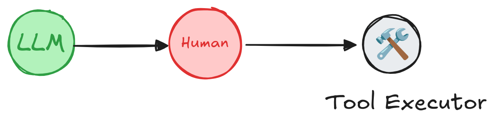

# Human-in-the-loop

To review, edit and approve tool calls in an agent you can use LangGraph's built-in [human-in-the-loop](../concepts/human_in_the_loop.md) features, specifically the [`interrupt()`](/langgraphjs/reference/functions/langgraph.interrupt-1.html) primitive.

LangGraph allows you to pause execution **indefinitely** — for minutes, hours, or even days—until human input is received.

This is possible because the agent state is **checkpointed into a database**, which allows the system to persist execution context and later resume the workflow, continuing from where it left off.

For a deeper dive into the **human-in-the-loop** concept, see the [concept guide](../concepts/human_in_the_loop.md).

<figure markdown="1">
{: style="max-height:400px"}
<figcaption>
A human can review and edit the output from the agent before proceeding. This is particularly critical in applications where the tool calls requested may be sensitive or require human oversight.
</figcaption>
</figure>


## Review tool calls

To add a human approval step to a tool:

1. Use `interrupt()` in the tool to pause execution.
2. Resume with a `Command({ resume: ... })` to continue based on human input.

```ts
import { MemorySaver } from "@langchain/langgraph-checkpoint";
import { interrupt } from "@langchain/langgraph";
import { createReactAgent } from "@langchain/langgraph/prebuilt";
import { initChatModel } from "langchain/chat_models/universal";
import { tool } from "@langchain/core/tools";
import { z } from "zod";

// An example of a sensitive tool that requires human review / approval
const bookHotel = tool(
  async (input: { hotelName: string; }) => {
    let hotelName = input.hotelName;
    // highlight-next-line
    const response = interrupt(  // (1)!
      `Trying to call \`book_hotel\` with args {'hotel_name': ${hotelName}}. ` +
      `Please approve or suggest edits.`
    )
    if (response.type === "accept") {
      // proceed to execute the tool logic
    } else if (response.type === "edit") {
        hotelName = response.args["hotel_name"]
    } else {
        throw new Error(`Unknown response type: ${response.type}`)
    }
    return `Successfully booked a stay at ${hotelName}.`;
  },
  {
    name: "bookHotel",
    schema: z.object({
      hotelName: z.string().describe("Hotel to book"),
    }),
    description: "Book a hotel.",
  }
);

// highlight-next-line
const checkpointer = new MemorySaver();  // (2)!

const llm = await initChatModel("anthropic:claude-3-7-sonnet-latest");
const agent = createReactAgent({
  llm,
  tools: [bookHotel],
  // highlight-next-line
  checkpointer  // (3)!
});
```

1. The [`interrupt` function](/langgraphjs/reference/functions/langgraph.interrupt-1.html) pauses the agent graph at a specific node. In this case, we call `interrupt()` at the beginning of the tool function, which pauses the graph at the node that executes the tool. The information inside `interrupt()` (e.g., tool calls) can be presented to a human, and the graph can be resumed with the user input (tool call approval, edit or feedback).
2. The `InMemorySaver` is used to store the agent state at every step in the tool calling loop. This enables [short-term memory](./memory.md#short-term-memory) and [human-in-the-loop](./human-in-the-loop.md) capabilities. In this example, we use `InMemorySaver` to store the agent state in memory. In a production application, the agent state will be stored in a database.
3. Initialize the agent with the `checkpointer`.

Run the agent with the `stream()` method, passing the `config` object to specify the thread ID. This allows the agent to resume the same conversation on future invocations.

```ts
const config = {
   configurable: {
      // highlight-next-line
      "thread_id": "1"
   }
}

for await (const chunk of await agent.stream(
  { messages: "book a stay at McKittrick hotel" },
  // highlight-next-line
  config
)) {
  console.log(chunk);
  console.log("\n");
};
```

> You should see that the agent runs until it reaches the `interrupt()` call, at which point it pauses and waits for human input.

Resume the agent with a `Command({ resume: ... })` to continue based on human input.

```ts
import { Command } from "@langchain/langgraph";

for await (const chunk of await agent.stream(
  new Command({ resume: { type: "accept" } }),  // (1)!
  // new Command({ resume: { type: "edit", args: { "hotel_name": "McKittrick Hotel" } } }),
  // highlight-next-line
  config
)) {
  console.log(chunk);
  console.log("\n");
};
```

1. The [`interrupt` function](/langgraphjs/reference/functions/langgraph.interrupt-1.html) is used in conjunction with the [`Command`](/langgraphjs/reference/classes/langgraph.Command.html) object to resume the graph with a value provided by the human.

## Additional resources

* [Human-in-the-loop in LangGraph](../concepts/human_in_the_loop.md)