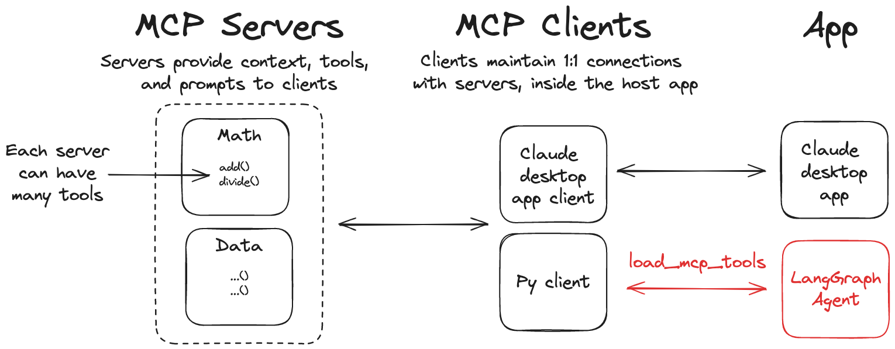

# MCP Integration

[Model Context Protocol (MCP)](https://modelcontextprotocol.io/introduction) is an open protocol that standardizes how applications provide tools and context to language models. LangGraph agents can use tools defined on MCP servers through the `@langchain/mcp-adapters` library.



Install the `@langchain/mcp-adapters` library to use MCP tools in LangGraph:

```bash
npm install @langchain/mcp-adapters
```

## Use MCP tools

The `@langchain/mcp-adapters` package enables agents to use tools defined across one or more MCP servers.

```ts
// highlight-next-line
import { MultiServerMCPClient } from "@langchain/mcp-adapters";
import { initChatModel } from "langchain/chat_models/universal";
import { createReactAgent } from "@langchain/langgraph/prebuilt";

// highlight-next-line
const client = new MultiServerMCPClient({
  mcpServers: {
    "math": {
      command: "python",
      // Replace with absolute path to your math_server.py file
      args: ["/path/to/math_server.py"],
      transport: "stdio",
    },
    "weather": {
      // Ensure your start your weather server on port 8000
      url: "http://localhost:8000/sse",
      transport: "sse",
    }
  }
})

const llm = await initChatModel("anthropic:claude-3-7-sonnet-latest");
const agent = createReactAgent({
  llm,
  // highlight-next-line
  tools: await client.getTools()
});
 
const mathResponse = await agent.invoke(
  { messages: [ { role: "user", content: "what's (3 + 5) x 12?" } ] }
);
const weatherResponse = await agent.invoke(
  { messages: [ { role: "user", content: "what is the weather in nyc?" } ] }
);
await client.close();
```

## Custom MCP servers

To create your own MCP servers, you can use the `mcp` library in Python (or `@modelcontextprotocol/sdk` in TypeScript). These libraries provide a simple way to define tools and run them as servers.

Install the MCP library:

```bash
pip install mcp
```
Use the following reference implementations to test your agent with MCP tool servers.

```python title="Example Math Server (stdio transport)"
from mcp.server.fastmcp import FastMCP

mcp = FastMCP("Math")

@mcp.tool()
def add(a: int, b: int) -> int:
    """Add two numbers"""
    return a + b

@mcp.tool()
def multiply(a: int, b: int) -> int:
    """Multiply two numbers"""
    return a * b

if __name__ == "__main__":
    mcp.run(transport="stdio")
```

```python title="Example Weather Server (SSE transport)"
from mcp.server.fastmcp import FastMCP

mcp = FastMCP("Weather")

@mcp.tool()
async def get_weather(location: str) -> str:
    """Get weather for location."""
    return "It's always sunny in New York"

if __name__ == "__main__":
    mcp.run(transport="sse")
```

## Additional resources

- [MCP documentation](https://modelcontextprotocol.io/introduction)
- [MCP Transport documentation](https://modelcontextprotocol.io/docs/concepts/transports)