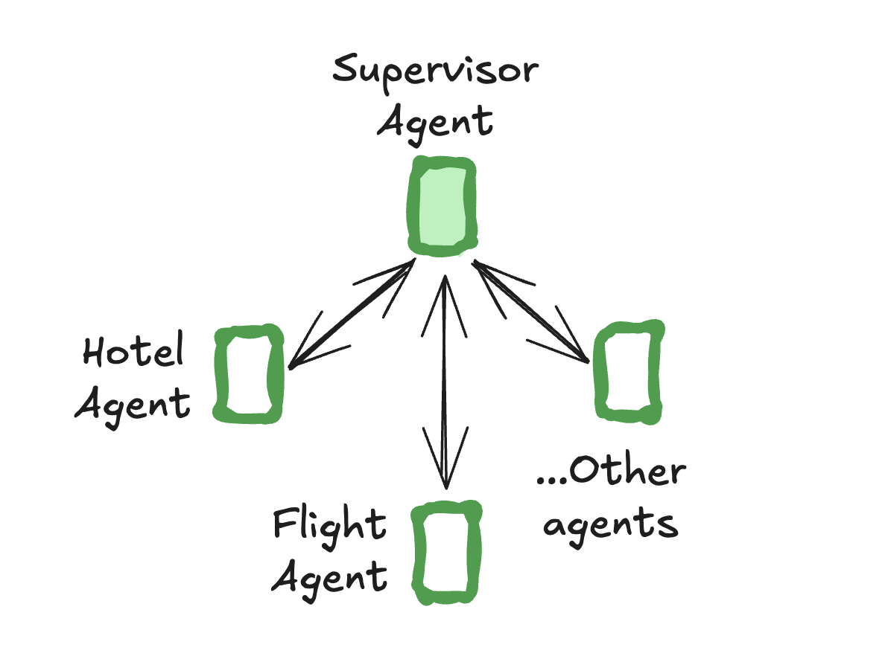
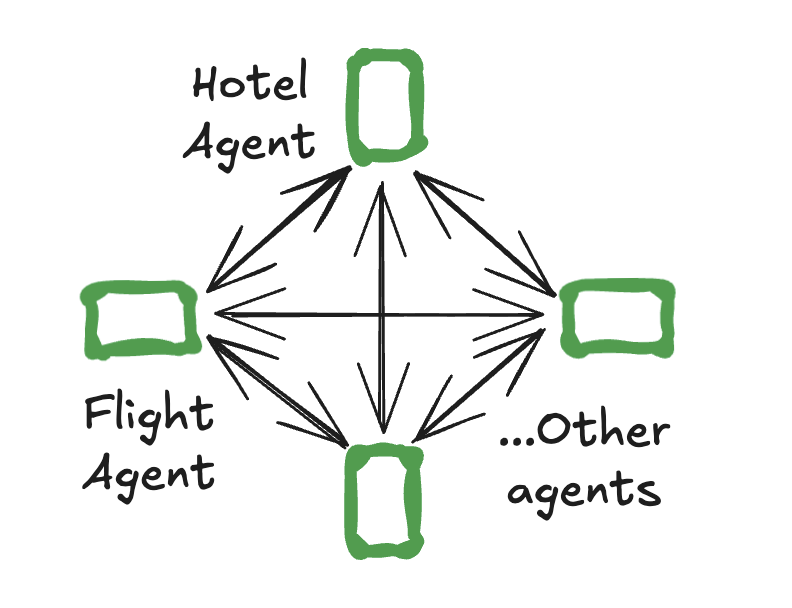

# Multi-agent

A single agent might struggle if it needs to specialize in multiple domains or manage many tools. To tackle this, you can break your agent into smaller, independent agents and composing them into a [multi-agent system](../concepts/multi_agent.md).

In multi-agent systems, agents need to communicate between each other. They do so via [handoffs](#handoffs) — a primitive that describes which agent to hand control to and the payload to send to that agent.

Two of the most popular multi-agent architectures are:

- [supervisor](#supervisor) — individual agents are coordinated by a central supervisor agent. The supervisor controls all communication flow and task delegation, making decisions about which agent to invoke based on the current context and task requirements.
- [swarm](#swarm) — agents dynamically hand off control to one another based on their specializations. The system remembers which agent was last active, ensuring that on subsequent interactions, the conversation resumes with that agent.

## Supervisor



Use [`langgraph-supervisor`](https://github.com/langchain-ai/langgraphjs/tree/main/libs/langgraph-supervisor) library to create a supervisor multi-agent system:

```bash
npm install @langchain/langgraph-supervisor
```

```ts
import { ChatOpenAI } from "@langchain/openai";
// highlight-next-line
import { createSupervisor } from "@langchain/langgraph-supervisor";
import { createReactAgent } from "@langchain/langgraph/prebuilt";
import { tool } from "@langchain/core/tools";
import { z } from "zod";

const bookHotel = tool(
  async (input: { hotel_name: string }) => {
    return `Successfully booked a stay at ${input.hotel_name}.`;
  },
  {
    name: "book_hotel",
    description: "Book a hotel",
    schema: z.object({
      hotel_name: z.string().describe("The name of the hotel to book"),
    }),
  }
);

const bookFlight = tool(
  async (input: { from_airport: string; to_airport: string }) => {
    return `Successfully booked a flight from ${input.from_airport} to ${input.to_airport}.`;
  },
  {
    name: "book_flight",
    description: "Book a flight",
    schema: z.object({
      from_airport: z.string().describe("The departure airport code"),
      to_airport: z.string().describe("The arrival airport code"),
    }),
  }
);

const llm = new ChatOpenAI({ modelName: "gpt-4o" });

// Create specialized agents
const flightAssistant = createReactAgent({
  llm,
  tools: [bookFlight],
  prompt: "You are a flight booking assistant",
  // highlight-next-line
  name: "flight_assistant",
});

const hotelAssistant = createReactAgent({
  llm,
  tools: [bookHotel],
  prompt: "You are a hotel booking assistant",
  // highlight-next-line
  name: "hotel_assistant",
});

// highlight-next-line
const supervisor = createSupervisor({
  agents: [flightAssistant, hotelAssistant],
  llm,
  prompt: "You manage a hotel booking assistant and a flight booking assistant. Assign work to them, one at a time.",
}).compile();

const stream = await supervisor.stream({
  messages: [{
    role: "user",
    content: "first book a flight from BOS to JFK and then book a stay at McKittrick Hotel"
  }]
});

for await (const chunk of stream) {
  console.log(chunk);
  console.log("\n");
}
```

## Swarm



Use [`langgraph-swarm`](https://github.com/langchain-ai/langgraphjs/tree/main/libs/langgraph-swarm) library to create a swarm multi-agent system:

```bash
npm install @langchain/langgraph-swarm
```

```ts
import { createReactAgent } from "@langchain/langgraph/prebuilt";
import { ChatAnthropic } from "@langchain/anthropic";
// highlight-next-line
import { createSwarm, createHandoffTool } from "@langchain/langgraph-swarm";

const transferToHotelAssistant = createHandoffTool({
  agentName: "hotel_assistant",
  description: "Transfer user to the hotel-booking assistant.",
});

const transferToFlightAssistant = createHandoffTool({
  agentName: "flight_assistant",
  description: "Transfer user to the flight-booking assistant.",
});


const llm = new ChatAnthropic({ modelName: "claude-3-5-sonnet-latest" });

const flightAssistant = createReactAgent({
  llm,
  tools: [bookFlight, transferToHotelAssistant],
  prompt: "You are a flight booking assistant",
  name: "flight_assistant",
});

const hotelAssistant = createReactAgent({
  llm,
  tools: [bookHotel, transferToFlightAssistant],
  prompt: "You are a hotel booking assistant",
  name: "hotel_assistant",
});

// highlight-next-line
const swarm = createSwarm({
  agents: [flightAssistant, hotelAssistant],
  defaultActiveAgent: "flight_assistant",
}).compile();

const stream = await swarm.stream({
  messages: [{
    role: "user",
    content: "first book a flight from BOS to JFK and then book a stay at McKittrick Hotel"
  }]
});

for await (const chunk of stream) {
  console.log(chunk);
  console.log("\n");
}
```

## Handoffs

A common pattern in multi-agent interactions is **handoffs**, where one agent *hands off* control to another. Handoffs allow you to specify:

- **destination**: target agent to navigate to
- **payload**: information to pass to that agent

This is used both by `langgraph-supervisor` (supervisor hands off to individual agents) and `langgraph-swarm` (an individual agent can hand off to other agents).

To implement handoffs with `createReactAgent`, you need to:

1. Create a special tool that can transfer control to a different agent

    ```ts
    const transferToBob = tool(
      async (_) => {
        return new Command({
          // name of the agent (node) to go to
          // highlight-next-line
          goto: "bob",
          // data to send to the agent
          // highlight-next-line
          update: { messages: ... },
          // indicate to LangGraph that we need to navigate to
          // agent node in a parent graph
          // highlight-next-line
          graph: Command.PARENT,
        });
      },
      {
        name: ...,
        schema: ...,
        description: ...
      }
    );
    ```

1. Create individual agents that have access to handoff tools:

    ```ts
    const flightAssistant = createReactAgent(
      ..., tools: [bookFlight, transferToHotelAssistant]
    )
    const hotelAssistant = createReactAgent(
      ..., tools=[bookHotel, transferToFlightAssistant]
    )
    ```

1. Define a parent graph that contains individual agents as nodes:

    ```ts
    import { StateGraph, MessagesAnnotation } from "@langchain/langgraph";

    const multiAgentGraph = new StateGraph(MessagesAnnotation)
      .addNode("flight_assistant", flightAssistant)
      .addNode("hotel_assistant", hotelAssistant)
      ...
    ```

Putting this together, here is how you can implement a simple multi-agent system with two agents — a flight booking assistant and a hotel booking assistant:

```ts
import { ChatAnthropic } from "@langchain/anthropic";
import { createReactAgent } from "@langchain/langgraph/prebuilt";
import { StateGraph, MessagesAnnotation, Command, START, getCurrentTaskInput, END } from "@langchain/langgraph";
import { tool } from "@langchain/core/tools";
import { z } from "zod";
import { ToolMessage } from "@langchain/core/messages";

interface CreateHandoffToolParams {
  agentName: string;
  description?: string;
}

const createHandoffTool = ({
  agentName,
  description,
}: CreateHandoffToolParams) => {
  const toolName = `transfer_to_${agentName}`;
  const toolDescription = description || `Ask agent '${agentName}' for help`;

  const handoffTool = tool(
    async (_, config) => {
      const toolMessage = new ToolMessage({
        content: `Successfully transferred to ${agentName}`,
        name: toolName,
        tool_call_id: config.toolCall.id,
      });

      // inject the current agent state
      const state =
        // highlight-next-line
        getCurrentTaskInput() as (typeof MessagesAnnotation)["State"];  // (1)!
      return new Command({  // (2)!
        // highlight-next-line
        goto: agentName,  // (3)!
        // highlight-next-line
        update: { messages: state.messages.concat(toolMessage) },  // (4)!
        // highlight-next-line
        graph: Command.PARENT,  // (5)!
      });
    },
    {
      name: toolName,
      schema: z.object({}),
      description: toolDescription,
    }
  );

  return handoffTool;
};

const bookHotel = tool(
  async (input: { hotel_name: string }) => {
    return `Successfully booked a stay at ${input.hotel_name}.`;
  },
  {
    name: "book_hotel",
    description: "Book a hotel",
    schema: z.object({
      hotel_name: z.string().describe("The name of the hotel to book"),
    }),
  }
);

const bookFlight = tool(
  async (input: { from_airport: string; to_airport: string }) => {
    return `Successfully booked a flight from ${input.from_airport} to ${input.to_airport}.`;
  },
  {
    name: "book_flight",
    description: "Book a flight",
    schema: z.object({
      from_airport: z.string().describe("The departure airport code"),
      to_airport: z.string().describe("The arrival airport code"),
    }),
  }
);

const transferToHotelAssistant = createHandoffTool({
  agentName: "hotel_assistant",
  description: "Transfer user to the hotel-booking assistant.",
});

const transferToFlightAssistant = createHandoffTool({
  agentName: "flight_assistant",
  description: "Transfer user to the flight-booking assistant.",
});

const llm = new ChatAnthropic({ modelName: "claude-3-5-sonnet-latest" });

const flightAssistant = createReactAgent({
  llm,
  // highlight-next-line
  tools: [bookFlight, transferToHotelAssistant],
  prompt: "You are a flight booking assistant",
  // highlight-next-line
  name: "flight_assistant",
});

const hotelAssistant = createReactAgent({
  llm,
  // highlight-next-line
  tools: [bookHotel, transferToFlightAssistant],
  prompt: "You are a hotel booking assistant",
  // highlight-next-line
  name: "hotel_assistant",
});

const multiAgentGraph = new StateGraph(MessagesAnnotation)
  .addNode("flight_assistant", flightAssistant, { ends: ["hotel_assistant", END] })
  .addNode("hotel_assistant", hotelAssistant, { ends: ["flight_assistant", END] })
  .addEdge(START, "flight_assistant")
  .compile();

const stream = await multiAgentGraph.stream({
  messages: [{
    role: "user",
    content: "book a flight from BOS to JFK and a stay at McKittrick Hotel"
  }]
});

for await (const chunk of stream) {
  console.log(chunk);
  console.log("\n");
}
```

1. Access agent's state
2. The `Command` primitive allows specifying a state update and a node transition as a single operation, making it useful for implementing handoffs.
3. Name of the agent or node to hand off to.
4. Take the agent's messages and **add** them to the parent's **state** as part of the handoff. The next agent will see the parent state.
5. Indicate to LangGraph that we need to navigate to agent node in a **parent** multi-agent graph.

!!! Note
    This handoff implementation assumes that:

    - each agent receives overall message history (across all agents) in the multi-agent system as its input
    - each agent outputs its internal messages history to the overall message history of the multi-agent system

    Check out LangGraph [supervisor](https://github.com/langchain-ai/langgraph-supervisor-py#customizing-handoff-tools) and [swarm](https://github.com/langchain-ai/langgraph-swarm-py#customizing-handoff-tools) documentation to learn how to customize handoffs.