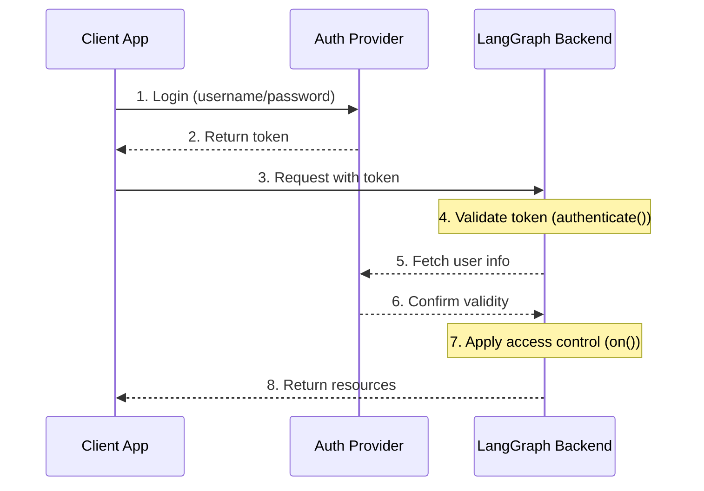

# Authentication & Access Control

LangGraph Platform provides a flexible authentication and authorization system that can integrate with most authentication schemes.

## Core Concepts

### Authentication vs Authorization

While often used interchangeably, these terms represent distinct security concepts:

- [**Authentication**](#authentication) ("AuthN") verifies _who_ you are. This runs as middleware for every request.
- [**Authorization**](#authorization) ("AuthZ") determines _what you can do_. This validates the user's privileges and roles on a per-resource basis.

In LangGraph Platform, authentication is handled by your [`authenticate()`](https://langchain-ai.github.io/langgraph/cloud/reference/sdk/js_ts_sdk_ref/#authenticate) handler, and authorization is handled by your [`on()`](https://langchain-ai.github.io/langgraph/cloud/reference/sdk/js_ts_sdk_ref/#on) handlers.

### Default Security Models

LangGraph Platform provides different security defaults:

- LangGraph Cloud
- Self-Hosted

### LangGraph Cloud

- Uses LangSmith API keys by default
- Requires valid API key in `x-api-key` header
- Can be customized with your auth handler

!!! note "Custom auth"

    Custom auth **is supported** for all plans in LangGraph Cloud.

### Self-Hosted

- No default authentication
- Complete flexibility to implement your security model
- You control all aspects of authentication and authorization

!!! note "Custom auth"

    Custom auth is supported for **Enterprise** self-hosted plans.
    Self-hosted lite plans do not support custom auth natively.

## System Architecture

A typical authentication setup involves three main components:

1. **Authentication Provider** (Identity Provider/IdP)

   - A dedicated service that manages user identities and credentials
   - Handles user registration, login, password resets, etc.
   - Issues tokens (JWT, session tokens, etc.) after successful authentication
   - Examples: Auth0, Supabase Auth, Okta, or your own auth server

2. **LangGraph Backend** (Resource Server)

   - Your LangGraph application that contains business logic and protected resources
   - Validates tokens with the auth provider
   - Enforces access control based on user identity and permissions
   - Doesn't store user credentials directly

3. **Client Application** (Frontend)

   - Web app, mobile app, or API client
   - Collects time-sensitive user credentials and sends to auth provider
   - Receives tokens from auth provider
   - Includes these tokens in requests to LangGraph backend

Here's how these components typically interact:



Your [`authenticate()`](https://langchain-ai.github.io/langgraph/cloud/reference/sdk/js_ts_sdk_ref/#authenticate) handler in LangGraph handles steps 4-6, while your [`on()`](https://langchain-ai.github.io/langgraph/cloud/reference/sdk/js_ts_sdk_ref/#on) handlers implement step 7.

## Authentication

Authentication in LangGraph runs as middleware on every request. Your [`authenticate()`](https://langchain-ai.github.io/langgraph/cloud/reference/sdk/js_ts_sdk_ref/#authenticate) handler receives request information and should:

1. Validate the credentials
2. Return user information containing the user's identity and user information if valid
3. Raise an [`HTTPException`](https://langchain-ai.github.io/langgraph/cloud/reference/sdk/js_ts_sdk_ref/#class-httpexception) or an error if invalid

```typescript
import { Auth, HTTPException } from "@langchain/langgraph-sdk/auth";

// (1) Validate the credentials
const isValidKey = (key: string) => {
  return true;
};

export const auth = new Auth().authenticate(async (request: Request) => {
  const apiKey = request.headers.get("x-api-key");

  if (!apiKey || !isValidKey(apiKey)) {
    // (3) Raise an HTTPException
    throw new HTTPException(401, { message: "Invalid API key" });
  }

  // (2) Return user information containing the user's identity and user information if valid
  return {
    // required, unique user identifier
    identity: "user-123",
    // required, list of permissions
    permissions: [],
    // optional, assumed `true` by default
    is_authenticated: true,

    // You can add more custom fields if you want to implement other auth patterns
    role: "admin",
    org_id: "org-123",
  };
});
```

The returned user information is available:

- To your authorization handlers via `user` property in [`on()`](https://langchain-ai.github.io/langgraph/cloud/reference/sdk/js_ts_sdk_ref/#on) callback.
- In your application via `config["configuration"]["langgraph_auth_user"]`

??? info "`Request` input parameter"

    The [`authenticate()`](https://langchain-ai.github.io/langgraph/cloud/reference/sdk/js_ts_sdk_ref/#authenticate) handler accepts a [Request](https://developer.mozilla.org/en-US/docs/Web/API/Request/Request) instance as an argument, but the `Request` object may not include the request body.

    You can still use the `Request` instance to extract other fields such as headers, query parameters etc.

## Authorization

After authentication, LangGraph calls your [`on()`](https://langchain-ai.github.io/langgraph/cloud/reference/sdk/js_ts_sdk_ref/#on) handlers to control access to specific resources (e.g., threads, assistants, crons). These handlers can:

1. Add metadata to be saved during resource creation by mutating the `value["metadata"]` object directly. See the [supported actions table](#supported-actions) for the list of types the value can take for each action.
2. Filter resources by metadata during search/list or read operations by returning a [filter object](#filter-operations).
3. Raise an HTTP error if access is denied.

If you want to just implement simple user-scoped access control, you can use a single [`on()`](https://langchain-ai.github.io/langgraph/cloud/reference/sdk/js_ts_sdk_ref/#on) handler for all resources and actions. If you want to have different control depending on the resource and action, you can use [resource-specific handlers](#resource-specific-handlers). See the [Supported Resources](#supported-resources) section for a full list of the resources that support access control.

```typescript
import { Auth, HTTPException } from "@langchain/langgraph-sdk/auth";

export const auth = new Auth()
  .authenticate(async (request: Request) => ({
    identity: "user-123",
    permissions: [],
  }))
  .on("*", ({ value, user }) => {
    // Create filter to restrict access to just this user's resources
    const filters = { owner: user.identity };

    // If the operation supports metadata, add the user identity
    // as metadata to the resource.
    if ("metadata" in value) {
      value.metadata ??= {};
      value.metadata.owner = user.identity;
    }

    // Return filters to restrict access
    // These filters are applied to ALL operations (create, read, update, search, etc.)
    // to ensure users can only access their own resources
    return filters;
  });
```

### Resource-Specific Handlers {#resource-specific-handlers}

You can register handlers for specific resources and actions by chaining the resource and action names together with the [`on()`](https://langchain-ai.github.io/langgraph/cloud/reference/sdk/js_ts_sdk_ref/#on) method.
When a request is made, the most specific handler that matches that resource and action is called. Below is an example of how to register handlers for specific resources and actions. For the following setup:

1. Authenticated users are able to create threads, read thread, create runs on threads
2. Only users with the "assistants:create" permission are allowed to create new assistants
3. All other endpoints (e.g., e.g., delete assistant, crons, store) are disabled for all users.

!!! tip "Supported Handlers"

    For a full list of supported resources and actions, see the [Supported Resources](#supported-resources) section below.

```typescript
import { Auth, HTTPException } from "@langchain/langgraph-sdk/auth";

export const auth = new Auth()
  .authenticate(async (request: Request) => ({
    identity: "user-123",
    permissions: ["threads:write", "threads:read"],
  }))
  .on("*", ({ event, user }) => {
    console.log(`Request for ${event} by ${user.identity}`);
    throw new HTTPException(403, { message: "Forbidden" });
  })

  // Matches the "threads" resource and all actions - create, read, update, delete, search
  // Since this is **more specific** than the generic `on("*")` handler, it will take precedence over the generic handler for all actions on the "threads" resource
  .on("threads", ({ permissions, value, user }) => {
    if (!permissions.includes("write")) {
      throw new HTTPException(403, {
        message: "User lacks the required permissions.",
      });
    }

    // Not all events do include `metadata` property in `value`.
    // So we need to add this type guard.
    if ("metadata" in value) {
      value.metadata ??= {};
      value.metadata.owner = user.identity;
    }

    return { owner: user.identity };
  })

  // Thread creation. This will match only on thread create actions.
  // Since this is **more specific** than both the generic `on("*")` handler and the `on("threads")` handler, it will take precedence for any "create" actions on the "threads" resources
  .on("threads:create", ({ value, user, permissions }) => {
    if (!permissions.includes("write")) {
      throw new HTTPException(403, {
        message: "User lacks the required permissions.",
      });
    }

    // Setting metadata on the thread being created will ensure that the resource contains an "owner" field
    // Then any time a user tries to access this thread or runs within the thread,
    // we can filter by owner
    value.metadata ??= {};
    value.metadata.owner = user.identity;

    return { owner: user.identity };
  })

  // Reading a thread. Since this is also more specific than the generic `on("*")` handler, and the `on("threads")` handler,
  .on("threads:read", ({ user }) => {
    // Since we are reading (and not creating) a thread,
    // we don't need to set metadata. We just need to
    // return a filter to ensure users can only see their own threads.
    return { owner: user.identity };
  })

  // Run creation, streaming, updates, etc.
  // This takes precedence over the generic `on("*")` handler and the `on("threads")` handler
  .on("threads:create_run", ({ value, user }) => {
    value.metadata ??= {};
    value.metadata.owner = user.identity;

    return { owner: user.identity };
  })

  // Assistant creation. This will match only on assistant create actions.
  // Since this is **more specific** than both the generic `on("*")` handler and the `on("assistants")` handler, it will take precedence for any "create" actions on the "assistants" resources
  .on("assistants:create", ({ value, user, permissions }) => {
    if (!permissions.includes("assistants:create")) {
      throw new HTTPException(403, {
        message: "User lacks the required permissions.",
      });
    }

    // Setting metadata on the assistant being created will ensure that the resource contains an "owner" field.
    // Then any time a user tries to access this assistant, we can filter by owner
    value.metadata ??= {};
    value.metadata.owner = user.identity;

    return { owner: user.identity };
  });
```

Notice that we are mixing global and resource-specific handlers in the above example. Since each request is handled by the most specific handler, a request to create a `thread` would match the `thread:create` handler but NOT the `*` handler. A request to `update` a thread, however would be handled by the global handler, since we don't have a more specific handler for that resource and action. Requests to create, update,

### Filter Operations {#filter-operations}

Authorization handlers can return `None`, a boolean, or a filter object.

- `null`, `void` and `true` mean "authorize access to all underlying resources"
- `False` means "deny access to all underlying resources (raises a 403 error)"
- A metadata filter object will restrict access to resources. Supports exact matches and operators.

???+ info "Filter object syntax"

    The following operators are supported:

    - Exact match shorthand: `{"field": "value"}`
    - Exact match: `{"field": {"$eq": "value"}}`
    - Contains: `{"field": {"$contains": "value"}}`

    A metadata filter object with multiple keys is treated using a logical `AND` filter. For example, `{"owner": org_id, "allowed_users": {"$contains": user_id}}` will only match resources with metadata whose "owner" is `org_id` and whose "allowed_users" list contains `user_id`.

## Common Access Patterns

Here are some typical authorization patterns:

### Single-Owner Resources

This common pattern lets you scope all threads, assistants, crons, and runs to a single user. It's useful for common single-user use cases like regular chatbot-style apps.

```typescript
import { Auth, HTTPException } from "@langchain/langgraph-sdk/auth";

export const auth = new Auth()
  .authenticate(async (request: Request) => ({
    identity: "user-123",
    permissions: ["threads:write", "threads:read"],
  }))
  .on("*", ({ value, user }) => {
    if ("metadata" in value) {
      value.metadata ??= {};
      value.metadata.owner = user.identity;
    }
    return { owner: user.identity };
  });
```

### Permission-based Access

This pattern lets you control access based on **permissions**. It's useful if you want certain roles to have broader or more restricted access to resources.

```typescript
import { Auth, HTTPException } from "@langchain/langgraph-sdk/auth";

export const auth = new Auth()
  .authenticate(async (request: Request) => ({
    identity: "user-123",
    // Define permissions in auth
    permissions: ["threads:write", "threads:read"],
  }))
  .on("threads:create", ({ value, user, permissions }) => {
    if (!permissions.includes("threads:write")) {
      throw new HTTPException(403, { message: "Unauthorized" });
    }

    if ("metadata" in value) {
      value.metadata ??= {};
      value.metadata.owner = user.identity;
    }
    return { owner: user.identity };
  })
  .on("threads:read", ({ user, permissions }) => {
    if (
      !permissions.includes("threads:read") &&
      !permissions.includes("threads:write")
    ) {
      throw new HTTPException(403, { message: "Unauthorized" });
    }

    return { owner: user.identity };
  });
```

## Supported Resources {#supported-resources}

LangGraph provides three levels of authorization handlers, from most general to most specific:

1. **Global Handler** (`on("*")`): Matches all resources and actions
2. **Resource Handler** (e.g., `on("threads")`, `on("assistants")`, `on("crons")`): Matches all actions for a specific resource
3. **Action Handler** (e.g., `on("threads:create")`, `on("threads:read")`): Matches a specific action on a specific resource

The most specific matching handler will be used. For example, `on("threads:create")` takes precedence over `on("threads")` for thread creation. If a more specific handler is registered, the more general handler will not be called for that resource and action.

#### Supported action events {#supported-actions}

| Resource       | Event                | Description                | Value Type                                                                                                         |
| -------------- | -------------------- | -------------------------- | ------------------------------------------------------------------------------------------------------------------ |
| **Threads**    | `threads:create`     | Thread creation            | [`ThreadsCreate`](https://langchain-ai.github.io/langgraph/cloud/reference/sdk/js_ts_sdk_ref/#threadscreate)       |
|                | `threads:read`       | Thread retrieval           | [`ThreadsRead`](https://langchain-ai.github.io/langgraph/cloud/reference/sdk/js_ts_sdk_ref/#threadsread)           |
|                | `threads:update`     | Thread updates             | [`ThreadsUpdate`](https://langchain-ai.github.io/langgraph/cloud/reference/sdk/js_ts_sdk_ref/#threadsupdate)       |
|                | `threads:delete`     | Thread deletion            | [`ThreadsDelete`](https://langchain-ai.github.io/langgraph/cloud/reference/sdk/js_ts_sdk_ref/#threadsdelete)       |
|                | `threads:search`     | Listing threads            | [`ThreadsSearch`](https://langchain-ai.github.io/langgraph/cloud/reference/sdk/js_ts_sdk_ref/#threadssearch)       |
|                | `threads:create_run` | Creating or updating a run | [`RunsCreate`](https://langchain-ai.github.io/langgraph/cloud/reference/sdk/js_ts_sdk_ref/#threadscreate_run)      |
| **Assistants** | `assistants:create`  | Assistant creation         | [`AssistantsCreate`](https://langchain-ai.github.io/langgraph/cloud/reference/sdk/js_ts_sdk_ref/#assistantscreate) |
|                | `assistants:read`    | Assistant retrieval        | [`AssistantsRead`](https://langchain-ai.github.io/langgraph/cloud/reference/sdk/js_ts_sdk_ref/#assistantsread)     |
|                | `assistants:update`  | Assistant updates          | [`AssistantsUpdate`](https://langchain-ai.github.io/langgraph/cloud/reference/sdk/js_ts_sdk_ref/#assistantsupdate) |
|                | `assistants:delete`  | Assistant deletion         | [`AssistantsDelete`](https://langchain-ai.github.io/langgraph/cloud/reference/sdk/js_ts_sdk_ref/#assistantsdelete) |
|                | `assistants:search`  | Listing assistants         | [`AssistantsSearch`](https://langchain-ai.github.io/langgraph/cloud/reference/sdk/js_ts_sdk_ref/#assistantssearch) |
| **Crons**      | `crons:create`       | Cron job creation          | [`CronsCreate`](https://langchain-ai.github.io/langgraph/cloud/reference/sdk/js_ts_sdk_ref/#cronscreate)           |
|                | `crons:read`         | Cron job retrieval         | [`CronsRead`](https://langchain-ai.github.io/langgraph/cloud/reference/sdk/js_ts_sdk_ref/#cronsread)               |
|                | `crons:update`       | Cron job updates           | [`CronsUpdate`](https://langchain-ai.github.io/langgraph/cloud/reference/sdk/js_ts_sdk_ref/#cronsupdate)           |
|                | `crons:delete`       | Cron job deletion          | [`CronsDelete`](https://langchain-ai.github.io/langgraph/cloud/reference/sdk/js_ts_sdk_ref/#cronsdelete)           |
|                | `crons:search`       | Listing cron jobs          | [`CronsSearch`](https://langchain-ai.github.io/langgraph/cloud/reference/sdk/js_ts_sdk_ref/#cronssearch)           |

???+ note "About Runs"

    Runs are scoped to their parent thread for access control. This means permissions are typically inherited from the thread, reflecting the conversational nature of the data model. All run operations (reading, listing) except creation are controlled by the thread's handlers.
    There is a specific `threads:create_run` event for creating new runs because it had more arguments that you can view in the handler.

## Next Steps

For implementation details:

- See the how-to guide on implementing a [custom auth handlers](../how-tos/auth/custom_auth.md)
