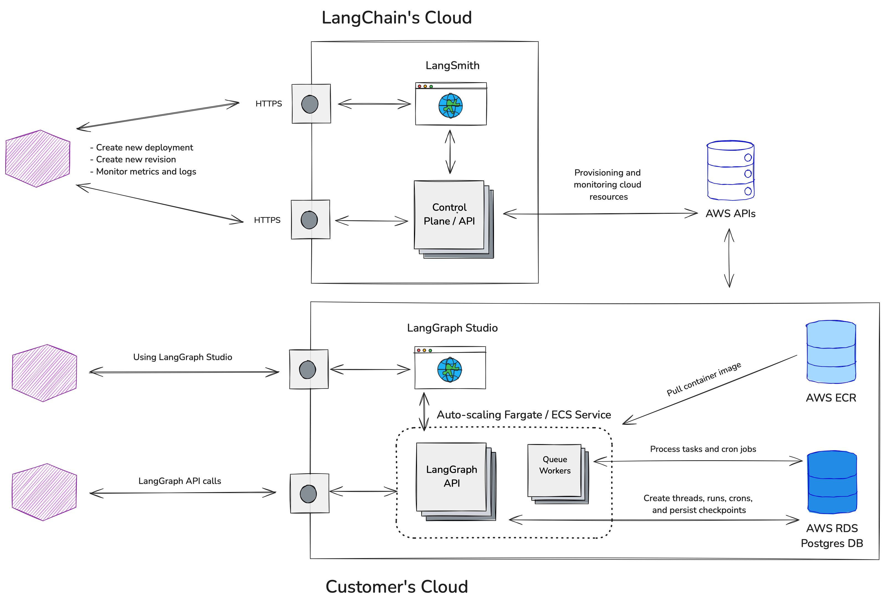

# Bring Your Own Cloud (BYOC)

!!! note Prerequisites

    - [LangGraph Platform](./langgraph_platform.md)
    - [Deployment Options](./deployment_options.md)

## Architecture

Split control plane (hosted by us) and data plane (hosted by you, managed by us).

|                             | Control Plane                   | Data Plane                                    |
|-----------------------------|---------------------------------|-----------------------------------------------|
| What it does                | Manages deployments, revisions. | Runs your LangGraph graphs, stores your data. |
| Where it is hosted          | LangChain Cloud account         | Your cloud account                            |
| Who provisions and monitors | LangChain                       | LangChain                                     |

LangChain has no direct access to the resources created in your cloud account, and can only interact with them via AWS APIs. Your data never leaves your cloud account / VPC at rest or in transit.

## Requirements

- You’re using AWS already.
- You use `langgraph-cli` and/or [LangGraph Studio](./langgraph_studio.md) app to test graph locally.
- You use `langgraph build` command to build image and then push it to your AWS ECR repository (`docker push`).

## How it works

- We provide you a [Terraform module](https://github.com/langchain-ai/terraform/tree/main/modules/langgraph_cloud_setup) which you run to set up our requirements
    1. Creates an AWS role (which our control plane will later assume to provision and monitor resources)
        - https://docs.aws.amazon.com/aws-managed-policy/latest/reference/AmazonVPCReadOnlyAccess.html
            - Read VPCS to find subnets
        - https://docs.aws.amazon.com/aws-managed-policy/latest/reference/AmazonECS_FullAccess.html
            - Used to create/delete ECS resources for your LangGraph Cloud instances
        - https://docs.aws.amazon.com/aws-managed-policy/latest/reference/SecretsManagerReadWrite.html
            - Create secrets for your ECS resources
        - https://docs.aws.amazon.com/aws-managed-policy/latest/reference/CloudWatchReadOnlyAccess.html
            - Read CloudWatch metrics/logs to monitor your instances/push deployment logs
        - https://docs.aws.amazon.com/aws-managed-policy/latest/reference/AmazonRDSFullAccess.html
            - Provision `RDS` instances for your LangGraph Cloud instances
    2. Either
        - Tags an existing vpc / subnets as `langgraph-cloud-enabled`
        - Creates a new vpc and subnets and tags them as `langgraph-cloud-enabled`
- You create a LangGraph Cloud Project in `smith.langchain.com` providing
    - the ID of the AWS role created in the step above
    - the AWS ECR repo to pull the service image from
- We provision the resources in your cloud account using the role above
- We monitor those resources to ensure uptime and recovery from errors

Notes for customers using [self-hosted LangSmith](https://docs.smith.langchain.com/self_hosting):

- Creation of new LangGraph Cloud projects and revisions currently needs to be done on smith.langchain.com.
- You can however set up the project to trace to your self-hosted LangSmith instance if desired
