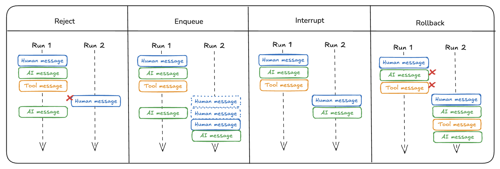

# Double Texting

!!! info "Prerequisites"
    - [LangGraph Server](./langgraph_server.md)

Many times users might interact with your graph in unintended ways.
For instance, a user may send one message and before the graph has finished running send a second message.
More generally, users may invoke the graph a second time before the first run has finished.
We call this "double texting".

Currently, LangGraph only addresses this as part of [LangGraph Platform](langgraph_platform.md), not in the open source.
The reason for this is that in order to handle this we need to know how the graph is deployed, and since LangGraph Platform deals with deployment the logic needs to live there.
If you do not want to use LangGraph Platform, we describe the options we have implemented in detail below.

## Reject

This is the simplest option, this just rejects any follow up runs and does not allow double texting.
See the [how-to guide](/langgraphjs/cloud/how-tos/reject_concurrent) for configuring the reject double text option.

## Enqueue

This is a relatively simple option which continues the first run until it completes the whole run, then sends the new input as a separate run.
See the [how-to guide](/langgraphjs/cloud/how-tos/enqueue_concurrent) for configuring the enqueue double text option.

## Interrupt

This option interrupts the current execution but saves all the work done up until that point.
It then inserts the user input and continues from there.

If you enable this option, your graph should be able to handle weird edge cases that may arise.
For example, you could have called a tool but not yet gotten back a result from running that tool.
You may need to remove that tool call in order to not have a dangling tool call.

See the [how-to guide](/langgraphjs/cloud/how-tos/interrupt_concurrent) for configuring the interrupt double text option.

## Rollback

This option rolls back all work done up until that point.
It then sends the user input in, basically as if it just followed the original run input.

This may create some weird states - for example, you may have two `User` messages in a row, with no `Assistant` message in between them.

You will need to make sure the LLM you are calling can handle that, or combine those into a single `User` message.

See the [how-to guide](/langgraphjs/cloud/how-tos/rollback_concurrent) for configuring the rollback double text option.
