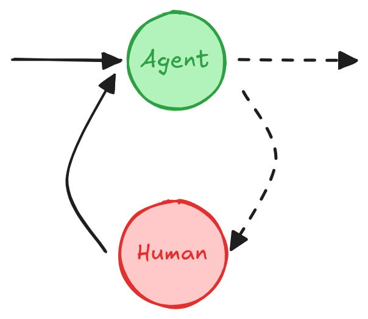

# Human-in-the-loop

!!! tip "This guide uses the new `interrupt` function."

    As of LangGraph 0.2.31, the recommended way to set breakpoints is using the [`interrupt` function](/langgraphjs/reference/functions/langgraph.interrupt-1.html) as it simplifies **human-in-the-loop** patterns.

    If you're looking for the previous version of this conceptual guide, which relied on static breakpoints and `NodeInterrupt` exception, it is available [here](v0-human-in-the-loop.md).

A **human-in-the-loop** (or "on-the-loop") workflow integrates human input into automated processes, allowing for decisions, validation, or corrections at key stages. This is especially useful in **LLM-based applications**, where the underlying model may generate occasional inaccuracies. In low-error-tolerance scenarios like compliance, decision-making, or content generation, human involvement ensures reliability by enabling review, correction, or override of model outputs.

## Use cases

Key use cases for **human-in-the-loop** workflows in LLM-based applications include:

1. [**🛠️ Reviewing tool calls**](#review-tool-calls): Humans can review, edit, or approve tool calls requested by the LLM before tool execution.

2. **✅ Validating LLM outputs**: Humans can review, edit, or approve content generated by the LLM.

3. **💡 Providing context**: Enable the LLM to explicitly request human input for clarification or additional details or to support multi-turn conversations.

## `interrupt`

The [`interrupt` function](/langgraphjs/reference/functions/langgraph.interrupt-1.html) in LangGraph enables human-in-the-loop workflows by pausing the graph at a specific node, presenting information to a human, and resuming the graph with their input. This function is useful for tasks like approvals, edits, or collecting additional input. The [`interrupt` function](/langgraphjs/reference/functions/langgraph.interrupt-1.html) is used in conjunction with the [`Command`](/langgraphjs/reference/classes/langgraph.Command.html) object to resume the graph with a value provided by the human.

```typescript
import { interrupt } from "@langchain/langgraph";

function humanNode(state: typeof GraphAnnotation.State) {
  const value = interrupt(
    // Any JSON serializable value to surface to the human.
    // For example, a question or a piece of text or a set of keys in the state
    {
      text_to_revise: state.some_text,
    }
  );
  // Update the state with the human's input or route the graph based on the input
  return {
    some_text: value,
  };
}

const graph = workflow.compile({
  checkpointer, // Required for `interrupt` to work
});

// Run the graph until the interrupt
const threadConfig = { configurable: { thread_id: "some_id" } };
await graph.invoke(someInput, threadConfig);

// Below code can run some amount of time later and/or in a different process

// Human input
const valueFromHuman = "...";

// Resume the graph with the human's input
await graph.invoke(new Command({ resume: valueFromHuman }), threadConfig);
```

```typescript
{
  some_text: "Edited text";
}
```

??? "Full Code"

      Here's a full example of how to use `interrupt` in a graph, if you'd like
      to see the code in action.

      ```typescript
      import { MemorySaver, Annotation, interrupt, Command, StateGraph } from "@langchain/langgraph";

      // Define the graph state
      const StateAnnotation = Annotation.Root({
        some_text: Annotation<string>()
      });

      function humanNode(state: typeof StateAnnotation.State) {
         const value = interrupt(
            // Any JSON serializable value to surface to the human.
            // For example, a question or a piece of text or a set of keys in the state
            {
               text_to_revise: state.some_text
            }
         );
         return {
            // Update the state with the human's input
            some_text: value
         };
      }

      // Build the graph
      const workflow = new StateGraph(StateAnnotation)
      // Add the human-node to the graph
        .addNode("human_node", humanNode)
        .addEdge("__start__", "human_node")

      // A checkpointer is required for `interrupt` to work.
      const checkpointer = new MemorySaver();
      const graph = workflow.compile({
         checkpointer
      });

      // Using stream() to directly surface the `__interrupt__` information.
      for await (const chunk of await graph.stream(
         { some_text: "Original text" },
         threadConfig
      )) {
         console.log(chunk);
      }

      // Resume using Command
      for await (const chunk of await graph.stream(
         new Command({ resume: "Edited text" }),
         threadConfig
      )) {
         console.log(chunk);
      }
      ```

      ```typescript
      {
         __interrupt__: [
            {
               value: { question: 'Please revise the text', some_text: 'Original text' },
               resumable: true,
               ns: ['human_node:10fe492f-3688-c8c6-0d0a-ec61a43fecd6'],
               when: 'during'
            }
         ]
      }
      { human_node: { some_text: 'Edited text' } }
      ```

## Requirements

To use `interrupt` in your graph, you need to:

1. [**Specify a checkpointer**](persistence.md#checkpoints) to save the graph state after each step.

2. **Call `interrupt()`** in the appropriate place. See the [Design Patterns](#design-patterns) section for examples.

3. **Run the graph** with a [**thread ID**](./persistence.md#threads) until the `interrupt` is hit.

4. **Resume execution** using `invoke`/`stream` (see [**The `Command` primitive**](#the-command-primitive)).

## Design Patterns

There are typically three different **actions** that you can do with a human-in-the-loop workflow:

1. **Approve or Reject**: Pause the graph before a critical step, such as an API call, to review and approve the action. If the action is rejected, you can prevent the graph from executing the step, and potentially take an alternative action. This pattern often involves **routing** the graph based on the human's input.

2. **Edit Graph State**: Pause the graph to review and edit the graph state. This is useful for correcting mistakes or updating the state with additional information. This pattern often involves **updating** the state with the human's input.

3. **Get Input**: Explicitly request human input at a particular step in the graph. This is useful for collecting additional information or context to inform the agent's decision-making process or for supporting **multi-turn conversations**.

Below we show different design patterns that can be implemented using these **actions**.

**Note:** The `interrupt` function propagates by throwing a special `GraphInterrupt` error. Therefore, you should avoid using `try/catch` blocks around the `interrupt` function - or if you do, ensure that the `GraphInterrupt` error is thrown again within your `catch` block.

### Approve or Reject

<figure markdown="1">

{: style="max-height:400px"}

<figcaption>Depending on the human's approval or rejection, the graph can proceed with the action or take an alternative path.</figcaption>

</figure>

Pause the graph before a critical step, such as an API call, to review and approve the action. If the action is rejected, you can prevent the graph from executing the step, and potentially take an alternative action.

```typescript
import { interrupt, Command } from "@langchain/langgraph";

function humanApproval(state: typeof GraphAnnotation.State): Command {
  const isApproved = interrupt({
    question: "Is this correct?",
    // Surface the output that should be
    // reviewed and approved by the human.
    llm_output: state.llm_output,
  });

  if (isApproved) {
    return new Command({ goto: "some_node" });
  } else {
    return new Command({ goto: "another_node" });
  }
}

// Add the node to the graph in an appropriate location
// and connect it to the relevant nodes.
const graph = graphBuilder
  .addNode("human_approval", humanApproval)
  .compile({ checkpointer });

// After running the graph and hitting the interrupt, the graph will pause.
// Resume it with either an approval or rejection.
const threadConfig = { configurable: { thread_id: "some_id" } };
await graph.invoke(new Command({ resume: true }), threadConfig);
```

See [how to review tool calls](/langgraphjs/how-tos/review-tool-calls) for a more detailed example.

### Review & Edit State

<figure markdown="1">

{: style="max-height:400px"}

<figcaption>A human can review and edit the state of the graph. This is useful for correcting mistakes or updating the state with additional information.

</figcaption>

</figure>

```typescript
import { interrupt } from "@langchain/langgraph";

function humanEditing(state: typeof GraphAnnotation.State): Command {
  const result = interrupt({
    // Interrupt information to surface to the client.
    // Can be any JSON serializable value.
    task: "Review the output from the LLM and make any necessary edits.",
    llm_generated_summary: state.llm_generated_summary,
  });

  // Update the state with the edited text
  return {
    llm_generated_summary: result.edited_text,
  };
}

// Add the node to the graph in an appropriate location
// and connect it to the relevant nodes.
const graph = graphBuilder
  .addNode("human_editing", humanEditing)
  .compile({ checkpointer });

// After running the graph and hitting the interrupt, the graph will pause.
// Resume it with the edited text.
const threadConfig = { configurable: { thread_id: "some_id" } };
await graph.invoke(
  new Command({ resume: { edited_text: "The edited text" } }),
  threadConfig
);
```

See [How to wait for user input using interrupt](/langgraphjs/how-tos/wait-user-input) for a more detailed example.

### Review Tool Calls

<figure markdown="1">

{: style="max-height:400px"}

<figcaption>A human can review and edit the output from the LLM before proceeding. This is particularly
critical in applications where the tool calls requested by the LLM may be sensitive or require human oversight.

</figcaption>

</figure>

```typescript
import { interrupt, Command } from "@langchain/langgraph";

function humanReviewNode(state: typeof GraphAnnotation.State): Command {
  // This is the value we'll be providing via Command.resume(<human_review>)
  const humanReview = interrupt({
    question: "Is this correct?",
    // Surface tool calls for review
    tool_call: toolCall,
  });

  const [reviewAction, reviewData] = humanReview;

  // Approve the tool call and continue
  if (reviewAction === "continue") {
    return new Command({ goto: "run_tool" });
  }
  // Modify the tool call manually and then continue
  else if (reviewAction === "update") {
    const updatedMsg = getUpdatedMsg(reviewData);
    // Remember that to modify an existing message you will need
    // to pass the message with a matching ID.
    return new Command({
      goto: "run_tool",
      update: { messages: [updatedMsg] },
    });
  }
  // Give natural language feedback, and then pass that back to the agent
  else if (reviewAction === "feedback") {
    const feedbackMsg = getFeedbackMsg(reviewData);
    return new Command({
      goto: "call_llm",
      update: { messages: [feedbackMsg] },
    });
  }
}
```

See [how to review tool calls](/langgraphjs/how-tos/review-tool-calls) for a more detailed example.

### Multi-turn conversation

<figure markdown="1">

{: style="max-height:400px"}

<figcaption>A <strong>multi-turn conversation</strong> architecture where an <strong>agent</strong> and <strong>human node</strong> cycle back and forth until the agent decides to hand off the conversation to another agent or another part of the system.

</figcaption>

</figure>

A **multi-turn conversation** involves multiple back-and-forth interactions between an agent and a human, which can allow the agent to gather additional information from the human in a conversational manner.

This design pattern is useful in an LLM application consisting of [multiple agents](./multi_agent.md). One or more agents may need to carry out multi-turn conversations with a human, where the human provides input or feedback at different stages of the conversation. For simplicity, the agent implementation below is illustrated as a single node, but in reality it may be part of a larger graph consisting of multiple nodes and include a conditional edge.

=== "Using a human node per agent"

    In this pattern, each agent has its own human node for collecting user input.

    This can be achieved by either naming the human nodes with unique names (e.g., "human for agent 1", "human for agent 2") or by
    using subgraphs where a subgraph contains a human node and an agent node.

    ```typescript
    import { interrupt } from "@langchain/langgraph";

    function humanInput(state: typeof GraphAnnotation.State) {
      const humanMessage = interrupt("human_input");

      return {
        messages: [
          {
            role: "human",
            content: humanMessage
          }
        ]
      };
    }

    function agent(state: typeof GraphAnnotation.State) {
      // Agent logic
      // ...
    }

    const graph = graphBuilder
      .addNode("human_input", humanInput)
      .addEdge("human_input", "agent")
      .compile({ checkpointer });

    // After running the graph and hitting the interrupt, the graph will pause.
    // Resume it with the human's input.
    await graph.invoke(
      new Command({ resume: "hello!" }),
      threadConfig
    );
    ```

=== "Sharing human node across multiple agents"

    In this pattern, a single human node is used to collect user input for multiple agents. The active agent is determined from the state, so after human input is collected, the graph can route to the correct agent.

    ```typescript
    import { interrupt, Command, MessagesAnnotation } from "@langchain/langgraph";

    function humanNode(state: typeof MessagesAnnotation.State): Command {
      /**
       * A node for collecting user input.
       */
      const userInput = interrupt("Ready for user input.");

      // Determine the **active agent** from the state, so
      // we can route to the correct agent after collecting input.
      // For example, add a field to the state or use the last active agent.
      // or fill in `name` attribute of AI messages generated by the agents.
      const activeAgent = ...;

      return new Command({
        goto: activeAgent,
        update: {
          messages: [{
            role: "human",
            content: userInput,
          }]
        }
      });
    }
    ```

See [how to implement multi-turn conversations](/langgraphjs/how-tos/multi-agent-multi-turn-convo) for a more detailed example.

### Validating human input

If you need to validate the input provided by the human within the graph itself (rather than on the client side), you can achieve this by using multiple interrupt calls within a single node.

```typescript
import { interrupt } from "@langchain/langgraph";

function humanNode(state: typeof GraphAnnotation.State) {
  /**
   * Human node with validation.
   */
  let question = "What is your age?";

  while (true) {
    const answer = interrupt(question);

    // Validate answer, if the answer isn't valid ask for input again.
    if (typeof answer !== "number" || answer < 0) {
      question = `'${answer}' is not a valid age. What is your age?`;
      continue;
    } else {
      // If the answer is valid, we can proceed.
      break;
    }
  }

  console.log(`The human in the loop is ${answer} years old.`);

  return {
    age: answer,
  };
}
```

## The `Command` primitive

When using the `interrupt` function, the graph will pause at the interrupt and wait for user input.

Graph execution can be resumed using the [Command](/langgraphjs/reference/classes/langgraph.Command.html) primitive which can be passed through the `invoke` or `stream` methods.

The `Command` primitive provides several options to control and modify the graph's state during resumption:

1. **Pass a value to the `interrupt`**: Provide data, such as a user's response, to the graph using `new Command({ resume: value })`. Execution resumes from the beginning of the node where the `interrupt` was used, however, this time the `interrupt(...)` call will return the value passed in the `new Command({ resume: value })` instead of pausing the graph.

   ```typescript
   // Resume graph execution with the user's input.
   await graph.invoke(new Command({ resume: { age: "25" } }), threadConfig);
   ```

2. **Update the graph state**: Modify the graph state using `Command({ goto: ..., update: ... })`. Note that resumption starts from the beginning of the node where the `interrupt` was used. Execution resumes from the beginning of the node where the `interrupt` was used, but with the updated state.

   ```typescript
   // Update the graph state and resume.
   // You must provide a `resume` value if using an `interrupt`.
   await graph.invoke(
     new Command({ resume: "Let's go!!!", update: { foo: "bar" } }),
     threadConfig
   );
   ```

By leveraging `Command`, you can resume graph execution, handle user inputs, and dynamically adjust the graph's state.

## Using with `invoke`

When you use `stream` to run the graph, you will receive an `Interrupt` event that lets you know the `interrupt` was triggered.

`invoke` does not return the interrupt information. To access this information, you must use the [getState](/langgraphjs/reference/classes/langgraph.CompiledStateGraph.html#getState) method to retrieve the graph state after calling `invoke`.

```typescript
// Run the graph up to the interrupt
const result = await graph.invoke(inputs, threadConfig);

// Get the graph state to get interrupt information.
const state = await graph.getState(threadConfig);

// Print the state values
console.log(state.values);

// Print the pending tasks
console.log(state.tasks);

// Resume the graph with the user's input.
await graph.invoke(new Command({ resume: { age: "25" } }), threadConfig);
```

```typescript
{
  foo: "bar";
} // State values

[
  {
    id: "5d8ffc92-8011-0c9b-8b59-9d3545b7e553",
    name: "node_foo",
    path: ["__pregel_pull", "node_foo"],
    error: null,
    interrupts: [
      {
        value: "value_in_interrupt",
        resumable: true,
        ns: ["node_foo:5d8ffc92-8011-0c9b-8b59-9d3545b7e553"],
        when: "during",
      },
    ],
    state: null,
    result: null,
  },
]; // Pending tasks. interrupts
```

## How does resuming from an interrupt work?

A critical aspect of using `interrupt` is understanding how resuming works. When you resume execution after an `interrupt`, graph execution starts from the **beginning** of the **graph node** where the last `interrupt` was triggered.

**All** code from the beginning of the node to the `interrupt` will be re-executed.

```typescript
let counter = 0;

function node(state: State) {
  // All the code from the beginning of the node to the interrupt will be re-executed
  // when the graph resumes.
  counter += 1;

  console.log(`> Entered the node: ${counter} # of times`);

  // Pause the graph and wait for user input.
  const answer = interrupt();

  console.log("The value of counter is:", counter);
  // ...
}
```

Upon **resuming** the graph, the counter will be incremented a second time, resulting in the following output:

```typescript
> Entered the node: 2 # of times
The value of counter is: 2
```

## Common Pitfalls

### Side-effects

Place code with side effects, such as API calls, **after** the `interrupt` to avoid duplication, as these are re-triggered every time the node is resumed.

=== "Side effects before interrupt (BAD)"

    This code will re-execute the API call another time when the node is resumed from
    the `interrupt`.
    This can be problematic if the API call is not idempotent or is just expensive.

    ```typescript
    import { interrupt } from "@langchain/langgraph";

    function humanNode(state: typeof GraphAnnotation.State) {
      /**
       * Human node with validation.
       */
      apiCall(); // This code will be re-executed when the node is resumed.

      const answer = interrupt(question);
    }
    ```

=== "Side effects after interrupt (OK)"

    ```typescript
    import { interrupt } from "@langchain/langgraph";

    function humanNode(state: typeof GraphAnnotation.State) {
      /**
       * Human node with validation.
       */

      const answer = interrupt(question);

      apiCall(answer); // OK as it's after the interrupt
    }
    ```

=== "Side effects in a separate node (OK)"

    ```typescript
    import { interrupt } from "@langchain/langgraph";

    function humanNode(state: typeof GraphAnnotation.State) {
      /**
       * Human node with validation.
       */

      const answer = interrupt(question);

      return {
        answer
      };
    }

    function apiCallNode(state: typeof GraphAnnotation.State) {
      apiCall(); // OK as it's in a separate node
    }
    ```

### Subgraphs called as functions

When invoking a subgraph [as a function](low_level.md#as-a-function), the **parent graph** will resume execution from the **beginning of the node** where the subgraph was invoked (and where an `interrupt` was triggered). Similarly, the **subgraph**, will resume from the **beginning of the node** where the `interrupt()` function was called.

For example,

```typescript
async function nodeInParentGraph(state: typeof GraphAnnotation.State) {
    someCode();  // <-- This will re-execute when the subgraph is resumed.
    // Invoke a subgraph as a function.
    // The subgraph contains an `interrupt` call.
    const subgraphResult = await subgraph.invoke(someInput);
    ...
}
```

??? "**Example: Parent and Subgraph Execution Flow**"

      Say we have a parent graph with 3 nodes:

      **Parent Graph**: `node_1` → `node_2` (subgraph call) → `node_3`

      And the subgraph has 3 nodes, where the second node contains an `interrupt`:

      **Subgraph**: `sub_node_1` → `sub_node_2` (`interrupt`) → `sub_node_3`

      When resuming the graph, the execution will proceed as follows:

      1. **Skip `node_1`** in the parent graph (already executed, graph state was saved in snapshot).
      2. **Re-execute `node_2`** in the parent graph from the start.
      3. **Skip `sub_node_1`** in the subgraph (already executed, graph state was saved in snapshot).
      4. **Re-execute `sub_node_2`** in the subgraph from the beginning.
      5. Continue with `sub_node_3` and subsequent nodes.

      Here is abbreviated example code that you can use to understand how subgraphs work with interrupts.
      It counts the number of times each node is entered and prints the count.

      ```typescript
      import {
        StateGraph,
        START,
        interrupt,
        Command,
        MemorySaver,
        Annotation
      } from "@langchain/langgraph";

      const GraphAnnotation = Annotation.Root({
        stateCounter: Annotation<number>({
          reducer: (a, b) => a + b,
          default: () => 0
        })
      })

      let counterNodeInSubgraph = 0;

      function nodeInSubgraph(state: typeof GraphAnnotation.State) {
        counterNodeInSubgraph += 1;  // This code will **NOT** run again!
        console.log(`Entered 'nodeInSubgraph' a total of ${counterNodeInSubgraph} times`);
        return {};
      }

      let counterHumanNode = 0;

      async function humanNode(state: typeof GraphAnnotation.State) {
        counterHumanNode += 1; // This code will run again!
        console.log(`Entered humanNode in sub-graph a total of ${counterHumanNode} times`);
        const answer = await interrupt("what is your name?");
        console.log(`Got an answer of ${answer}`);
        return {};
      }

      const checkpointer = new MemorySaver();

      const subgraphBuilder = new StateGraph(GraphAnnotation)
        .addNode("some_node", nodeInSubgraph)
        .addNode("human_node", humanNode)
        .addEdge(START, "some_node")
        .addEdge("some_node", "human_node")
      const subgraph = subgraphBuilder.compile({ checkpointer });

      let counterParentNode = 0;

      async function parentNode(state: typeof GraphAnnotation.State) {
        counterParentNode += 1; // This code will run again on resuming!
        console.log(`Entered 'parentNode' a total of ${counterParentNode} times`);

        // Please note that we're intentionally incrementing the state counter
        // in the graph state as well to demonstrate that the subgraph update
        // of the same key will not conflict with the parent graph (until
        const subgraphState = await subgraph.invoke(state);
        return subgraphState;
      }

      const builder = new StateGraph(GraphAnnotation)
        .addNode("parent_node", parentNode)
        .addEdge(START, "parent_node")

      // A checkpointer must be enabled for interrupts to work!
      const graph = builder.compile({ checkpointer });

      const config = {
        configurable: {
          thread_id: crypto.randomUUID(),
        }
      };

      for await (const chunk of await graph.stream({ stateCounter: 1 }, config)) {
        console.log(chunk);
      }

      console.log('--- Resuming ---');

      for await (const chunk of await graph.stream(new Command({ resume: "35" }), config)) {
        console.log(chunk);
      }
      ```

      This will print out

      ```typescript
      --- First invocation ---
      In parent node: { foo: 'bar' }
      Entered 'parentNode' a total of 1 times
      Entered 'nodeInSubgraph' a total of 1 times
      Entered humanNode in sub-graph a total of 1 times
      { __interrupt__: [{ value: 'what is your name?', resumable: true, ns: ['parent_node:0b23d72f-aaba-0329-1a59-ca4f3c8bad3b', 'human_node:25df717c-cb80-57b0-7410-44e20aac8f3c'], when: 'during' }] }

      --- Resuming ---
      In parent node: { foo: 'bar' }
      Entered 'parentNode' a total of 2 times
      Entered humanNode in sub-graph a total of 2 times
      Got an answer of 35
      { parent_node: null }
      ```

### Using multiple interrupts

Using multiple interrupts within a **single** node can be helpful for patterns like [validating human input](#validating-human-input). However, using multiple interrupts in the same node can lead to unexpected behavior if not handled carefully.

When a node contains multiple interrupt calls, LangGraph keeps a list of resume values specific to the task executing the node. Whenever execution resumes, it starts at the beginning of the node. For each interrupt encountered, LangGraph checks if a matching value exists in the task's resume list. Matching is **strictly index-based**, so the order of interrupt calls within the node is critical.

To avoid issues, refrain from dynamically changing the node's structure between executions. This includes adding, removing, or reordering interrupt calls, as such changes can result in mismatched indices. These problems often arise from unconventional patterns, such as mutating state via `Command.resume(...).update(SOME_STATE_MUTATION)` or relying on global variables to modify the node's structure dynamically.

??? "Example of incorrect code"

    ```typescript
    import { v4 as uuidv4 } from "uuid";
    import {
      StateGraph,
      MemorySaver,
      START,
      interrupt,
      Command,
      Annotation
    } from "@langchain/langgraph";

    const GraphAnnotation = Annotation.Root({
      name: Annotation<string>(),
      age: Annotation<string>()
    });

    function humanNode(state: typeof GraphAnnotation.State) {
      let name;
      if (!state.name) {
        name = interrupt("what is your name?");
      } else {
        name = "N/A";
      }

      let age;
      if (!state.age) {
        age = interrupt("what is your age?");
      } else {
        age = "N/A";
      }

      console.log(`Name: ${name}. Age: ${age}`);

      return {
        age,
        name,
      };
    }

    const builder = new StateGraph(GraphAnnotation)
      .addNode("human_node", humanNode);
      .addEdge(START, "human_node");

    // A checkpointer must be enabled for interrupts to work!
    const checkpointer = new MemorySaver();

    const graph = builder.compile({ checkpointer });

    const config = {
      configurable: {
        thread_id: uuidv4(),
      }
    };

    for await (const chunk of await graph.stream({ age: undefined, name: undefined }, config)) {
      console.log(chunk);
    }

    for await (const chunk of await graph.stream(
      new Command({ resume: "John", update: { name: "foo" } }),
      config
    )) {
      console.log(chunk);
    }
    ```

    ```typescript
    { __interrupt__: [{
      value: 'what is your name?',
      resumable: true,
      ns: ['human_node:3a007ef9-c30d-c357-1ec1-86a1a70d8fba'],
      when: 'during'
    }]}
    Name: N/A. Age: John
    { human_node: { age: 'John', name: 'N/A' } }
    ```

## Additional Resources 📚

- [**Conceptual Guide: Persistence**](persistence.md#replay): Read the persistence guide for more context on replaying.

- [**How to Guides: Human-in-the-loop**](/langgraphjs/how-tos/#human-in-the-loop): Learn how to implement human-in-the-loop workflows in LangGraph.

- [**How to implement multi-turn conversations**](/langgraphjs/how-tos/multi-agent-multi-turn-convo): Learn how to implement multi-turn conversations in LangGraph.
