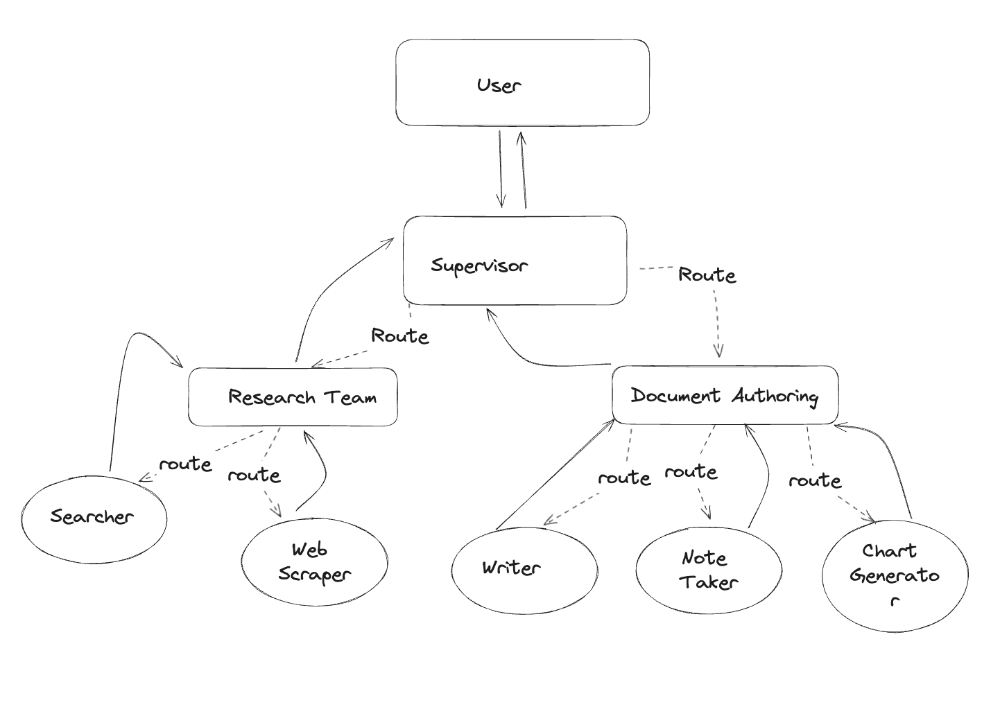

# Multi-agent Systems

A multi-agent system is a system with multiple independent actors powered by LLMs that are connected in a specific way. These actors can be as simple as a prompt and an LLM call, or as complex as a [ReAct](./agentic_concepts.md#react-implementation) agent.

The primary benefits of this architecture are:

* **Modularity**: Separate agents facilitate easier development, testing, and maintenance of agentic systems.
* **Specialization**: You can create expert agents focused on specific domains, and compose them into more complex applications
* **Control**: You can explicitly control how agents communicate (as opposed to relying on function calling)

## Multi-agent systems in LangGraph

### Agents as nodes

Agents can be defined as nodes in LangGraph. As any other node in the LangGraph, these agent nodes receive the graph state as an input and return an update to the state as their output.

* Simple **LLM nodes**: single LLMs with custom prompts
* **Subgraph nodes**: complex graphs called inside the orchestrator graph node


### Agents as tools

Agents can also be defined as tools. In this case, the orchestrator agent (e.g. ReAct agent) would use a tool-calling LLM to decide which of the agent tools to call, as well as the arguments to pass to those agents.

You could also take a "mega-graph" approach – incorporating subordinate agents' nodes directly into the parent, orchestrator graph. However, this is not recommended for complex subordinate agents, as it would make the overall system harder to scale, maintain and debug – you should use subgraphs or tools in those cases.

## Communication in multi-agent systems

A big question in multi-agent systems is how the agents communicate amongst themselves and with the orchestrator agent. This involves both the schema of how they communicate, as well as the sequence in which they communicate. LangGraph is perfect for orchestrating these types of systems and allows you to define both.

### Schema

LangGraph provides a lot of flexibility for how to communicate within multi-agent architectures.

* A node in LangGraph can have a [private input state schema](/langgraphjs/how-tos/pass_private_state/) that is distinct from the graph state schema. This allows passing additional information during the graph execution that is only needed for executing a particular node.
* Subgraph node agents can have independent [input / output state schemas](/langgraphjs/how-tos/input_output_schema/). In this case it’s important to [add input / output transformations](/langgraphjs/how-tos/subgraph-transform-state/) so that the parent graph knows how to communicate with the subgraphs.
* For tool-based subordinate agents, the orchestrator determines the inputs based on the tool schema. Additionally, LangGraph allows passing state to individual tools at runtime, so subordinate agents can access parent state, if needed.

### Sequence

LangGraph provides multiple methods to control agent communication sequence:

* **Explicit control flow (graph edges)**: LangGraph allows you to define the control flow of your application (i.e. the sequence of how agents communicate) explicitly, via [graph edges](./low_level.md#edges).

```typescript
import { ChatOpenAI } from "@langchain/openai";
import { SystemMessage } from "@langchain/core/messages";
import { StateGraph, MessagesAnnotation } from "langgraph";

const model = new ChatOpenAI({ model: "gpt-4o" });

const researchAgent = async (state: typeof MessagesAnnotation.State) => {
  const messages = [
    new SystemMessage("You are a research assistant. Given a topic, provide key facts and information."),
    ...state.messages
  ];
  const response = await model.invoke(messages);
  return { messages: [response] };
};

const summarizeAgent = async (state: typeof MessagesAnnotation.State) => {
  const messages = [
    new SystemMessage("You are a summarization expert. Condense the given information into a brief summary."),
    ...state.messages
  ];
  const response = await model.invoke(messages);
  return { messages: [response] };
};

const graph = new StateGraph(MessagesAnnotation)
    .addNode("research", researchAgent)
    .addNode("summarize", summarizeAgent)
    // Define the flow explicitly
    .addEdge("start", "research")
    .addEdge("research", "summarize")
    .addEdge("summarize", "end");

// Compile the graph
const app = graph.compile();
```

* **Dynamic control flow (conditional edges)**: LangGraph also allows you to define [conditional edges](./low_level.md#conditional-edges), where the control flow is dependent on satisfying a given condition. In such cases, you can use an LLM to decide which subordinate agent to call next.


* **Implicit control flow (tool calling)**: if the orchestrator agent treats subordinate agents as tools, the tool-calling LLM powering the orchestrator will make decisions about the order in which the tools (agents) are being called.

```typescript
import { ChatOpenAI } from "@langchain/openai";
import { SystemMessage, ToolMessage } from "@langchain/core/messages";
import { StateGraph, MessagesAnnotation } from "langgraph";
import { ToolNode, InjectedState, createReactAgent } from "langgraph/prebuilt";

const model = new ChatOpenAI({ model: "gpt-4o-mini" });

const researchAgent = async (state: typeof MessagesAnnotation.State) => {
  const messages = [
    new SystemMessage("You are a research assistant. Given a topic, provide key facts and information."),
    ...state.messages.slice(0, -1)
  ];
  const response = await model.invoke(messages);
  const toolCall = state.messages[state.messages.length - 1].tool_calls[0];
  return { messages: [new ToolMessage({ content: response.content, toolCallId: toolCall.id })] };
};

const summarizeAgent = async (state: typeof MessagesAnnotation.State) => {
  const messages = [
    new SystemMessage("You are a summarization expert. Condense the given information into a brief summary."),
    ...state.messages.slice(0, -1)
  ];
  const response = await model.invoke(messages);
  const toolCall = state.messages[state.messages.length - 1].tool_calls[0];
  return { messages: [new ToolMessage({ content: response.content, toolCallId: toolCall.id })] };
};

const tools = [researchAgent, summarizeAgent];
const toolNode = new ToolNode(tools);

const graph = createReactAgent({
    llm: model,
    tools,
    messageModifier: "First research and then summarize information on a given topic."
});
```

## Example architectures

Below are several examples of complex multi-agent architectures that can be implemented in LangGraph.

### Multi-Agent Collaboration

In this example, different agents collaborate on a **shared** scratchpad of messages (i.e. shared graph state). This means that all the work any of them do is visible to the other ones. The benefit is that the other agents can see all the individual steps done. The downside is that sometimes is it overly verbose and unnecessary to pass ALL this information along, and sometimes only the final answer from an agent is needed. We call this **collaboration** because of the shared nature the scratchpad.

In this case, the independent agents are actually just a single LLM call with a custom system message.

Here is a visualization of how these agents are connected:


See full code example in this [tutorial](/langgraphjs/tutorials/multi_agent/multi_agent_collaboration/).

### Agent Supervisor

In this example, multiple agents are connected, but compared to above they do NOT share a shared scratchpad. Rather, they have their own independent scratchpads (i.e. their own state), and then their final responses are appended to a global scratchpad.

In this case, the independent agents are a LangGraph ReAct agent (graph). This means they have their own individual prompt, LLM, and tools. When called, it's not just a single LLM call, but rather an invocation of the graph powering the ReAct agent.


See full code example in this [tutorial](/langgraphjs/tutorials/multi_agent/agent_supervisor/).

### Hierarchical Agent Teams

What if the job for a single worker in agent supervisor example becomes too complex? What if the number of workers becomes too large? For some applications, the system may be more effective if work is distributed hierarchically. You can do this by creating additional level of subgraphs and creating a top-level supervisor, along with mid-level supervisors:



See full code example in this [tutorial](/langgraphjs/tutorials/multi_agent/hierarchical_agent_teams/).