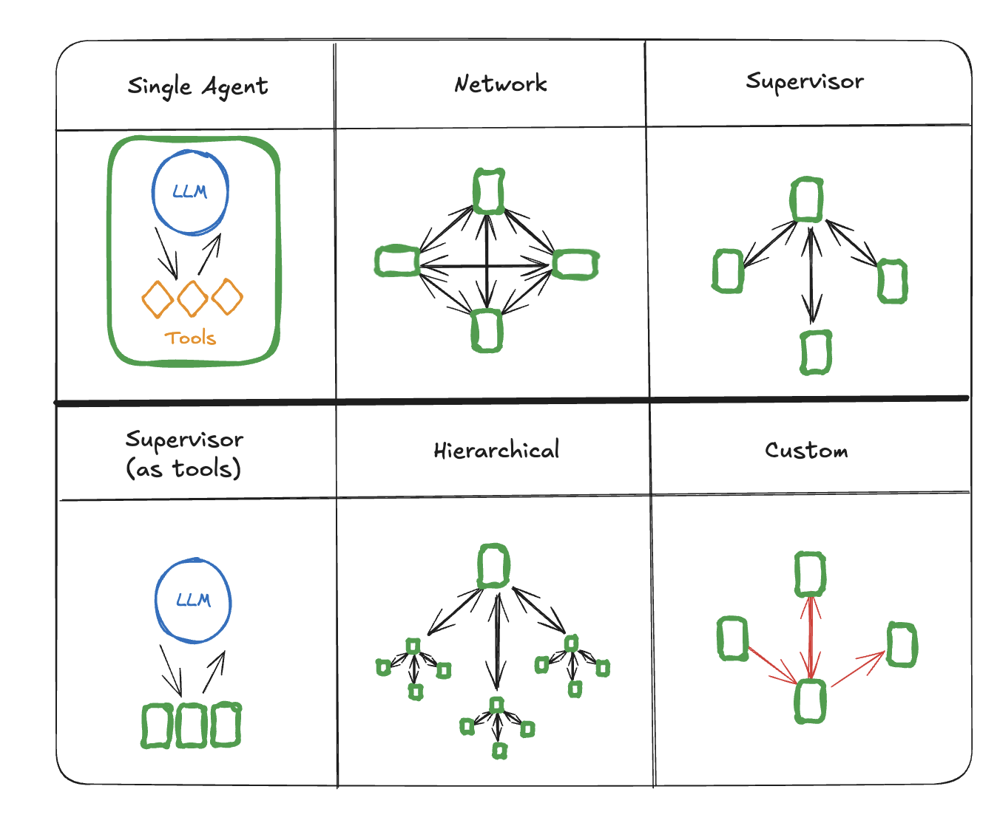

# Multi-agent Systems

An [agent](./agentic_concepts.md#agent-architectures) is _a system that uses an LLM to decide the control flow of an application_. As you develop these systems, they might grow more complex over time, making them harder to manage and scale. For example, you might run into the following problems:

- agent has too many tools at its disposal and makes poor decisions about which tool to call next
- context grows too complex for a single agent to keep track of
- there is a need for multiple specialization areas in the system (e.g. planner, researcher, math expert, etc.)

To tackle these, you might consider breaking your application into multiple smaller, independent agents and composing them into a **multi-agent system**. These independent agents can be as simple as a prompt and an LLM call, or as complex as a [ReAct](./agentic_concepts.md#react-implementation) agent (and more!).

The primary benefits of using multi-agent systems are:

- **Modularity**: Separate agents make it easier to develop, test, and maintain agentic systems.
- **Specialization**: You can create expert agents focused on specific domains, which helps with the overall system performance.
- **Control**: You can explicitly control how agents communicate (as opposed to relying on function calling).

## Multi-agent architectures



There are several ways to connect agents in a multi-agent system:

- **Network**: each agent can communicate with every other agent. Any agent can decide which other agent to call next.
- **Supervisor**: each agent communicates with a single [supervisor](https://langchain-ai.github.io/langgraphjs/tutorials/multi_agent/agent_supervisor/) agent. Supervisor agent makes decisions on which agent should be called next.
- **Hierarchical**: you can define a multi-agent system with a supervisor of supervisors. This is a generalization of the supervisor architecture and allows for more complex control flows.
- **Custom multi-agent workflow**: each agent communicates with only a subset of agents. Parts of the flow are deterministic, and only some agents can decide which other agents to call next.

### Handoffs

In multi-agent architectures, agents can be represented as graph nodes. Each agent node executes its step(s) and decides whether to finish execution or route to another agent, including potentially routing to itself (e.g., running in a loop). A common pattern in multi-agent interactions is handoffs, where one agent hands off control to another. Handoffs allow you to specify:

- __destination__: target agent to navigate to (e.g., name of the node to go to)
- __payload__: [information to pass to that agent](#communication-between-agents) (e.g., state update)

To implement handoffs in LangGraph, agent nodes can return [`Command`](./low_level.md#command) object that allows you to combine both control flow and state updates:

```ts
const agent = (state: typeof StateAnnotation.State) => {
  const goto = getNextAgent(...)  // 'agent' / 'another_agent'
  return new Command({
    // Specify which agent to call next
    goto: goto,
    // Update the graph state
    update: {
      foo: "bar",
    }
  });
};
```

In a more complex scenario where each agent node is itself a graph (i.e., a [subgraph](./low_level.md#subgraphs)), a node in one of the agent subgraphs might want to navigate to a different agent. For example, if you have two agents, `alice` and `bob` (subgraph nodes in a parent graph), and `alice` needs to navigate to `bob`, you can set `graph=Command.PARENT` in the `Command` object:

```ts
const some_node_inside_alice = (state) => {
    return new Command({
      goto: "bob",
      update: {
          foo: "bar",
      },
      // specify which graph to navigate to (defaults to the current graph)
      graph: Command.PARENT,
    })
}
```

### Network

In this architecture, agents are defined as graph nodes. Each agent can communicate with every other agent (many-to-many connections) and can decide which agent to call next. This architecture is good for problems that do not have a clear hierarchy of agents or a specific sequence in which agents should be called.

```ts
import {
  StateGraph,
  Annotation,
  MessagesAnnotation,
  Command
} from "@langchain/langgraph";
import { ChatOpenAI } from "@langchain/openai";

const model = new ChatOpenAI({
  model: "gpt-4o-mini",
});

const agent1 = async (state: typeof MessagesAnnotation.State) => {
  // you can pass relevant parts of the state to the LLM (e.g., state.messages)
  // to determine which agent to call next. a common pattern is to call the model
  // with a structured output (e.g. force it to return an output with a "next_agent" field)
  const response = await model.withStructuredOutput(...).invoke(...);
  return new Command({
    update: {
      messages: [response.content],
    },
    goto: response.next_agent,
  });
};

const agent2 = async (state: typeof MessagesAnnotation.State) => {
  const response = await model.withStructuredOutput(...).invoke(...);
  return new Command({
    update: {
      messages: [response.content],
    },
    goto: response.next_agent,
  });
};

const agent3 = async (state: typeof MessagesAnnotation.State) => {
  ...
  return new Command({
    update: {
      messages: [response.content],
    },
    goto: response.next_agent,
  });
};

const graph = new StateGraph(MessagesAnnotation)
  .addNode("agent1", agent1, {
    ends: ["agent2", "agent3" "__end__"],
  })
  .addNode("agent2", agent2, {
    ends: ["agent1", "agent3", "__end__"],
  })
  .addNode("agent3", agent3, {
    ends: ["agent1", "agent2", "__end__"],
  })
  .addEdge("__start__", "agent1")
  .compile();
```

### Supervisor

In this architecture, we define agents as nodes and add a supervisor node (LLM) that decides which agent nodes should be called next. We use [`Command`](./low_level.md#command) to route execution to the appropriate agent node based on supervisor's decision. This architecture also lends itself well to running multiple agents in parallel or using [map-reduce](../how-tos/map-reduce.ipynb) pattern.

```ts
import {
  StateGraph,
  MessagesAnnotation,
  Command,
} from "@langchain/langgraph";
import { ChatOpenAI } from "@langchain/openai";

const model = new ChatOpenAI({
  model: "gpt-4o-mini",
});

const supervisor = async (state: typeof MessagesAnnotation.State) => {
  // you can pass relevant parts of the state to the LLM (e.g., state.messages)
  // to determine which agent to call next. a common pattern is to call the model
  // with a structured output (e.g. force it to return an output with a "next_agent" field)
  const response = await model.withStructuredOutput(...).invoke(...);
  // route to one of the agents or exit based on the supervisor's decision
  // if the supervisor returns "__end__", the graph will finish execution
  return new Command({
    goto: response.next_agent,
  });
};

const agent1 = async (state: typeof MessagesAnnotation.State) => {
  // you can pass relevant parts of the state to the LLM (e.g., state.messages)
  // and add any additional logic (different models, custom prompts, structured output, etc.)
  const response = await model.invoke(...);
  return new Command({
    goto: "supervisor",
    update: {
      messages: [response],
    },
  });
};

const agent2 = async (state: typeof MessagesAnnotation.State) => {
  const response = await model.invoke(...);
  return new Command({
    goto: "supervisor",
    update: {
      messages: [response],
    },
  });
};

const graph = new StateGraph(MessagesAnnotation)
  .addNode("supervisor", supervisor, {
    ends: ["agent1", "agent2", "__end__"],
  })
  .addNode("agent1", agent1, {
    ends: ["supervisor"],
  })
  .addNode("agent2", agent2, {
    ends: ["supervisor"],
  })
  .addEdge("__start__", "supervisor")
  .compile();
```

Check out this [tutorial](https://langchain-ai.github.io/langgraphjs/tutorials/multi_agent/agent_supervisor/) for an example of supervisor multi-agent architecture.

### Custom multi-agent workflow

In this architecture we add individual agents as graph nodes and define the order in which agents are called ahead of time, in a custom workflow. In LangGraph the workflow can be defined in two ways:

- **Explicit control flow (normal edges)**: LangGraph allows you to explicitly define the control flow of your application (i.e. the sequence of how agents communicate) explicitly, via [normal graph edges](./low_level.md#normal-edges). This is the most deterministic variant of this architecture above — we always know which agent will be called next ahead of time.

- **Dynamic control flow (conditional edges)**: in LangGraph you can allow LLMs to decide parts of your application control flow. This can be achieved by using [`Command`](./low_level.md#command).

```ts
import {
  StateGraph,
  MessagesAnnotation,
} from "@langchain/langgraph";
import { ChatOpenAI } from "@langchain/openai";

const model = new ChatOpenAI({
  model: "gpt-4o-mini",
});

const agent1 = async (state: typeof MessagesAnnotation.State) => {
  const response = await model.invoke(...);
  return { messages: [response] };
};

const agent2 = async (state: typeof MessagesAnnotation.State) => {
  const response = await model.invoke(...);
  return { messages: [response] };
};

const graph = new StateGraph(MessagesAnnotation)
  .addNode("agent1", agent1)
  .addNode("agent2", agent2)
  // define the flow explicitly
  .addEdge("__start__", "agent1")
  .addEdge("agent1", "agent2")
  .compile();
```

## Communication between agents

The most important thing when building multi-agent systems is figuring out how the agents communicate. There are few different considerations:

- What if two agents have [**different state schemas**](#different-state-schemas)?
- How to communicate over a [**shared message list**](#shared-message-list)?

#### Graph state

To communicate via graph state, individual agents need to be defined as [graph nodes](./low_level.md#nodes). These can be added as functions or as entire [subgraphs](./low_level.md#subgraphs). At each step of the graph execution, agent node receives the current state of the graph, executes the agent code and then passes the updated state to the next nodes.

Typically agent nodes share a single [state schema](./low_level.md#state). However, you might want to design agent nodes with [different state schemas](#different-state-schemas).

### Different state schemas

An agent might need to have a different state schema from the rest of the agents. For example, a search agent might only need to keep track of queries and retrieved documents. There are two ways to achieve this in LangGraph:

- Define [subgraph](./low_level.md#subgraphs) agents with a separate state schema. If there are no shared state keys (channels) between the subgraph and the parent graph, it’s important to [add input / output transformations](https://langchain-ai.github.io/langgraphjs/how-tos/subgraph-transform-state/) so that the parent graph knows how to communicate with the subgraphs.
- Define agent node functions with a [private input state schema](https://langchain-ai.github.io/langgraphjs/how-tos/pass_private_state/) that is distinct from the overall graph state schema. This allows passing information that is only needed for executing that particular agent.

### Shared message list

The most common way for the agents to communicate is via a shared state channel, typically a list of messages. This assumes that there is always at least a single channel (key) in the state that is shared by the agents. When communicating via a shared message list there is an additional consideration: should the agents [share the full history](#share-full-history) of their thought process or only [the final result](#share-final-result)?


#### Share full history

Agents can **share the full history** of their thought process (i.e. "scratchpad") with all other agents. This "scratchpad" would typically look like a [list of messages](./low_level.md#why-use-messages). The benefit of sharing full thought process is that it might help other agents make better decisions and improve reasoning ability for the system as a whole. The downside is that as the number of agents and their complexity grows, the "scratchpad" will grow quickly and might require additional strategies for [memory management](./memory.md#managing-long-conversation-history).

#### Share final result

Agents can have their own private "scratchpad" and only **share the final result** with the rest of the agents. This approach might work better for systems with many agents or agents that are more complex. In this case, you would need to define agents with [different state schemas](#different-state-schemas)

For agents called as tools, the supervisor determines the inputs based on the tool schema. Additionally, LangGraph allows [passing state](https://langchain-ai.github.io/langgraphjs/how-tos/pass-run-time-values-to-tools/) to individual tools at runtime, so subordinate agents can access parent state, if needed.
