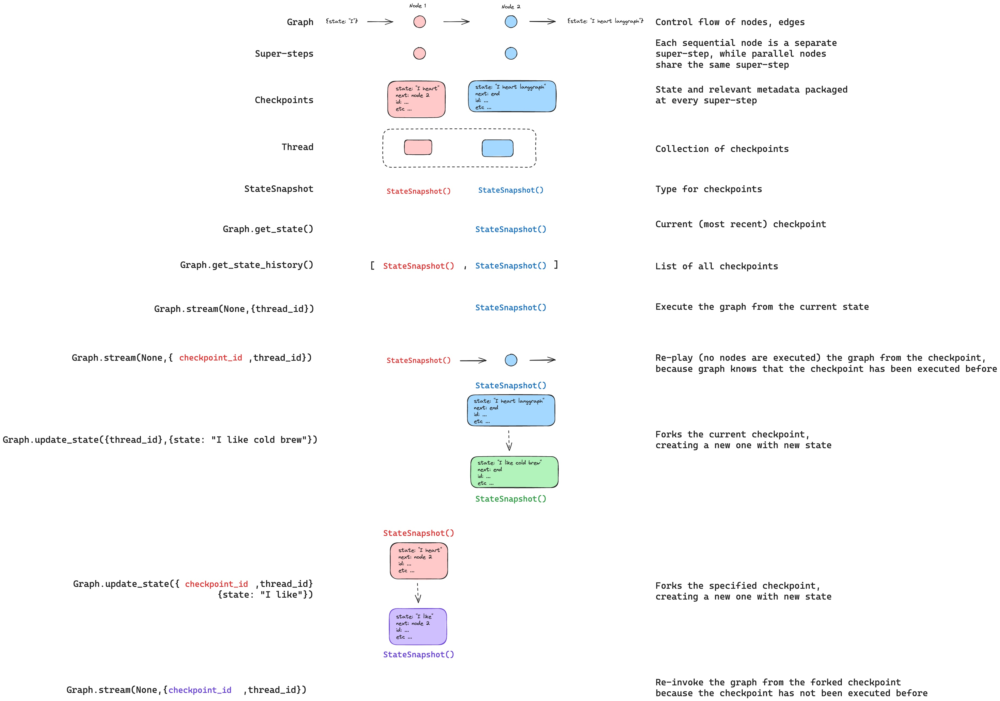

# Persistence

LangGraph has a built-in persistence layer, implemented through checkpointers. When you compile graph with a checkpointer, the checkpointer saves a `checkpoint` of the graph state at every super-step. Those checkpoints are saved to a `thread`, which can be accessed after graph execution. Because `threads` allow access to graph's state after execution, several powerful capabilities including human-in-the-loop, memory, time travel, and fault-tolerance are all possible. See [this how-to guide](/langgraphjs/how-tos/persistence) for an end-to-end example on how to add and use checkpointers with your graph. Below, we'll discuss each of these concepts in more detail. 


## Threads

A thread is a unique ID or [thread identifier](#threads) assigned to each checkpoint saved by a checkpointer. When invoking graph with a checkpointer, you **must** specify a `thread_id` as part of the `configurable` portion of the config:

```typescript
{"configurable": {"thread_id": "1"}}
```

## Checkpoints

Checkpoint is a snapshot of the graph state saved at each super-step and is represented by `StateSnapshot` object with the following key properties:

- `config`: Config associated with this checkpoint. 
- `metadata`: Metadata associated with this checkpoint.
- `values`: Values of the state channels at this point in time.
- `next` A tuple of the node names to execute next in the graph.
- `tasks`: A tuple of `PregelTask` objects that contain information about next tasks to be executed. If the step was previously attempted, it will include error information. If a graph was interrupted [dynamically](/langgraphjs/how-tos/dynamic_breakpoints) from within a node, tasks will contain additional data associated with interrupts.

Let's see what checkpoints are saved when a simple graph is invoked as follows:

```typescript
import { StateGraph, START, END } from "langgraph";
import { MemorySaver } from "langgraph/checkpoint";
import { Annotation } from "@langchain/core/utils/types";

const GraphAnnotation = Annotation.Object({
  foo: Annotation<string>
  bar: Annotation<string[]>({
    reducer: (a, b) => [...a, ...b],
    default: () => [],
  })
});

function nodeA(state: typeof GraphAnnotation.State) {
  return { foo: "a", bar: ["a"] };
}

function nodeB(state: typeof GraphAnnotation.State) {
  return { foo: "b", bar: ["b"] };
}

const workflow = new StateGraph(GraphAnnotation);
workflow.addNode("nodeA", nodeA);
workflow.addNode("nodeB", nodeB);
workflow.addEdge(START, "nodeA");
workflow.addEdge("nodeA", "nodeB");
workflow.addEdge("nodeB", END);

const checkpointer = new MemorySaver();
const graph = workflow.compile({ checkpointer });

const config = { configurable: { thread_id: "1" } };
await graph.invoke({ foo: "" }, config);
```

After we run the graph, we expect to see exactly 4 checkpoints:

* empty checkpoint with `START` as the next node to be executed
* checkpoint with the user input `{foo: '', bar: []}` and `nodeA` as the next node to be executed
* checkpoint with the outputs of `nodeA` `{foo: 'a', bar: ['a']}` and `nodeB` as the next node to be executed
* checkpoint with the outputs of `nodeB` `{foo: 'b', bar: ['a', 'b']}` and no next nodes to be executed

Note that we `bar` channel values contain outputs from both nodes as we have a reducer for `bar` channel.

### Get state

When interacting with the saved graph state, you **must** specify a [thread identifier](#threads). You can view the *latest* state of the graph by calling `await graph.getState(config)`. This will return a `StateSnapshot` object that corresponds to the latest checkpoint associated with the thread ID provided in the config or a checkpoint associated with a checkpoint ID for the thread, if provided.

```typescript
// Get the latest state snapshot
const config = { configurable: { thread_id: "1" } };
const state = await graph.getState(config);

// Get a state snapshot for a specific checkpoint_id
const configWithCheckpoint = { configurable: { thread_id: "1", checkpoint_id: "1ef663ba-28fe-6528-8002-5a559208592c" } };
const stateWithCheckpoint = await graph.getState(configWithCheckpoint);
```

In our example, the output of `getState` will look like this:

```
{
  values: { foo: 'b', bar: ['a', 'b'] },
  next: [],
  config: { configurable: { thread_id: '1', checkpoint_ns: '', checkpoint_id: '1ef663ba-28fe-6528-8002-5a559208592c' } },
  metadata: { source: 'loop', writes: { nodeB: { foo: 'b', bar: ['b'] } }, step: 2 },
  created_at: '2024-08-29T19:19:38.821749+00:00',
  parent_config: { configurable: { thread_id: '1', checkpoint_ns: '', checkpoint_id: '1ef663ba-28f9-6ec4-8001-31981c2c39f8' } },
  tasks: []
}
```

### Get state history

You can get the full history of the graph execution for a given thread by calling `await graph.getStateHistory(config)`. This will return a list of `StateSnapshot` objects associated with the thread ID provided in the config. Importantly, the checkpoints will be ordered chronologically with the most recent checkpoint / `StateSnapshot` being the first in the list.

```typescript
const config = { configurable: { thread_id: "1" } };
const history = await graph.getStateHistory(config);
```

In our example, the output of `getStateHistory` will look like this:

```
[
  {
    values: { foo: 'b', bar: ['a', 'b'] },
    next: [],
    config: { configurable: { thread_id: '1', checkpoint_ns: '', checkpoint_id: '1ef663ba-28fe-6528-8002-5a559208592c' } },
    metadata: { source: 'loop', writes: { nodeB: { foo: 'b', bar: ['b'] } }, step: 2 },
    created_at: '2024-08-29T19:19:38.821749+00:00',
    parent_config: { configurable: { thread_id: '1', checkpoint_ns: '', checkpoint_id: '1ef663ba-28f9-6ec4-8001-31981c2c39f8' } },
    tasks: [],
  },
  {
    values: { foo: 'a', bar: ['a'] },
    next: ['nodeB'],
    config: { configurable: { thread_id: '1', checkpoint_ns: '', checkpoint_id: '1ef663ba-28f9-6ec4-8001-31981c2c39f8' } },
    metadata: { source: 'loop', writes: { nodeA: { foo: 'a', bar: ['a'] } }, step: 1 },
    created_at: '2024-08-29T19:19:38.819946+00:00',
    parent_config: { configurable: { thread_id: '1', checkpoint_ns: '', checkpoint_id: '1ef663ba-28f4-6b4a-8000-ca575a13d36a' } },
    tasks: [{ id: '6fb7314f-f114-5413-a1f3-d37dfe98ff44', name: 'nodeB', error: null, interrupts: [] }],
  },
  // ... (other checkpoints)
]
```


### Replay

It's also possible to play-back a prior graph execution. If we `invoking` a graph with a `thread_id` and a `checkpoint_id`, then we will *re-play* the graph from a checkpoint that corresponds to the `checkpoint_id`.

* `thread_id` is simply the ID of a thread. This is always required.
* `checkpoint_id` This identifier refers to a specific checkpoint within a thread. 

You must pass these when invoking the graph as part of the `configurable` portion of the config:

```typescript
// { configurable: { thread_id: "1" } }  // valid config
// { configurable: { thread_id: "1", checkpoint_id: "0c62ca34-ac19-445d-bbb0-5b4984975b2a" } }  // also valid config

const config = { configurable: { thread_id: "1" } };
await graph.invoke(inputs, config);
```

Importantly, LangGraph knows whether a particular checkpoint has been executed previously. If it has, LangGraph simply *re-plays* that particular step in the graph and does not re-execute the step. See this [how to guide on time-travel to learn more about replaying](/langgraphjs/how-tos/time-travel).


### Update state

In addition to re-playing the graph from specific `checkpoints`, we can also *edit* the graph state. We do this using `graph.updateState()`. This method three different arguments:

#### `config`

The config should contain `thread_id` specifying which thread to update. When only the `thread_id` is passed, we update (or fork) the current state. Optionally, if we include `checkpoint_id` field, then we fork that selected checkpoint.

#### `values`

These are the values that will be used to update the state. Note that this update is treated exactly as any update from a node is treated. This means that these values will be passed to the [reducer](/langgraphjs/concepts/low_level#reducers) functions, if they are defined for some of the channels in the graph state. This means that `updateState` does NOT automatically overwrite the channel values for every channel, but only for the channels without reducers. Let's walk through an example.

Let's assume you have defined the state of your graph with the following schema (see full example above):

```typescript
import { Annotation } from "@langchain/core/utils/types";

const GraphAnnotation = Annotation.Object({
  foo: Annotation<string>
  bar: Annotation<string[]>({
    reducer: (a, b) => [...a, ...b],
    default: () => [],
  })
});
```

Let's now assume the current state of the graph is

```
{ foo: "1", bar: ["a"] }
```

If you update the state as below:

```typescript
await graph.updateState(config, { foo: "2", bar: ["b"] });
```

Then the new state of the graph will be:

```
{ foo: "2", bar: ["a", "b"] }
```

The `foo` key (channel) is completely changed (because there is no reducer specified for that channel, so `updateState` overwrites it). However, there is a reducer specified for the `bar` key, and so it appends `"b"` to the state of `bar`.

#### As Node

The final argument you can optionally specify when calling `updateState` is the third positional `asNode` argument. If you provided it, the update will be applied as if it came from node `asNode`. If `asNode` is not provided, it will be set to the last node that updated the state, if not ambiguous. The reason this matters is that the next steps to execute depend on the last node to have given an update, so this can be used to control which node executes next. See this [how to guide on time-travel to learn more about forking state](/langgraphjs/how-tos/time-travel).



## Checkpointer libraries

Under the hood, checkpointing is powered by checkpointer objects that conform to [BaseCheckpointSaver](/langgraphjs/reference/classes/checkpoint.BaseCheckpointSaver.html) interface. LangGraph provides several checkpointer implementations, all implemented via standalone, installable libraries:

* `@langchain/langgraph-checkpoint`: The base interface for checkpointer savers ([BaseCheckpointSaver](/langgraphjs/reference/classes/checkpoint.BaseCheckpointSaver.html)) and serialization/deserialization interface ([SerializerProtocol](/langgraphjs/reference/interfaces/checkpoint.SerializerProtocol.html)). Includes in-memory checkpointer implementation ([MemorySaver](/langgraphjs/reference/classes/checkpoint.MemorySaver.html)) for experimentation. LangGraph comes with `@langchain/langgraph-checkpoint` included.
* `@langchain/langgraph-checkpoint-sqlite`: An implementation of LangGraph checkpointer that uses SQLite database ([SqliteSaver](/langgraphjs/reference/classes/checkpoint_sqlite.SqliteSaver.html)). Ideal for experimentation and local workflows. Needs to be installed separately.

### Checkpointer interface

Each checkpointer conforms to [BaseCheckpointSaver](/langgraphjs/reference/classes/checkpoint.BaseCheckpointSaver.html) interface and implements the following methods:

* `.put` - Store a checkpoint with its configuration and metadata.  
* `.putWrites` - Store intermediate writes linked to a checkpoint (i.e. [pending writes](#pending-writes)).  
* `.getTuple` - Fetch a checkpoint tuple using for a given configuration (`thread_id` and `checkpoint_id`). This is used to populate `StateSnapshot` in `graph.getState()`.  
* `.list` - List checkpoints that match a given configuration and filter criteria. This is used to populate state history in `graph.getStateHistory()`

## Capabilities

### Human-in-the-loop

First, checkpointers facilitate [human-in-the-loop workflows](/langgraphjs/concepts/agentic_concepts#human-in-the-loop) workflows by allowing humans to inspect, interrupt, and approve graph steps. Checkpointers are needed for these workflows as the human has to be able to view the state of a graph at any point in time, and the graph has to be to resume execution after the human has made any updates to the state. See [these how-to guides](/langgraphjs/how-tos/breakpoints) for concrete examples.

### Memory

Second, checkpointers allow for ["memory"](/langgraphjs/concepts/agentic_concepts#memory) between interactions.  In the case of repeated human interactions (like conversations) any follow up messages can be sent to that thread, which will retain its memory of previous ones. See [this how-to guide](/langgraphjs/how-tos/manage-conversation-history) for an end-to-end example on how to add and manage conversation memory using checkpointers.

### Time Travel

Third, checkpointers allow for ["time travel"](/langgraphjs/how-tos/time-travel), allowing users to replay prior graph executions to review and / or debug specific graph steps. In addition, checkpointers make it possible to fork the graph state at arbitrary checkpoints to explore alternative trajectories.

### Fault-tolerance

Lastly, checkpointing also provides fault-tolerance and error recovery: if one or more nodes fail at a given superstep, you can restart your graph from the last successful step. Additionally, when a graph node fails mid-execution at a given superstep, LangGraph stores pending checkpoint writes from any other nodes that completed successfully at that superstep, so that whenever we resume graph execution from that superstep we don't re-run the successful nodes.

#### Pending writes

Additionally, when a graph node fails mid-execution at a given superstep, LangGraph stores pending checkpoint writes from any other nodes that completed successfully at that superstep, so that whenever we resume graph execution from that superstep we don't re-run the successful nodes.