# Pregel in LangGraph, explained like you are 5

If you only remember one thing, remember this:

**Pregel is a game of passing notes between little workers.**

Each worker:

1. reads the notes it has,
2. does its tiny job,
3. writes new notes,
4. and then everybody waits until the round is over.

LangGraph uses this idea to run your graph step by step in a safe, organized way.

---

## The toy-box version

Imagine a classroom:

- **Nodes** are kids doing jobs.
- **Channels** are mailboxes.
- **State** is everything currently inside the mailboxes.
- A **superstep** is one classroom round:
  - all kids who have mail do their work,
  - they drop new mail into mailboxes,
  - then everyone waits,
  - then the next round starts.

That is the heart of Pregel.

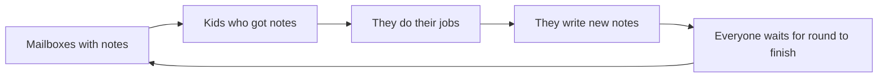

---

## What LangGraph adds on top

LangGraph lets you describe a workflow as a graph:

- "start here"
- "run this node"
- "then maybe go here"
- "save state"
- "pause for a human"
- "stream updates while running"

Under the hood, LangGraph turns that graph into a **Pregel engine run**.

So your nice, friendly graph API becomes:

- channels for state,
- tasks for runnable nodes,
- supersteps for execution,
- checkpoints for saving progress,
- interrupts for pausing,
- streams for live updates.

---

## The big picture in one picture

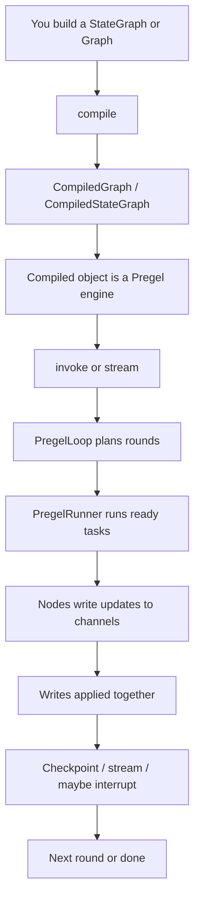

---

## The 5 important characters

### 1) Nodes: the workers

A node is just a function that does some work.

In kid words:

- read the mailbox,
- think,
- put new notes back.

In LangGraph:

- nodes become **Pregel tasks**
- tasks run when their input channels changed

---

### 2) Channels: the mailboxes

Channels hold values and updates.

Different channels can behave differently:

- some keep the **last value**
- some **collect many values**
- some are just temporary for one step

This is why LangGraph state feels flexible: each state key is backed by a channel with rules for how updates are combined.

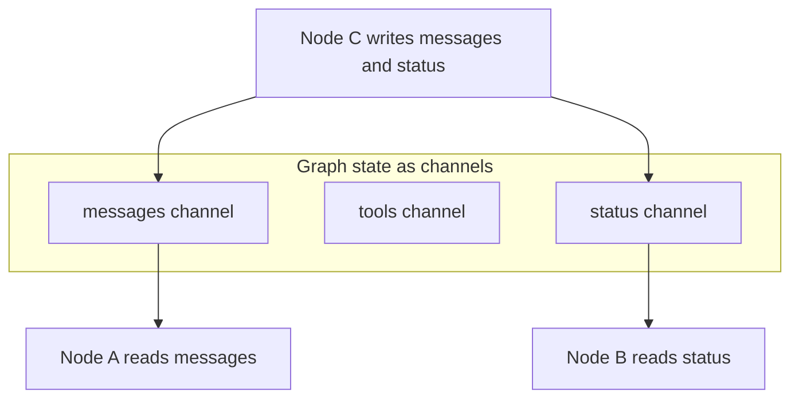

---

### 3) Supersteps: the rounds

Pregel does **not** run everything in a messy free-for-all.

It runs in rounds:

1. figure out which nodes are ready,
2. run them,
3. collect all their writes,
4. apply the writes together,
5. start the next round.

That "apply together" part is important.

It means LangGraph gets a clean rhythm:

- read old state for this round,
- do work,
- commit updates,
- move to next round.

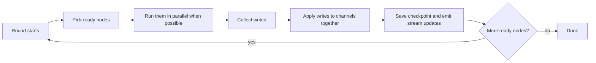

---

### 4) Checkpoints: the save button

A checkpoint is like saving your game.

LangGraph can save:

- current channel values,
- what changed,
- where the graph is,
- what should run next,
- enough information to resume later.

That is why LangGraph can support:

- persistence,
- resumability,
- time travel style debugging,
- human approval flows.

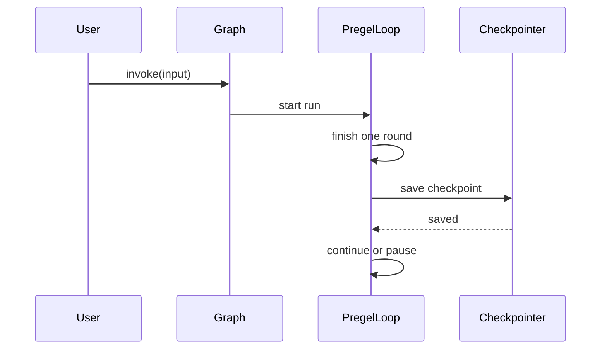

---

### 5) Interrupts and streaming: pause and show

Pregel in LangGraph is not just "run until done."

It can also:

- **stream** values, updates, messages, debug events
- **interrupt** before or after certain nodes
- **resume** from saved state

So the engine is not just a runner. It is also a traffic cop and a save system.

---

## A tiny story example

Imagine this graph:

- `wakeUp`
- `brushTeeth`
- `packBag`
- `goToSchool`

And suppose:

- `wakeUp` triggers both `brushTeeth` and `packBag`
- then both must finish before `goToSchool`

Pregel naturally thinks in rounds:

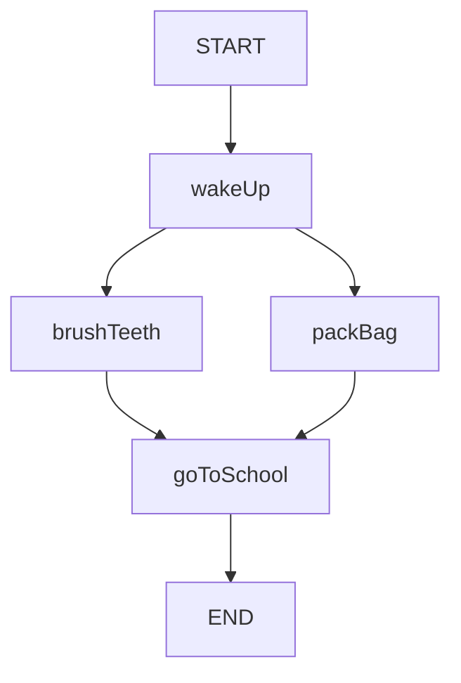

Possible execution:

- **Round 1**: `wakeUp`
- **Round 2**: `brushTeeth` and `packBag` in parallel
- **Round 3**: `goToSchool`

That is a great example of how Pregel groups independent work into the same superstep.

---

## How LangGraph uses Pregel in the real code

Here is the real story in simple words.

### Step A: You build a graph

You write something like:

```ts
const graph = new StateGraph(...)
  .addNode(...)
  .addEdge(...)
  .compile();
```

At compile time, LangGraph turns your graph definition into a runnable object.

Important code path:

- `libs/langgraph-core/src/graph/state.ts`
- `libs/langgraph-core/src/graph/graph.ts`

### What compile does

Compile roughly does these things:

1. validates the graph,
2. creates channels for state keys and the `START` input,
3. creates Pregel nodes,
4. wires edges as triggers/subscriptions,
5. returns a compiled graph that **extends Pregel**.

That last part is the key:

**A compiled LangGraph graph is a Pregel engine.**

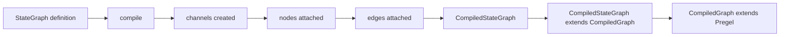

### Real code landmarks

- `StateGraph.compile(...)` builds `CompiledStateGraph`
- `CompiledStateGraph` extends `CompiledGraph`
- `CompiledGraph` extends `Pregel`

You can see this in:

- `libs/langgraph-core/src/graph/state.ts`
- `libs/langgraph-core/src/graph/graph.ts`

---

### Step B: You call `invoke()` or `stream()`

When you run the graph, LangGraph enters Pregel execution.

Important code path:

- `libs/langgraph-core/src/pregel/index.ts`

The main flow is approximately:

1. validate input and config,
2. create the output stream,
3. initialize the loop,
4. create the runner,
5. keep ticking until done.

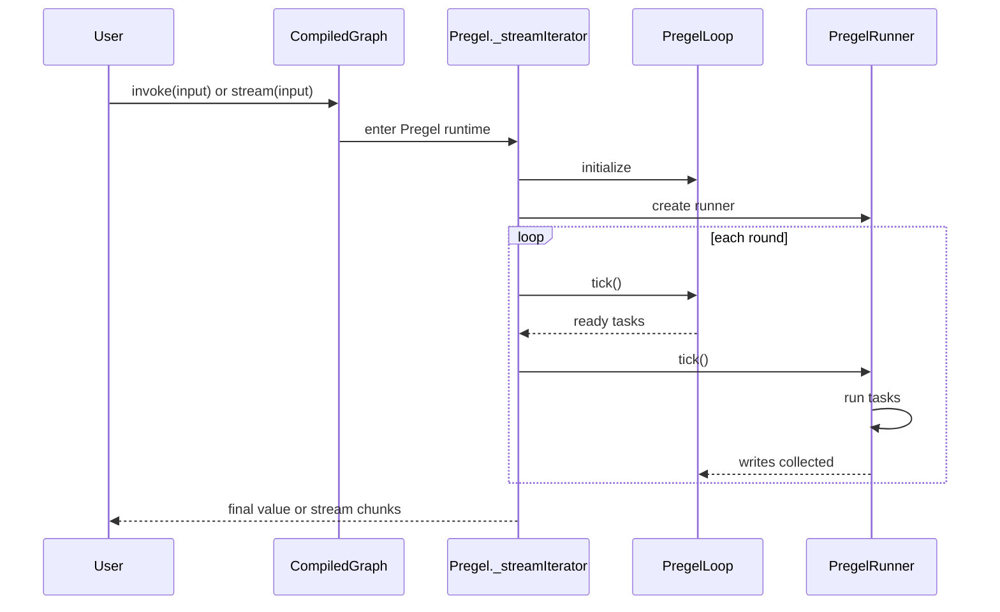

---

### Step C: PregelLoop plans the rounds

`PregelLoop` is the part that decides:

- "Is this the first step?"
- "Did we finish a round?"
- "Which tasks are ready next?"
- "Should we checkpoint?"
- "Should we interrupt?"
- "Are we done?"

Important file:

- `libs/langgraph-core/src/pregel/loop.ts`

### The important rhythm inside `tick()`

The loop does something like this:

1. if this is the first time, put the input into channels
2. if all current tasks finished, apply their writes
3. emit outputs/updates
4. save checkpoint
5. maybe interrupt
6. prepare next tasks
7. if no tasks remain, finish

That is the superstep heartbeat.

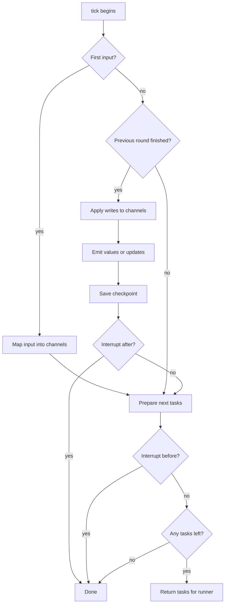

---

### Step D: PregelRunner runs the ready tasks

`PregelRunner` is the muscle.

If `PregelLoop` is the teacher deciding who should work this round, `PregelRunner` is the part that actually says:

- "okay, ready kids, go"

Important file:

- `libs/langgraph-core/src/pregel/runner.ts`

It handles:

- running ready tasks,
- concurrency,
- retries,
- timeouts,
- abort signals,
- error collection,
- graph interrupts bubbling up correctly.

So:

- **Loop = planner**
- **Runner = executor**

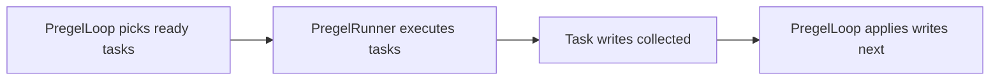

---

### Step E: writes become state changes

When a node returns something, LangGraph does not instantly scramble the whole graph.

Instead, the node's result becomes **writes** to channels.

Then the loop applies those writes together at the end of the round.

Important files:

- `libs/langgraph-core/src/pregel/write.ts`
- `libs/langgraph-core/src/pregel/algo.ts`
- `libs/langgraph-core/src/pregel/io.ts`

This gives a stable pattern:

- nodes read from channels,
- nodes produce writes,
- writes update channels,
- channel updates decide who runs next.

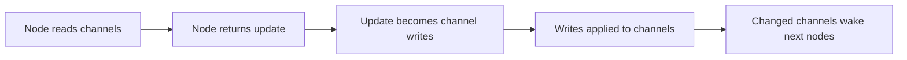

---

## Why this design is nice

Pregel gives LangGraph a strong backbone:

### 1) Parallelism is natural

If two nodes are both ready in the same round, they can run together.

### 2) State updates are controlled

Updates are grouped by round, which makes behavior easier to reason about.

### 3) Persistence fits naturally

At the end of a round, it is a good time to save a checkpoint.

### 4) Interrupts fit naturally

You can pause before or after a round or certain nodes.

### 5) Streaming fits naturally

Each round can emit values, updates, messages, debug info, and more.

---

## The shortest accurate summary

LangGraph uses Pregel like this:

1. **Graph authoring layer**: you define nodes, edges, and state.
2. **Compile layer**: LangGraph turns that into channels + Pregel nodes.
3. **Runtime layer**: PregelLoop and PregelRunner execute the graph in supersteps.
4. **Persistence/interrupt/streaming layer**: checkpoints, pauses, resumes, and live output are added around that execution cycle.

---

## The "real names" behind the simple story

If you want to connect the kid story to the source code:

| Kid story | LangGraph name | Main file |
|---|---|---|
| workers | `PregelNode` / executable tasks | `libs/langgraph-core/src/pregel/read.ts` |
| mailboxes | channels | `libs/langgraph-core/src/channels/*` |
| round manager | `PregelLoop` | `libs/langgraph-core/src/pregel/loop.ts` |
| task runner | `PregelRunner` | `libs/langgraph-core/src/pregel/runner.ts` |
| decide next workers | `_prepareNextTasks` | `libs/langgraph-core/src/pregel/algo.ts` |
| apply all notes | `_applyWrites` | `libs/langgraph-core/src/pregel/algo.ts` |
| graph runtime | `Pregel` | `libs/langgraph-core/src/pregel/index.ts` |
| graph becomes pregel | `CompiledGraph extends Pregel` | `libs/langgraph-core/src/graph/graph.ts` |
| state graph compile | `StateGraph.compile` | `libs/langgraph-core/src/graph/state.ts` |

---

## One very practical mental model

When you run a LangGraph graph, imagine this:

```text
Round starts
-> which nodes got new mail?
-> run those nodes
-> collect all writes
-> update the mailboxes
-> save progress
-> tell the outside world what happened
-> repeat until nobody has work left
```

That is most of Pregel in one paragraph.

---

## Final takeaway

Pregel in LangGraph is basically:

- a **mailbox system** for state,
- a **round-based scheduler** for nodes,
- a **safe commit point** for updates,
- and a **save/pause/stream wrapper** around the whole thing.

So when you use LangGraph, you are mostly writing the "what should each node do?" part.

Pregel is the part quietly making sure the graph runs in a clean, repeatable, resumable way.
