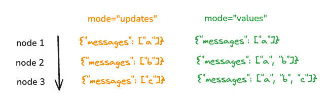

# Streaming

LangGraph is built with first class support for streaming. There are several different ways to stream back outputs from a graph run

## Streaming graph outputs (`.stream`)

`.stream` is an async method for streaming back outputs from a graph run.
There are several different modes you can specify when calling these methods (e.g. `await graph.stream(..., { ...config, streamMode: "values" })):

- [`"values"`](/langgraphjs/how-tos/stream-values): This streams the full value of the state after each step of the graph.
- [`"updates"`](/langgraphjs/how-tos/stream-updates): This streams the updates to the state after each step of the graph. If multiple updates are made in the same step (e.g. multiple nodes are run) then those updates are streamed separately.
- [`"custom"`](/langgraphjs/how-tos/streaming-content): This streams custom data from inside your graph nodes.
- [`"messages"`](/langgraphjs/how-tos/streaming-tokens): This streams LLM tokens and metadata for the graph node where LLM is invoked.
- `"debug"`: This streams as much information as possible throughout the execution of the graph.

The below visualization shows the difference between the `values` and `updates` modes:



## Streaming LLM tokens and events (`.streamEvents`)

In addition, you can use the [`streamEvents`](/langgraphjs/how-tos/streaming-events-from-within-tools) method to stream back events that happen _inside_ nodes. This is useful for streaming tokens of LLM calls.

This is a standard method on all [LangChain objects](https://js.langchain.com/docs/concepts/#runnable-interface). This means that as the graph is executed, certain events are emitted along the way and can be seen if you run the graph using `.streamEvents`.

All events have (among other things) `event`, `name`, and `data` fields. What do these mean?

- `event`: This is the type of event that is being emitted. You can find a detailed table of all callback events and triggers [here](https://js.langchain.com/docs/concepts/#callback-events).
- `name`: This is the name of event.
- `data`: This is the data associated with the event.

What types of things cause events to be emitted?

- each node (runnable) emits `on_chain_start` when it starts execution, `on_chain_stream` during the node execution and `on_chain_end` when the node finishes. Node events will have the node name in the event's `name` field
- the graph will emit `on_chain_start` in the beginning of the graph execution, `on_chain_stream` after each node execution and `on_chain_end` when the graph finishes. Graph events will have the `LangGraph` in the event's `name` field
- Any writes to state channels (i.e. anytime you update the value of one of your state keys) will emit `on_chain_start` and `on_chain_end` events

Additionally, any events that are created inside your nodes (LLM events, tool events, manually emitted events, etc.) will also be visible in the output of `.streamEvents`.

To make this more concrete and to see what this looks like, let's see what events are returned when we run a simple graph:

```typescript
import { ChatOpenAI } from "@langchain/openai";
import { StateGraph, MessagesAnnotation } from "langgraph";

const model = new ChatOpenAI({ model: "gpt-4-turbo-preview" });

function callModel(state: typeof MessagesAnnotation.State) {
  const response = model.invoke(state.messages);
  return { messages: response };
}

const workflow = new StateGraph(MessagesAnnotation)
  .addNode("callModel", callModel)
  .addEdge("start", "callModel")
  .addEdge("callModel", "end");
const app = workflow.compile();

const inputs = [{ role: "user", content: "hi!" }];

for await (const event of app.streamEvents(
  { messages: inputs },
  { version: "v2" }
)) {
  const kind = event.event;
  console.log(`${kind}: ${event.name}`);
}
```

```shell
on_chain_start: LangGraph
on_chain_start: __start__
on_chain_end: __start__
on_chain_start: callModel
on_chat_model_start: ChatOpenAI
on_chat_model_stream: ChatOpenAI
on_chat_model_stream: ChatOpenAI
on_chat_model_stream: ChatOpenAI
on_chat_model_stream: ChatOpenAI
on_chat_model_stream: ChatOpenAI
on_chat_model_stream: ChatOpenAI
on_chat_model_stream: ChatOpenAI
on_chat_model_stream: ChatOpenAI
on_chat_model_stream: ChatOpenAI
on_chat_model_stream: ChatOpenAI
on_chat_model_stream: ChatOpenAI
on_chat_model_end: ChatOpenAI
on_chain_start: ChannelWrite<callModel,messages>
on_chain_end: ChannelWrite<callModel,messages>
on_chain_stream: callModel
on_chain_end: callModel
on_chain_stream: LangGraph
on_chain_end: LangGraph
```

We start with the overall graph start (`on_chain_start: LangGraph`). We then write to the `__start__` node (this is special node to handle input).
We then start the `callModel` node (`on_chain_start: callModel`). We then start the chat model invocation (`on_chat_model_start: ChatOpenAI`),
stream back token by token (`on_chat_model_stream: ChatOpenAI`) and then finish the chat model (`on_chat_model_end: ChatOpenAI`). From there,
we write the results back to the channel (`ChannelWrite<callModel,messages>`) and then finish the `callModel` node and then the graph as a whole.

This should hopefully give you a good sense of what events are emitted in a simple graph. But what data do these events contain?
Each type of event contains data in a different format. Let's look at what `on_chat_model_stream` events look like. This is an important type of event
since it is needed for streaming tokens from an LLM response.

These events look like:

```shell
{'event': 'on_chat_model_stream',
 'name': 'ChatOpenAI',
 'run_id': '3fdbf494-acce-402e-9b50-4eab46403859',
 'tags': ['seq:step:1'],
 'metadata': {'langgraph_step': 1,
  'langgraph_node': 'callModel',
  'langgraph_triggers': ['start:callModel'],
  'langgraph_task_idx': 0,
  'checkpoint_id': '1ef657a0-0f9d-61b8-bffe-0c39e4f9ad6c',
  'checkpoint_ns': 'callModel',
  'ls_provider': 'openai',
  'ls_model_name': 'gpt-4o-mini',
  'ls_model_type': 'chat',
  'ls_temperature': 0.7},
 'data': {'chunk': AIMessageChunk({ content: 'Hello', id: 'run-3fdbf494-acce-402e-9b50-4eab46403859' })},
 'parent_ids': []}
```

We can see that we have the event type and name (which we knew from before).

We also have a bunch of stuff in metadata. Noticeably, `'langgraph_node': 'callModel',` is some really helpful information
which tells us which node this model was invoked inside of.

Finally, `data` is a really important field. This contains the actual data for this event! Which in this case
is an AIMessageChunk. This contains the `content` for the message, as well as an `id`.
This is the ID of the overall AIMessage (not just this chunk) and is super helpful - it helps
us track which chunks are part of the same message (so we can show them together in the UI).

This information contains all that is needed for creating a UI for streaming LLM tokens.
