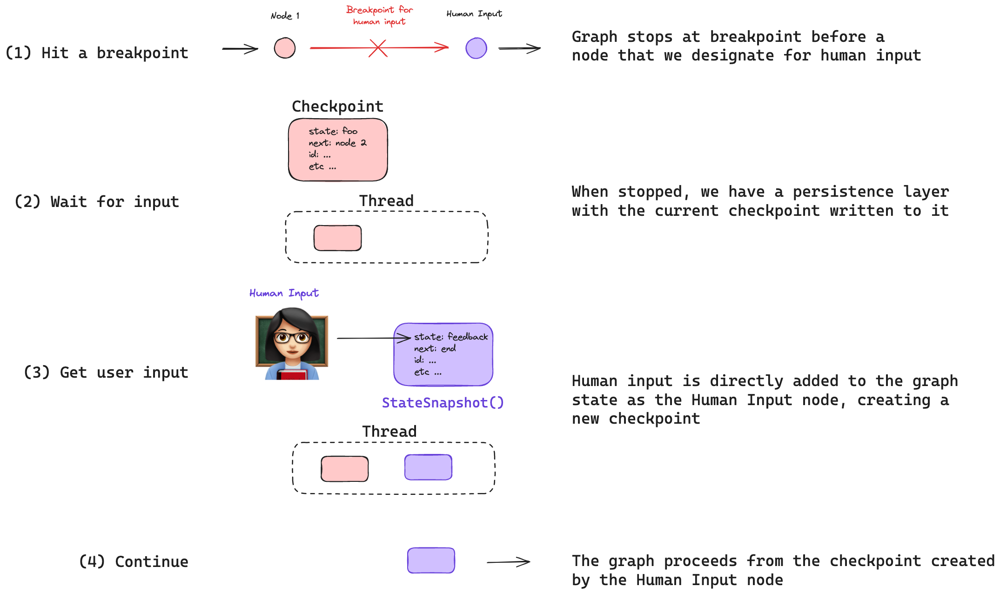

# Human-in-the-loop

Human-in-the-loop (or "on-the-loop") enhances agent capabilities through several common user interaction patterns.

Common interaction patterns include:

(1) `Approval` - We can interrupt our agent, surface the current state to a user, and allow the user to accept an action. 

(2) `Editing` - We can interrupt our agent, surface the current state to a user, and allow the user to edit the agent state. 

(3) `Input` - We can explicitly create a graph node to collect human input and pass that input directly to the agent state.

Use-cases for these interaction patterns include:

(1) `Reviewing tool calls` - We can interrupt an agent to review and edit the results of tool calls.

(2) `Time Travel` - We can manually re-play and / or fork past actions of an agent.

## Persistence

All of these interaction patterns are enabled by LangGraph's built-in [persistence](/langgraphjs/concepts/persistence) layer, which will write a checkpoint of the graph state at each step. Persistence allows the graph to stop so that a human can review and / or edit the current state of the graph and then resume with the human's input.

### Breakpoints

Adding a [breakpoint](/langgraphjs/concepts/low_level#breakpoints) at a specific location in the graph flow is one way to enable human-in-the-loop. In this case, the developer knows *where* in the workflow human input is needed and simply places a breakpoint prior to or following that particular graph node.

Here, we compile our graph with a checkpointer and a breakpoint at the node we want to interrupt before, `step_for_human_in_the_loop`. We then perform one of the above interaction patterns, which will create a new checkpoint if a human edits the graph state. The new checkpoint is saved to the thread and we can resume the graph execution from there by passing in `null` as the input.

```typescript
// Compile our graph with a checkpointer and a breakpoint before "step_for_human_in_the_loop"
const graph = builder.compile({ checkpointer, interruptBefore: ["step_for_human_in_the_loop"] });

// Run the graph up to the breakpoint
const threadConfig = { configurable: { thread_id: "1" }, streamMode: "values" as const };
for await (const event of await graph.stream(inputs, threadConfig)) {
    console.log(event);
}
    
// Perform some action that requires human in the loop

// Continue the graph execution from the current checkpoint 
for await (const event of await graph.stream(null, threadConfig)) {
    console.log(event);
}
```

### Dynamic Breakpoints

Alternatively, the developer can define some *condition* that must be met for a breakpoint to be triggered. This concept of [dynamic breakpoints](/langgraphjs/concepts/low_level#dynamic-breakpoints) is useful when the developer wants to halt the graph under *a particular condition*. This uses a [`NodeInterrupt`](/langgraphjs/reference/classes/langgraph.NodeInterrupt.html), which is a special type of error that can be raised from within a node based upon some condition. As an example, we can define a dynamic breakpoint that triggers when the `input` is longer than 5 characters.

```typescript
function myNode(state: typeof GraphAnnotation.State): typeof GraphAnnotation.State {
    if (state.input.length > 5) {
        throw new NodeInterrupt(`Received input that is longer than 5 characters: ${state['input']}`);
    }
    return state;
}
```

Let's assume we run the graph with an input that triggers the dynamic breakpoint and then attempt to resume the graph execution simply by passing in `null` for the input. 

```typescript
// Attempt to continue the graph execution with no change to state after we hit the dynamic breakpoint 
for await (const event of await graph.stream(null, threadConfig)) {
    console.log(event);
}
```

The graph will *interrupt* again because this node will be *re-run* with the same graph state. We need to change the graph state such that the condition that triggers the dynamic breakpoint is no longer met. So, we can simply edit the graph state to an input that meets the condition of our dynamic breakpoint (< 5 characters) and re-run the node.

```typescript 
// Update the state to pass the dynamic breakpoint
await graph.updateState(threadConfig, { input: "foo" });
for await (const event of await graph.stream(null, threadConfig)) {
    console.log(event);
}
```

Alternatively, what if we want to keep our current input and skip the node (`myNode`) that performs the check? To do this, we can simply perform the graph update with `"myNode"` as the third positional argument, and pass in `null` for the values. This will make no update to the graph state, but run the update as `myNode`, effectively skipping the node and bypassing the dynamic breakpoint.

```typescript
// This update will skip the node `myNode` altogether
await graph.updateState(threadConfig, null, "myNode");
for await (const event of await graph.stream(null, threadConfig)) {
    console.log(event);
}
```

See [our guide](/langgraphjs/how-tos/dynamic_breakpoints) for a detailed how-to on doing this!

## Interaction Patterns

### Approval


Sometimes we want to approve certain steps in our agent's execution. 
 
We can interrupt our agent at a [breakpoint](/langgraphjs/concepts/low_level#breakpoints) prior to the step that we want to approve.

This is generally recommended for sensitive actions (e.g., using external APIs or writing to a database).
 
With persistence, we can surface the current agent state as well as the next step to a user for review and approval. 
 
If approved, the graph resumes execution from the last saved checkpoint, which is saved to the thread:

```typescript
// Compile our graph with a checkpointer and a breakpoint before the step to approve
const graph = builder.compile({ checkpointer, interruptBefore: ["node_2"] });

// Run the graph up to the breakpoint
for await (const event of await graph.stream(inputs, threadConfig)) {
    console.log(event);
}
    
// ... Get human approval ...

// If approved, continue the graph execution from the last saved checkpoint
for await (const event of await graph.stream(null, threadConfig)) {
    console.log(event);
}
```

See [our guide](/langgraphjs/how-tos/breakpoints) for a detailed how-to on doing this!

### Editing


Sometimes we want to review and edit the agent's state. 
 
As with approval, we can interrupt our agent at a [breakpoint](/langgraphjs/concepts/low_level#breakpoints) prior to the step we want to check. 
 
We can surface the current state to a user and allow the user to edit the agent state.
 
This can, for example, be used to correct the agent if it made a mistake (e.g., see the section on tool calling below).

We can edit the graph state by forking the current checkpoint, which is saved to the thread.

We can then proceed with the graph from our forked checkpoint as done before. 

```typescript
// Compile our graph with a checkpointer and a breakpoint before the step to review
const graph = builder.compile({ checkpointer, interruptBefore: ["node_2"] });

// Run the graph up to the breakpoint
for await (const event of await graph.stream(inputs, threadConfig)) {
    console.log(event);
}
    
// Review the state, decide to edit it, and create a forked checkpoint with the new state
await graph.updateState(threadConfig, { state: "new state" });

// Continue the graph execution from the forked checkpoint
for await (const event of await graph.stream(null, threadConfig)) {
    console.log(event);
}
```

See [this guide](/langgraphjs/how-tos/edit-graph-state) for a detailed how-to on doing this!

### Input



Sometimes we want to explicitly get human input at a particular step in the graph. 
 
We can create a graph node designated for this (e.g., `human_input` in our example diagram).
 
As with approval and editing, we can interrupt our agent at a [breakpoint](/langgraphjs/concepts/low_level#breakpoints) prior to this node.
 
We can then perform a state update that includes the human input, just as we did with editing state.

But, we add one thing: 

We can use `"human_input"` as the node with the state update to specify that the state update *should be treated as a node*.

This is subtle, but important: 

With editing, the user makes a decision about whether or not to edit the graph state.

With input, we explicitly define a node in our graph for collecting human input!

The state update with the human input then runs *as this node*.

```typescript
// Compile our graph with a checkpointer and a breakpoint before the step to collect human input
const graph = builder.compile({ checkpointer, interruptBefore: ["human_input"] });

// Run the graph up to the breakpoint
for await (const event of await graph.stream(inputs, threadConfig)) {
    console.log(event);
}
    
// Update the state with the user input as if it was the human_input node
await graph.updateState(threadConfig, { user_input: userInput }, "human_input");

// Continue the graph execution from the checkpoint created by the human_input node
for await (const event of await graph.stream(null, threadConfig)) {
    console.log(event);
}
```

See [this guide](/langgraphjs/how-tos/wait-user-input) for a detailed how-to on doing this!

## Use-cases

### Reviewing Tool Calls

Some user interaction patterns combine the above ideas.

For example, many agents use [tool calling](https://js.langchain.com/docs/modules/agents/tools/) to make decisions. 

Tool calling presents a challenge because the agent must get two things right: 

(1) The name of the tool to call 

(2) The arguments to pass to the tool

Even if the tool call is correct, we may also want to apply discretion: 

(3) The tool call may be a sensitive operation that we want to approve 

With these points in mind, we can combine the above ideas to create a human-in-the-loop review of a tool call.

```typescript
// Compile our graph with a checkpointer and a breakpoint before the step to review the tool call from the LLM 
const graph = builder.compile({ checkpointer, interruptBefore: ["human_review"] });

// Run the graph up to the breakpoint
for await (const event of await graph.stream(inputs, threadConfig)) {
    console.log(event);
}
    
// Review the tool call and update it, if needed, as the human_review node
await graph.updateState(threadConfig, { tool_call: "updated tool call" }, "human_review");

// Otherwise, approve the tool call and proceed with the graph execution with no edits 

// Continue the graph execution from either: 
// (1) the forked checkpoint created by human_review or 
// (2) the checkpoint saved when the tool call was originally made (no edits in human_review)
for await (const event of await graph.stream(null, threadConfig)) {
    console.log(event);
}
```

See [this guide](/langgraphjs/how-tos/review-tool-calls) for a detailed how-to on doing this!

### Time Travel

When working with agents, we often want to closely examine their decision making process: 

(1) Even when they arrive at a desired final result, the reasoning that led to that result is often important to examine.

(2) When agents make mistakes, it is often valuable to understand why.

(3) In either of the above cases, it is useful to manually explore alternative decision making paths.

Collectively, we call these debugging concepts `time-travel` and they are composed of `replaying` and `forking`.

#### Replaying


Sometimes we want to simply replay past actions of an agent. 
 
Above, we showed the case of executing an agent from the current state (or checkpoint) of the graph.

We do this by simply passing in `null` for the input with a `threadConfig`.

```typescript
const threadConfig = { configurable: { thread_id: "1" } };
for await (const event of await graph.stream(null, threadConfig)) {
    console.log(event);
}
```

Now, we can modify this to replay past actions from a *specific* checkpoint by passing in the checkpoint ID.

To get a specific checkpoint ID, we can easily get all of the checkpoints in the thread and filter to the one we want.

```typescript
const allCheckpoints = [];
for await (const state of app.getStateHistory(threadConfig)) {
    allCheckpoints.push(state);
}
```

Each checkpoint has a unique ID, which we can use to replay from a specific checkpoint.

Assume from reviewing the checkpoints that we want to replay from one, `xxx`.

We just pass in the checkpoint ID when we run the graph.

```typescript
const config = { configurable: { thread_id: '1', checkpoint_id: 'xxx' }, streamMode: "values" as const };
for await (const event of await graph.stream(null, config)) {
    console.log(event);
}
```
 
Importantly, the graph knows which checkpoints have been previously executed. 

So, it will re-play any previously executed nodes rather than re-executing them.

See [this additional conceptual guide](https://langchain-ai.github.io/langgraph/concepts/persistence/#replay) for related context on replaying.

See [this guide](/langgraphjs/how-tos/time-travel) for a detailed how-to on doing time-travel!

#### Forking


Sometimes we want to fork past actions of an agent, and explore different paths through the graph.

`Editing`, as discussed above, is *exactly* how we do this for the *current* state of the graph! 

But, what if we want to fork *past* states of the graph?

For example, let's say we want to edit a particular checkpoint, `xxx`.

We pass this `checkpoint_id` when we update the state of the graph.

```typescript
const config = { configurable: { thread_id: "1", checkpoint_id: "xxx" } };
await graph.updateState(config, { state: "updated state" });
```

This creates a new forked checkpoint, `xxx-fork`, which we can then run the graph from.

```typescript
const config = { configurable: { thread_id: '1', checkpoint_id: 'xxx-fork' }, streamMode: "values" as const };
for await (const event of await graph.stream(null, config)) {
    console.log(event);
}
```

See [this additional conceptual guide](/langgraphjs/concepts/persistence/#update-state) for related context on forking.

See [this guide](/langgraphjs/how-tos/time-travel) for a detailed how-to on doing time-travel!
