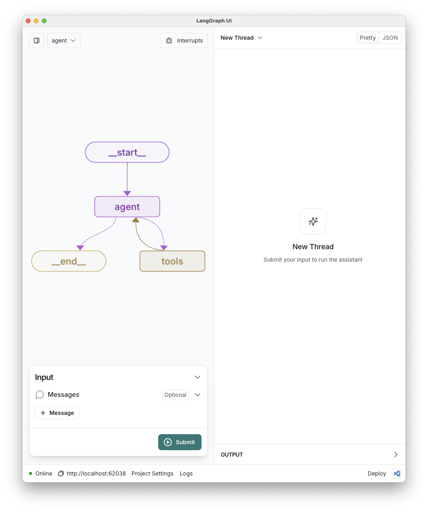
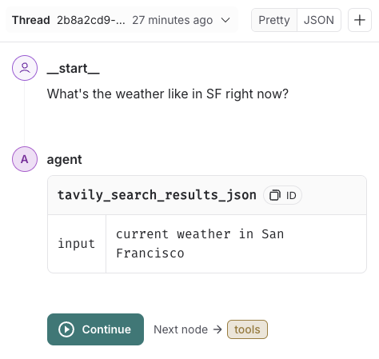
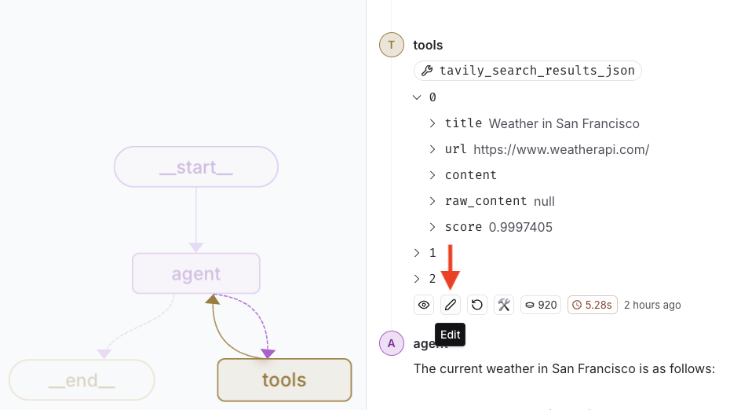
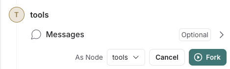

# Part 5: Iterate in LangGraph Studio (beta)

In the previous tutorials, we built a chatbot that can answer user questions using a Large Language Model (LLM) and tools. We added memory to the chatbot to enable multi-turn conversations. Now, we will use LangGraph Studio, a specialized agent IDE that enables visualization, interaction, and debugging of complex agentic applications. Studio makes it easy to iterate on your agent and debug its behavior.

> **Note:** LangGraph Studio is currently in beta and only available for MacOS. If you encounter any issues or have feedback, please let us know!

## Step 1: Set up the prerequisites

To use LangGraph Studio (beta), you will need to have a few things set up on your machine:

- [Node.js v20](https://nodejs.org/en/download/releases/). LangGraph Studio currently only supports Node.js v20.
- [Docker Desktop](https://www.docker.com/products/docker-desktop). LangGraph Studio runs your agent in a Docker container.
- A LangSmith account. You can [sign up for a free account](https://smith.langchain.com/) if you don't have one already. LangSmith is a service from LangChain that makes it easy to implement agent observability.
- The latest release of LangGraph Studio. You can download it [from here](https://github.com/langchain-ai/langgraph-studio/releases).
- You will also want to have a good network connection, as LangGraph Studio will need to download the Docker container image that is used to run your agent.

To follow along with this tutorial, you should have also completed the previous tutorials in this series. This tutorial will be using the chatbot we built in them. If you haven't been following along, start by [building your first LangGraph Agent](0-setup.md). If you're already comfortable with LangGraph and just want to learn about LangGraph Studio, you can grab the code from the bottom of the [previous tutorial](4-persistent-state.md) and use that as a starting point to follow along.

Let's start by getting all the dependencies set up.

### Setting up Node.js v20 using Node Version Manager (NVM)

The LangGraph Studio beta currently only supports Node.js version 20. You can check your current node version using the command `node -v`. If you have a different version of node installed, we recommend using [nvm](https://github.com/nvm-sh/nvm) to install multiple node versions side-by-side. Follow the installation steps in the nvm repo to get it installed.

Once you have nvm installed, you will need to use nvm to set the default node version to v20 to use LangGraph Studio. You can use the following commands to install Node v20 and set is as default using nvm:

```bash
nvm install 20
nvm alias default 20
```

After running these commands, you can check that your node version is set to v20 using `node -v`. If you need to change to another version for any reason, you can use the same commands, replacing `20` with the version you want to use.

### Docker desktop

You will need to have Docker Desktop running on your machine for LangGraph Studio to be able to run your agent. If you don't have Docker installed on your machine, you can [download Docker from the official website](https://www.docker.com/products/docker-desktop/). Studio will automatically use Docker to pull the container image used to run your agent. Once you've got it downloaded, run the Docker Desktop application.

Additionally, you'll need to tell LangGraph Studio where your agent is located. This is done using a `langgraph.json` file in the root of your project. This file should contain the following information:

```json
{
	"node_version": "20",
	"dockerfile_lines": [],
	"dependencies": ["."],
	"graphs": {
		"agent": "./chatbot.ts:app"
	},
	"env": ".env"
}
```

Notice that in the `graphs` field, we have the following value:

```json
"agent": "./chatbot.ts:app"
```

The key, `"agent"`, tells LangGraph Studio how to identify the graph in the UI. You can name it whatever you want, and use different names if you wish to view multiple agents from the same project in LangGraph Studio. The value, `"./chatbot.ts:app"`, tells LangGraph Studio where to find the graph. The first part, `"./chatbot.ts"`, is the path to the file containing the graph. If your `chatbot.ts` file were in a `src` folder, your path might be `./src/chatbot.ts` instead. The second part, separated from the path using a colon `":app"`, is the name of the graph in that file. The graph must be _exported_ as a variable with this name. If you named your graph something other than `app`, you would replace `app` with the name of your graph.

### LangSmith and LangGraph Studio

Before you can open your agent in LangGraph Studio, you'll have to complete a few setup steps:

1. [Sign up for a free LangSmith account](https://smith.langchain.com/).
2. Download the latest release of LangGraph Studio [from here](https://github.com/langchain-ai/langgraph-studio/releases) and install it on your machine.
3. Open the LangGraph Studio app and log in with your LangSmith account.

## Step 2: Setup LangGraph Studio (beta)

Once you have logged into LangSmith from inside LangGraph Studio, you should see the following screen:


From this screen, you can choose the LangGraph application folder to use. Either drag and drop or manually select the folder that contains your `langgraph.json`, `chatbot.ts`, and `chatloop.ts` files to open your agent in Studio!

It may take a few minutes for your project to open. LangGraph Studio runs your agent in a Docker container, and it takes some time for the container image to download and start up. If you encounter any issues, please let us know by [opening an issue on the LangGraph Studio GitHub repository](https://github.com/langchain-ai/langgraph-studio/issues/new). LangGraph Studio is currently in beta, and reporting any issues you encounter helps us resolve them and improve the tool for everyone.

Once your project is open in Studio, you should see the following screen showing a visual representation of your agent graph:



This visual graph is a valuable tool for understanding the structure of an agent. You can see the nodes and edges that make up the agent's logic, and you can interact with the agent by sending messages to it. This is a much better interface than the basic console interface we built in `chatloop.ts`. Let's try it out!

## Step 3: Interact with your agent in LangGraph Studio

Now that your agent is open in Studio, let's try interacting with it here. In the bottom left corner, there's a panel labeled "Input" that contains a "+ Message" button. Click the button and type a message. You may have noticed a dropdown menu appears that says "Human" in it. That lets you choose what type of message you want to send - very helpful for debugging. We'll come back to this later, but for now leave it as "Human".

Let's try a familiar prompt and take a look at how LangGraph Studio makes it easier to understand how the agent responds to it. Ask the agent "What's the weather like in SF right now?" Press the submit button to send the message and start the execution of your agent graph.

There are a few things that will happen as a result of sending your message:

1. The agent graph visualization should have shown where execution is happening - in the "agent" node - as well as the edge taken to get there
2. The right panel shows a nice conversation thread UI, where each sender is the graph node that produced the message
3. Execution stopped after the agent node, because it wants to make a tool call - using Tavily to search for the current weather in San Francisco

You may recall that at the end of [the previous tutorial on human-in-the-loop](4-human-in-the-loop.md), we added an interrupt that stops execution before making a tool call. Back then we had to write a bunch of updates in `chatloop.ts` so we could preview the tool request and approve or deny the tool call. LangGraph Studio provides a much nicer way to do this, and the only code it requires is the agent graph!

## Step 4: Human in the loop using LangGraph Studio

In the message thread UI on the right side, you can see your own message asking about the weather as well as the agent's request for a tool call. It should look similar to this:



LangGraph Studio nicely formats it as a table that communicates:

- The tool that was requested - `tavily_search_results_json`
- The argument names and values for the tool request - `{ "input": "current weather in San Francisco" }`

This view is much easier to read than the raw JSON and the CLI output we made previously. If you want to see the full details of the tool request, you can use the toggle at the top to switch from the "Pretty" view to "JSON". The JSON view is formatted and supports expanding and collapsing nested objects, making it easy to explore the structure of the tool request data.

You probably noticed that there is a "Continue" button at the bottom of the message thread. Next to it is the helpful information about what node will run next if the "Continue" button is pressed. In our case, that's the "tools" node. When you hover over the "Continue" button or any other message in the thread, the corresponding node in the graph visualization will be highlighted.

The LangGraph Studio UI makes it a lot easier to understand and test human-in-the-loop workflows. When you are ready to continue, press the "Continue" button.

## Step 5: Time travel debugging

Continuing from the interrupt, the tool node runs, gets the current weather data using Tavily. The result of the tool run is added as a JSON message from "tools" in the thread sent. Studio nicely formats the JSON and provides expand/collapse controls for nested objects, even in the "Pretty" view. The response is passed to the agent, which uses the search results to provide a response to the initial query. The response may vary based on when your query is run, but it should be something like this:

```md
The current weather in San Francisco is as follows:

- **Temperature**: 64°F (17.8°C)
- **Condition**: Overcast
- **Humidity**: 90%
- **Wind**: 2.2 mph from the WSW
- **Visibility**: 9 miles

For more details, you can check the [Weather API](https://www.weatherapi.com/) or the [National Weather Service](https://forecast.weather.gov/MapClick.php?lon=-122.43573&lat=37.68754).
```

Imagine that the agent was producing some weird or unexpected results, such as claiming that San Francisco had anything other than beautiful, warm, sunny weather. We can attempt to debug such a nonsense answer by looking at the message from "tools" to understand what information the LLM is using to generate a response. Tavily should have returned 3 results as specified in the tool config in `chatbot.ts`. One of the results is from [weatherapi.com](https://weatherapi.com), and it contains information such as the following (trimmed for brevity):

```json
"content": {
    "location": {
        "name": "San Francisco",
        "region": "California",
        "country": "United States of America",
    },
    "current": {
        "temp_c": 17.8,
        "temp_f": 64.0,
        "condition": {
            "text": "Overcast",
        },
        "humidity": 90,
        "cloud": 100,
        "feelslike_c": 17.8,
        "feelslike_f": 64.0,
        "windchill_c": 14.2,
        "windchill_f": 57.5,
        "vis_km": 16.0,
        "vis_miles": 9.0,
        "uv": 3.0,
    }
}
```

Note that LLM generation and search results may change over time, and your results may not include the same sources. If that's the case, do your best to follow along with whatever search results you have.

Given these search results claiming that San Francisco is only 64°F and overcast, it's easy to see why the LLM answered with something other than beautiful 75°F and sunny weather.

Fortunately, LangGraph Studio makes it easy to do time-travel debugging. It's a technique where past state is changed, and then the execution is continued using the modified state. To do this, hover over the "tools" message and click the pencil icon to edit the message.



Now update the tool message to reflect the desired weather. I'll be updating it to 75° and sunny with 0 clouds. Once you've updated the tools result with new information, notice that there's a new "Fork" button below the edited message:



The "Continue" button from earlier would continue the graph execution in the current thread. The "Fork" button will create an alternate timeline or "thread" where the agent is provided the modified search results instead. This is a powerful debugging tool that allows you to explore different paths your agent could have taken based on different inputs. Forking the conversation using the new and improved San Francisco weather information yields the following answer from the LLM:

```md
The current weather in San Francisco is sunny with a temperature of 75°F (approximately 24°C). The humidity is at 90%, and there is a light wind coming from the west-southwest at about 2.2 mph.

For more details, you can check the [Weather API](https://www.weatherapi.com/) or the [National Weather Service](https://forecast.weather.gov/MapClick.php?lon=-122.43573&lat=37.68754).
```

Warm and sunny with a light breeze, much better!

In addition to editing past messages, LangGraph Studio provides easy ways to switch between forks in a conversation thread. Below the "tools" message, you should now see a small interface element labeled "Fork 2 / 2" with arrows to switch versions of the conversation starting from the different versions of the tools message. This makes it easy to compare the agent's responses to different inputs.

## Summary

LangGraph Studio has powerful tools that make it easy to start interacting with an agent, debug behavior, and validate your graph works as expected before deploying it. While this tutorial provides a nice overview of some of the capabilities, there are others that can be extremely helpful. For example:

- [**Create and edit threads**](https://github.com/langchain-ai/langgraph-studio?tab=readme-ov-file#create-and-edit-threads) easily to have multiple separate chats and explore different execution paths.
- [**Managing interrupts**](https://github.com/langchain-ai/langgraph-studio?tab=readme-ov-file#how-to-add-interrupts-to-your-graph) without code changes using the Studio GUI.
- [**Specify custom graph configurations**](https://github.com/langchain-ai/langgraph-studio?tab=readme-ov-file#configure-graph-run) that allow you to customize the runtime behavior of your agent

Now that you know how to get your agent working exactly the way you want by iterating in LangGraph Studio, the final step is to deploy it! In the next tutorial, we'll cover how to [deploy your agent to the cloud](6-deploy-to-cloud.md) using LangGraph Cloud.
