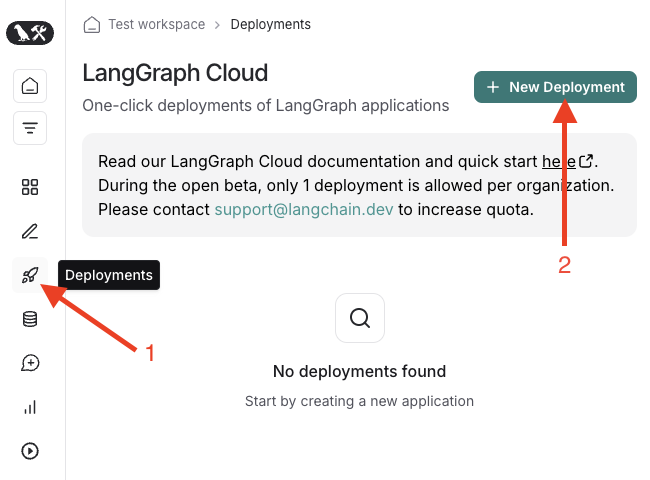
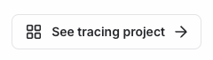

# Part 6: Deploy your agent using LangGraph Cloud (beta)

> **Note**
>
> - LangGraph is an MIT-licensed open-source library, which we are committed to maintaining and growing for the community.
> - LangGraph Cloud is an optional managed hosting service for LangGraph, which provides additional features geared towards production deployments.
> - We are actively contributing improvements back to LangGraph informed by our work on LangGraph Cloud.
> - You can always deploy LangGraph applications on your own infrastructure using the open-source LangGraph project.

In the previous tutorials, you've learned how to create and iterate on a LangGraph agent. Everything we've done so far has been local to your machine. Once you're happy with your agent, it's time to deploy it to the cloud so that it can be accessed via your application or other users.

This tutorial will walk you through the process of deploying your agent using LangGraph Cloud (beta). LangGraph Cloud is a managed hosting service from LangChain that makes it easy to deploy and scale your LangGraph agents. It integrates with LangSmith for observability and tracing to provide robust deployment infrastructure.

> **Note**
> LangGraph Cloud is a paid service and is currently in beta. To deploy an agent to LangGraph Cloud, you must be on any of the paid LangSmith plans. [Learn more about LangSmith pricing](https://www.langchain.com/pricing)

## Prerequisites

To deploy your agent to LangGraph Cloud, you will need:

- A [GitHub](https://github.com/) account and the Git CLI or some other way to create and push a Git repository to GitHub from your computer.
- A LangSmith account on any paid plan. [Sign up for LangSmith](https://smith.langchain.com/) if you don't have an account yet.
- A LangGraph agent that you want to deploy, such as the one built throughout this tutorial series.
- We'll be using the [`@langchain/langgraph-sdk`](https://www.npmjs.com/package/@langchain/langgraph-sdk) to interact with the LangGraph Cloud REST API.

Start by installing the `@langchain/langgraph-sdk` package:

```sh
npm install @langchain/langgraph-sdk
```

If you'll be deploying the agent from this tutorial series, there is one small modification you need to make before we move on to deployment. In the part about [human-in-the-loop workflows](4-human-in-the-loop.md), we added an `interruptBefore` argument when compiling the graph. That was a great way to learn about human-in-the-loop workflows, but we want the agent to be able to search autonomously for the deployed version. To remove it, locate the code where the agent is compiled in `chatbot.ts`. It should look like this:

```ts
// Define the graph and compile it into a runnable
export const app = new StateGraph(MessagesAnnotation)
  .addNode("agent", callModel)
  .addEdge("__start__", "agent")
  .addNode("tools", new ToolNode(tools))
  .addConditionalEdges("agent", shouldUseTool)
  .addEdge("tools", "agent")
  .compile({ checkpointer: new MemorySaver(), interruptBefore: ["tools"] });
```

Additionally, agents deployed via LangGraph Cloud will automatically be checkpointed using a Postgres checkpointer for persistent storage. This means you can also remove the `MemorySaver` checkpointer we have been using for local runs.

Remove the object containing the `checkpointer` and `interruptBefore: ["tools"]` options from the call to `compile` so that it looks like this:

```ts
// Define the graph and compile it into a runnable
export const app = new StateGraph(MessagesAnnotation)
  .addNode("agent", callModel)
  .addEdge("__start__", "agent")
  .addNode("tools", new ToolNode(tools))
  .addConditionalEdges("agent", shouldUseTool)
  .addEdge("tools", "agent")
  .compile();
```

This change will allow the deployed agent to perform its searches autonomously and save the progress checkpoints in a persistent Postgres database managed by LangGraph Cloud. With that, you're ready to get your agent deployed!

## Step 1: Create a new Git repository with your agent code

Start by opening your terminal and navigating to the directory where your agent code is located. From there, run the following code to initialize a git repository in that folder:

```sh
git init .
```

It's important not to commit your environment variables to the repo. They're stored in the `.env` file, so we're going to add it to the `.gitignore` file, which tells Git which files should not be tracked. While we're at it, we'll also ignore the `node_modules` folder. The following commands will create a `.gitignore` file that ignores those files from our project:

```sh
touch .gitignore
echo ".env" >> .gitignore
echo "node_modules" >> .gitignore
```

Next, add the files LangGraph Cloud needs to build and run the agent and commit them to the repo locally:

```sh
git add chatbot.ts langgraph.json package.json .gitignore
git commit --message "Initial commit of LangGraph agent"
git branch --move --force main
```

Now you've got a local repository with your agent code in the `main` branch. The next step is to push the repository to GitHub.

## Step 2: Push your repository to GitHub

Click [this link](https://github.com/new?name=langgraph-agent&description=My%20first%20langgraph%20agent) to create a new GitHub repository. Use the following options to create it:

- **Repository template**: No template
- **Repository name**: This tutorial will assume the repo is named `langgraph-agent`, but feel free to choose something else if you prefer. Wherever this tutorial mentions `langgraph-agent`, replace it with the name you choose.
- **Description**: You can use any description you'd like.
- LangGraph Cloud can deploy from both Public and Private repositories, so choose whichever you prefer
- **Initialize this repository with**: None. We've already initialized the repository locally, so there's no need to do so here.

When you're done, click the "Create repository" button at the bottom of the page. You'll be taken to the repository page, which will have a URL like `https://github.com/YOUR_USERNAME/langgraph-agent`. With the repository created, you can push your files to it. Run the following commands in your terminal, making sure to replace `YOUR_USERNAME` with your GitHub username:

```sh
git remote add origin https://github.com/YOUR_USERNAME/langgraph-agent.git
git push --set-upstream origin main
```

This adds the GitHub repository as a remote and pushes your code to it. You can now see your code on GitHub by visiting the repository URL in your browser. More importantly, this means that once you connect your GitHub account to LangSmith, you'll be able to deploy your agent directly from GitHub. Let's do that now!

## Step 3: Connect your GitHub account to LangSmith

Log in to your LangSmith account at [smith.langchain.com](https://smith.langchain.com/). Once you're logged in:

1. Click on the "Deployments" (rocket ship icon) tab in the sidebar on the left.
2. From the deployments page, click the "+ New Deployment" button in the top right corner.



That will open the "Create New Deployment" panel. To start, you'll need to connect your GitHub account to access the repo with your agent code.

1. Click the "Import with GitHub" button at the top. This will open a new tab where you will be prompted to grant LangGraph Cloud access to your GitHub repositories.
2. When prompted to install "hosted-langserve" select the account or organization that owns your agent repository.
3. On the next screen, you will be prompted to decide which repositories to install and authorize access to. It's a good security practice to grant the minimum permissions necessary.
4. Choose "Only select repositories" and then select the `langgraph-agent` repository you created earlier.
5. Click the "Install & Authorize" button to grant LangGraph Cloud access to read the code and metadata in your repository.

## Step 4: Configure your deployment

After connecting your GitHub account to LangSmith, the GitHub tab will close and return you to the LangSmith UI.

Now, instead of the GitHub button you should see your account and a prompt to select a repository from a dropdown. Select your `langgraph-agent` repository from the dropdown. Change the "Name" of your deployment to `langgraph-agent` so it's easy to identify.

The LangGraph API config file and Git reference should both have the correct values by default. You also don't need to change the "Deployment Type" configuration.

Make sure to add your environment variables. As a reminder, they are in the `.env` file in your project folder on your computer. You can copy the whole `.env` file and paste its contents into the `name` field.

Once you've added your environment variables you are ready to deploy! Click the "Submit" button in the top right corner. You will be taken to the deployment page for your new deployment!

## Step 5: Deploy your agent

The first thing that needs to happen is LangGraph Cloud will build your agent into a deployable application. After the build completes, LangGraph Cloud will deploy your agent.

Once the agent has finished deploying, you should see a green message saying "Currently deployed" in the entry inside the "Revisions" list. Near the top of the page and towards the middle, locate your "API URL". This is the base URL for the endpoints you will hit to use your agent. Note it down somewhere, as you'll be using it soon.

The last step before using the deployed agent is to create an API key. Agent deployments are secured using API keys are how you control who has access to run your deployed agent. To create an API key, click the settings button (gear icon) in the bottom left corner of the page to go to the workspace settings page. Then click the "API Keys" tab in the settings page.

From the API keys page, create a new API Key:

1. Click the "Create API Key" button in the top right
2. Set the description to something identifiable, like "LangGraph Agent API Key"
3. Select "Personal Access Token". When integrating the agent into your application, use a Service Key instead.
4. Click the "Create API Key" button
5. Add the generated API key to your `.env` file as `LANGSMITH_API_KEY=YOUR_KEY_HERE`

Now you have everything you need to start using your deployed agent!

## Step 6: Invoke your deployed agent via the API

With the agent deployed, we need to write some code that interacts with it via the API using the LangGraph SDK. Create a new file called `deployed-agent.ts` and add the following code to interact with it via API:

```ts
// deployed-agent.ts
import { BaseMessageLike } from "@langchain/core/messages";
import { Client } from "@langchain/langgraph-sdk";
import "dotenv/config";

// Create an API client for interacting with the API
const client = new Client({
  apiUrl: process.env.LANGGRAPH_DEPLOY_URL!,
  apiKey: process.env.LANGSMITH_API_KEY!,
});

// get the default assistant created when deploying the agent
const assistant = (await client.assistants.search())[0];

// create a conversation thread
const thread = await client.threads.create();

// define the user message that will start the conversation thread
const input = {
  messages: [
    { type: "user", content: "What is the weather like in sf right now?" },
  ] satisfies BaseMessageLike[],
};

// Initialize the conversation using `.stream()`, which streams each message response as it is generated
const streamResponse = client.runs.stream(
  thread.thread_id,
  assistant.assistant_id,
  {
    input,
  }
);

// wait for each message in the stream and print it to the console
for await (const chunk of streamResponse) {
  if (chunk.data && chunk.event !== "metadata") {
    console.log(chunk.data.messages.at(-1).content, "\n\n");
  }
}
```

Previously we've been using the `invoke()` method of running agents, which waits for the entire conversation to resolve before returning the results. In applications where you want the user to see messages as they become available, the `.stream()` API provides a generator that yields each message once it is available. This can make long-running agentic workflows feel more responsive.

To run the deployed agent using this code, use the following command:

```sh
npx tsx deployed-agent.ts
```

This will grab the default-generated assistant for your deployment, create a new thread, and run the conversation with your deployed agent! You should see a response similar to the following (tool response trimmed for brevity):

```
What is the weather like in sf right now?


[{"title":"Weather in San Francisco", ... }]


The current weather in San Francisco is partly cloudy with a temperature of 20.2°C (68.4°F). The wind is coming from the west-southwest at 12.1 mph (19.4 kph), and the humidity is at 68%. There is no precipitation reported, and visibility is good at 16 km (9 miles).

For more details, you can check the full report [here](https://www.weatherapi.com/).
```

And that's it! You've now successfully deployed your agent using LangGraph Cloud and run it using the `@langchain/langgraph-sdk` package. You're ready to integrate LLM-powered, tool-wielding agents into your applications now.

## Step 7: Viewing traces in LangSmith

Now that you've run a deployed agent, it's possible to view traces from its executions using langsmith.

From the "Deployments" page in [LangSmith](https://smith.langchain.com/), select your `langgraph-agent` deployment. near the bottom-right corner of the page, you should see a button that says "See tracing project" that looks like this:



Click that button to be taken to the tracing project for your deployed agent. Here you can access observability info about your agent such as runs and metrics. Feel free to explore the data available here.

## Summary

Great work getting here! You've learned so much:

- how to build an LLM-powered agent with access to tools
- persist its state across runs and conversations
- add a human-in-the-loop for sensitive actions
- visualize, debug, and iterate on your agent using LangGraph Studio
- deploy your agent using LangGraph Cloud and interact with it via the SDK

This is the end of the tutorial series, but it's just the beginning of your journey building LLM-powered agents for your applications. We hope you've enjoyed the series and are excited to see what you build next!
