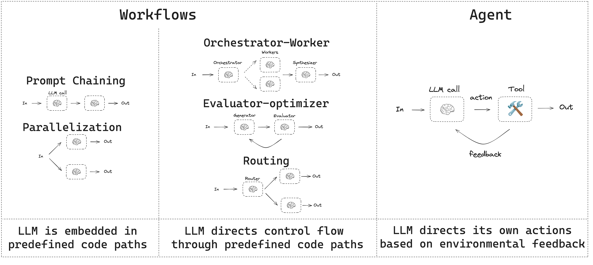
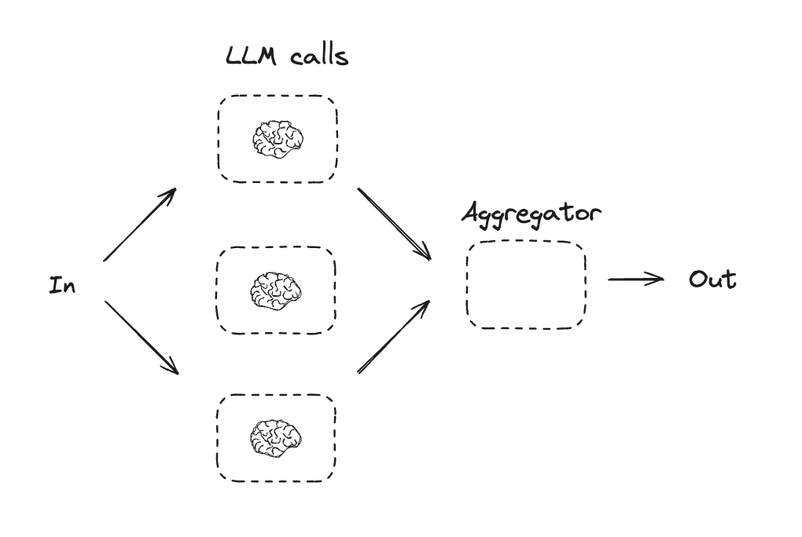
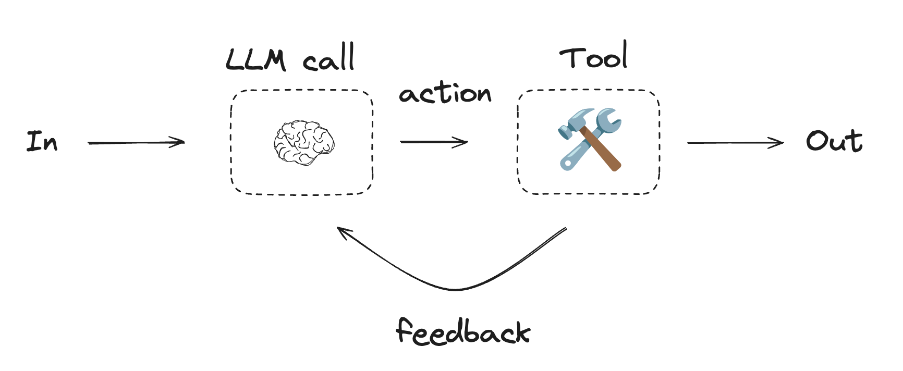

# Workflows and Agents

This guide reviews common patterns for agentic systems. In describing these systems, it can be useful to make a distinction between "workflows" and "agents". One way to think about this difference is nicely explained [here](https://www.anthropic.com/research/building-effective-agents) by Anthropic:

> Workflows are systems where LLMs and tools are orchestrated through predefined code paths.
> Agents, on the other hand, are systems where LLMs dynamically direct their own processes and tool usage, maintaining control over how they accomplish tasks.

Here is a simple way to visualize these differences:



When building agents and workflows, LangGraph [offers a number of benefits](https://langchain-ai.github.io/langgraphjs/concepts/high_level/) including persistence, streaming, and support for debugging as well as deployment.

## Set up

!!! note Compatibility

    The Functional API requires `@langchain/langgraph>=0.2.24`.

You can use [any chat model](https://js.langchain.com/docs/integrations/chat/) that supports structured outputs and tool calling. Below, we show the process of installing the packages, setting API keys, and testing structured outputs / tool calling for Anthropic.

??? "Install dependencies"

    ```bash
    yarn add @langchain/langgraph @langchain/anthropic @langchain/core
    ```

Initialize an LLM

```ts
import { ChatAnthropic } from "@langchain/anthropic";

process.env.ANTHROPIC_API_KEY = "<your_anthropic_key>";

const llm = new ChatAnthropic({
  model: "claude-3-5-sonnet-latest",
});
```

## Building Blocks: The Augmented LLM

LLM have [augmentations](https://www.anthropic.com/research/building-effective-agents) that support building workflows and agents. These include [structured outputs](https://js.langchain.com/docs/concepts/structured_outputs/) and [tool calling](https://js.langchain.com/docs/concepts/tool_calling/), as shown in this image from the Anthropic [blog](https://www.anthropic.com/research/building-effective-agents):


```ts
import { tool } from "@langchain/core/tools";
import { z } from "zod";

const searchQuerySchema = z.object({
  searchQuery: z.string().describe("Query that is optimized web search."),
  justification: z.string("Why this query is relevant to the user's request."),
});

// Augment the LLM with schema for structured output
const structuredLlm = llm.withStructuredOutput(searchQuerySchema, {
  name: "searchQuery",
});

// Invoke the augmented LLM
const output = await structuredLlm.invoke(
  "How does Calcium CT score relate to high cholesterol?"
);

const multiply = tool(
  async ({ a, b }) => {
    return a * b;
  },
  {
    name: "multiply",
    description: "multiplies two numbers together",
    schema: z.object({
      a: z.number("the first number"),
      b: z.number("the second number"),
    }),
  }
);

// Augment the LLM with tools
const llmWithTools = llm.bindTools([multiply]);

// Invoke the LLM with input that triggers the tool call
const message = await llmWithTools.invoke("What is 2 times 3?");

console.log(message.tool_calls);
```

## Prompt chaining

In prompt chaining, each LLM call processes the output of the previous one.

As noted in the [Anthropic blog](https://www.anthropic.com/research/building-effective-agents):

> Prompt chaining decomposes a task into a sequence of steps, where each LLM call processes the output of the previous one. You can add programmatic checks (see "gate” in the diagram below) on any intermediate steps to ensure that the process is still on track.

> When to use this workflow: This workflow is ideal for situations where the task can be easily and cleanly decomposed into fixed subtasks. The main goal is to trade off latency for higher accuracy, by making each LLM call an easier task.


=== "Graph API"

    ```ts
    import { StateGraph, Annotation } from "@langchain/langgraph";

    // Graph state
    const StateAnnotation = Annotation.Root({
      topic: Annotation<string>,
      joke: Annotation<string>,
      improvedJoke: Annotation<string>,
      finalJoke: Annotation<string>,
    });

    // Define node functions

    // First LLM call to generate initial joke
    async function generateJoke(state: typeof StateAnnotation.State) {
      const msg = await llm.invoke(`Write a short joke about ${state.topic}`);
      return { joke: msg.content };
    }

    // Gate function to check if the joke has a punchline
    function checkPunchline(state: typeof StateAnnotation.State) {
      // Simple check - does the joke contain "?" or "!"
      if (state.joke?.includes("?") || state.joke?.includes("!")) {
        return "Pass";
      }
      return "Fail";
    }

      // Second LLM call to improve the joke
    async function improveJoke(state: typeof StateAnnotation.State) {
      const msg = await llm.invoke(
        `Make this joke funnier by adding wordplay: ${state.joke}`
      );
      return { improvedJoke: msg.content };
    }

    // Third LLM call for final polish
    async function polishJoke(state: typeof StateAnnotation.State) {
      const msg = await llm.invoke(
        `Add a surprising twist to this joke: ${state.improvedJoke}`
      );
      return { finalJoke: msg.content };
    }

    // Build workflow
    const chain = new StateGraph(StateAnnotation)
      .addNode("generateJoke", generateJoke)
      .addNode("improveJoke", improveJoke)
      .addNode("polishJoke", polishJoke)
      .addEdge("__start__", "generateJoke")
      .addConditionalEdges("generateJoke", checkPunchline, {
        Pass: "improveJoke",
        Fail: "__end__"
      })
      .addEdge("improveJoke", "polishJoke")
      .addEdge("polishJoke", "__end__")
      .compile();

    // Invoke
    const state = await chain.invoke({ topic: "cats" });
    console.log("Initial joke:");
    console.log(state.joke);
    console.log("\n--- --- ---\n");
    if (state.improvedJoke !== undefined) {
      console.log("Improved joke:");
      console.log(state.improvedJoke);
      console.log("\n--- --- ---\n");

      console.log("Final joke:");
      console.log(state.finalJoke);
    } else {
      console.log("Joke failed quality gate - no punchline detected!");
    }
    ```

    **LangSmith Trace**

    https://smith.langchain.com/public/a0281fca-3a71-46de-beee-791468607b75/r

=== "Functional API"

    ```ts
    import { task, entrypoint } from "@langchain/langgraph";

    // Tasks

    // First LLM call to generate initial joke
    const generateJoke = task("generateJoke", async (topic: string) => {
      const msg = await llm.invoke(`Write a short joke about ${topic}`);
      return msg.content;
    });

    // Gate function to check if the joke has a punchline
    function checkPunchline(joke: string) {
      // Simple check - does the joke contain "?" or "!"
      if (joke.includes("?") || joke.includes("!")) {
        return "Pass";
      }
      return "Fail";
    }

      // Second LLM call to improve the joke
    const improveJoke = task("improveJoke", async (joke: string) => {
      const msg = await llm.invoke(
        `Make this joke funnier by adding wordplay: ${joke}`
      );
      return msg.content;
    });

    // Third LLM call for final polish
    const polishJoke = task("polishJoke", async (joke: string) => {
      const msg = await llm.invoke(
        `Add a surprising twist to this joke: ${joke}`
      );
      return msg.content;
    });

    const workflow = entrypoint(
      "jokeMaker",
      async (topic: string) => {
        const originalJoke = await generateJoke(topic);
        if (checkPunchline(originalJoke) === "Pass") {
          return originalJoke;
        }
        const improvedJoke = await improveJoke(originalJoke);
        const polishedJoke = await polishJoke(improvedJoke);
        return polishedJoke;
      }
    );

    const stream = await workflow.stream("cats", {
      streamMode: "updates",
    });

    for await (const step of stream) {
      console.log(step);
    }
    ```

    **LangSmith Trace**

    https://smith.langchain.com/public/332fa4fc-b6ca-416e-baa3-161625e69163/r

## Parallelization

With parallelization, LLMs work simultaneously on a task:

> LLMs can sometimes work simultaneously on a task and have their outputs aggregated programmatically. This workflow, parallelization, manifests in two key variations: Sectioning: Breaking a task into independent subtasks run in parallel. Voting: Running the same task multiple times to get diverse outputs.

> When to use this workflow: Parallelization is effective when the divided subtasks can be parallelized for speed, or when multiple perspectives or attempts are needed for higher confidence results. For complex tasks with multiple considerations, LLMs generally perform better when each consideration is handled by a separate LLM call, allowing focused attention on each specific aspect.



=== "Graph API"

    ```typescript
    import { StateGraph, Annotation } from "@langchain/langgraph";

    // Graph state
    const StateAnnotation = Annotation.Root({
      topic: Annotation<string>,
      joke: Annotation<string>,
      story: Annotation<string>,
      poem: Annotation<string>,
      combinedOutput: Annotation<string>,
    });

    // Nodes
    // First LLM call to generate initial joke
    async function callLlm1(state: typeof StateAnnotation.State) {
      const msg = await llm.invoke(`Write a joke about ${state.topic}`);
      return { joke: msg.content };
    }

    // Second LLM call to generate story
    async function callLlm2(state: typeof StateAnnotation.State) {
      const msg = await llm.invoke(`Write a story about ${state.topic}`);
      return { story: msg.content };
    }

    // Third LLM call to generate poem
    async function callLlm3(state: typeof StateAnnotation.State) {
      const msg = await llm.invoke(`Write a poem about ${state.topic}`);
      return { poem: msg.content };
    }

    // Combine the joke, story and poem into a single output
    async function aggregator(state: typeof StateAnnotation.State) {
      const combined = `Here's a story, joke, and poem about ${state.topic}!\n\n` +
        `STORY:\n${state.story}\n\n` +
        `JOKE:\n${state.joke}\n\n` +
        `POEM:\n${state.poem}`;
      return { combinedOutput: combined };
    }

    // Build workflow
    const parallelWorkflow = new StateGraph(StateAnnotation)
      .addNode("callLlm1", callLlm1)
      .addNode("callLlm2", callLlm2)
      .addNode("callLlm3", callLlm3)
      .addNode("aggregator", aggregator)
      .addEdge("__start__", "callLlm1")
      .addEdge("__start__", "callLlm2")
      .addEdge("__start__", "callLlm3")
      .addEdge("callLlm1", "aggregator")
      .addEdge("callLlm2", "aggregator")
      .addEdge("callLlm3", "aggregator")
      .addEdge("aggregator", "__end__")
      .compile();

    // Invoke
    const result = await parallelWorkflow.invoke({ topic: "cats" });
    console.log(result.combinedOutput);
    ```

    **LangSmith Trace**

    https://smith.langchain.com/public/3be2e53c-ca94-40dd-934f-82ff87fac277/r

    **Resources:**

    **Documentation**

    See our documentation on parallelization [here](https://langchain-ai.github.io/langgraphjs/how-tos/branching/).

=== "Functional API"

    ```ts
    import { task, entrypoint } from "@langchain/langgraph";

    // Tasks

    // First LLM call to generate initial joke
    const callLlm1 = task("generateJoke", async (topic: string) => {
      const msg = await llm.invoke(`Write a joke about ${topic}`);
      return msg.content;
    });

    // Second LLM call to generate story
    const callLlm2 = task("generateStory", async (topic: string) => {
      const msg = await llm.invoke(`Write a story about ${topic}`);
      return msg.content;
    });

    // Third LLM call to generate poem
    const callLlm3 = task("generatePoem", async (topic: string) => {
      const msg = await llm.invoke(`Write a poem about ${topic}`);
      return msg.content;
    });

    // Combine outputs
    const aggregator = task("aggregator", async (params: {
      topic: string;
      joke: string;
      story: string;
      poem: string;
    }) => {
      const { topic, joke, story, poem } = params;
      return `Here's a story, joke, and poem about ${topic}!\n\n` +
        `STORY:\n${story}\n\n` +
        `JOKE:\n${joke}\n\n` +
        `POEM:\n${poem}`;
    });

    // Build workflow
    const workflow = entrypoint(
      "parallelWorkflow",
      async (topic: string) => {
        const [joke, story, poem] = await Promise.all([
          callLlm1(topic),
          callLlm2(topic),
          callLlm3(topic),
        ]);

        return aggregator({ topic, joke, story, poem });
      }
    );

    // Invoke
    const stream = await workflow.stream("cats", {
      streamMode: "updates",
    });

    for await (const step of stream) {
      console.log(step);
    }
    ```

    **LangSmith Trace**

    https://smith.langchain.com/public/623d033f-e814-41e9-80b1-75e6abb67801/r

## Routing

Routing classifies an input and directs it to a followup task. As noted in the [Anthropic blog](https://www.anthropic.com/research/building-effective-agents):

> Routing classifies an input and directs it to a specialized followup task. This workflow allows for separation of concerns, and building more specialized prompts. Without this workflow, optimizing for one kind of input can hurt performance on other inputs.

> When to use this workflow: Routing works well for complex tasks where there are distinct categories that are better handled separately, and where classification can be handled accurately, either by an LLM or a more traditional classification model/algorithm.


=== "Graph API"

    ```ts
    import { StateGraph, Annotation } from "@langchain/langgraph";
    import { z } from "zod";

    // Schema for structured output to use as routing logic
    const routeSchema = z.object({
      step: z.enum(["poem", "story", "joke"]).describe(
        "The next step in the routing process"
      ),
    });

    // Augment the LLM with schema for structured output
    const router = llm.withStructuredOutput(routeSchema);

    // Graph state
    const StateAnnotation = Annotation.Root({
      input: Annotation<string>,
      decision: Annotation<string>,
      output: Annotation<string>,
    });

    // Nodes
    // Write a story
    async function llmCall1(state: typeof StateAnnotation.State) {
      const result = await llm.invoke([{
        role: "system",
        content: "You are an expert storyteller.",
      }, {
        role: "user",
        content: state.input
      }]);
      return { output: result.content };
    }

    // Write a joke
    async function llmCall2(state: typeof StateAnnotation.State) {
      const result = await llm.invoke([{
        role: "system",
        content: "You are an expert comedian.",
      }, {
        role: "user",
        content: state.input
      }]);
      return { output: result.content };
    }

    // Write a poem
    async function llmCall3(state: typeof StateAnnotation.State) {
      const result = await llm.invoke([{
        role: "system",
        content: "You are an expert poet.",
      }, {
        role: "user",
        content: state.input
      }]);
      return { output: result.content };
    }

    async function llmCallRouter(state: typeof StateAnnotation.State) {
      // Route the input to the appropriate node
      const decision = await router.invoke([
        {
          role: "system",
          content: "Route the input to story, joke, or poem based on the user's request."
        },
        {
          role: "user",
          content: state.input
        },
      ]);

      return { decision: decision.step };
    }

    // Conditional edge function to route to the appropriate node
    function routeDecision(state: typeof StateAnnotation.State) {
      // Return the node name you want to visit next
      if (state.decision === "story") {
        return "llmCall1";
      } else if (state.decision === "joke") {
        return "llmCall2";
      } else if (state.decision === "poem") {
        return "llmCall3";
      }
    }

    // Build workflow
    const routerWorkflow = new StateGraph(StateAnnotation)
      .addNode("llmCall1", llmCall1)
      .addNode("llmCall2", llmCall2)
      .addNode("llmCall3", llmCall3)
      .addNode("llmCallRouter", llmCallRouter)
      .addEdge("__start__", "llmCallRouter")
      .addConditionalEdges(
        "llmCallRouter",
        routeDecision,
        ["llmCall1", "llmCall2", "llmCall3"],
      )
      .addEdge("llmCall1", "__end__")
      .addEdge("llmCall2", "__end__")
      .addEdge("llmCall3", "__end__")
      .compile();

    // Invoke
    const state = await routerWorkflow.invoke({
      input: "Write me a joke about cats"
    });
    console.log(state.output);
    ```

    **LangSmith Trace**

    https://smith.langchain.com/public/c4580b74-fe91-47e4-96fe-7fac598d509c/r

    **Examples**

    [Here](https://langchain-ai.github.io/langgraphjs/tutorials/rag/langgraph_adaptive_rag_local/) is RAG workflow that routes questions. See our video [here](https://www.youtube.com/watch?v=bq1Plo2RhYI).

=== "Functional API"

    ```ts
    import { z } from "zod";
    import { task, entrypoint } from "@langchain/langgraph";

    // Schema for structured output to use as routing logic
    const routeSchema = z.object({
      step: z.enum(["poem", "story", "joke"]).describe(
        "The next step in the routing process"
      ),
    });

    // Augment the LLM with schema for structured output
    const router = llm.withStructuredOutput(routeSchema);

    // Tasks
    // Write a story
    const llmCall1 = task("generateStory", async (input: string) => {
      const result = await llm.invoke([{
        role: "system",
        content: "You are an expert storyteller.",
      }, {
        role: "user",
        content: input
      }]);
      return result.content;
    });

    // Write a joke
    const llmCall2 = task("generateJoke", async (input: string) => {
      const result = await llm.invoke([{
        role: "system",
        content: "You are an expert comedian.",
      }, {
        role: "user",
        content: input
      }]);
      return result.content;
    });

    // Write a poem
    const llmCall3 = task("generatePoem", async (input: string) => {
      const result = await llm.invoke([{
        role: "system",
        content: "You are an expert poet.",
      }, {
        role: "user",
        content: input
      }]);
      return result.content;
    });

    // Route the input to the appropriate node
    const llmCallRouter = task("router", async (input: string) => {
      const decision = await router.invoke([
        {
          role: "system",
          content: "Route the input to story, joke, or poem based on the user's request."
        },
        {
          role: "user",
          content: input
        },
      ]);
      return decision.step;
    });

    // Build workflow
    const workflow = entrypoint(
      "routerWorkflow",
      async (input: string) => {
        const nextStep = await llmCallRouter(input);

        let llmCall;
        if (nextStep === "story") {
          llmCall = llmCall1;
        } else if (nextStep === "joke") {
          llmCall = llmCall2;
        } else if (nextStep === "poem") {
          llmCall = llmCall3;
        }

        const finalResult = await llmCall(input);
        return finalResult;
      }
    );

    // Invoke
    const stream = await workflow.stream("Write me a joke about cats", {
      streamMode: "updates",
    });

    for await (const step of stream) {
      console.log(step);
    }
    ```

    **LangSmith Trace**

    https://smith.langchain.com/public/5e2eb979-82dd-402c-b1a0-a8cceaf2a28a/r

## Orchestrator-Worker

With orchestrator-worker, an orchestrator breaks down a task and delegates each sub-task to workers. As noted in the [Anthropic blog](https://www.anthropic.com/research/building-effective-agents):

> In the orchestrator-workers workflow, a central LLM dynamically breaks down tasks, delegates them to worker LLMs, and synthesizes their results.

> When to use this workflow: This workflow is well-suited for complex tasks where you can’t predict the subtasks needed (in coding, for example, the number of files that need to be changed and the nature of the change in each file likely depend on the task). Whereas it’s topographically similar, the key difference from parallelization is its flexibility—subtasks aren't pre-defined, but determined by the orchestrator based on the specific input.


=== "Graph API"

    ```ts
    import { z } from "zod";

    // Schema for structured output to use in planning
    const sectionSchema = z.object({
      name: z.string().describe("Name for this section of the report."),
      description: z.string().describe(
        "Brief overview of the main topics and concepts to be covered in this section."
      ),
    });

    const sectionsSchema = z.object({
      sections: z.array(sectionSchema).describe("Sections of the report."),
    });

    // Augment the LLM with schema for structured output
    const planner = llm.withStructuredOutput(sectionsSchema);
    ```

    **Creating Workers in LangGraph**

    Because orchestrator-worker workflows are common, LangGraph **has the `Send` API to support this**. It lets you dynamically create worker nodes and send each one a specific input. Each worker has its own state, and all worker outputs are written to a *shared state key* that is accessible to the orchestrator graph. This gives the orchestrator access to all worker output and allows it to synthesize them into a final output. As you can see below, we iterate over a list of sections and `Send` each to a worker node. See further documentation [here](https://langchain-ai.github.io/langgraphjs/how-tos/map-reduce/) and [here](https://langchain-ai.github.io/langgraphjs/concepts/low_level/#send).

    ```ts
    import { Annotation, StateGraph, Send } from "@langchain/langgraph";

    // Graph state
    const StateAnnotation = Annotation.Root({
      topic: Annotation<string>,
      sections: Annotation<Array<z.infer<typeof sectionSchema>>>,
      completedSections: Annotation<string[]>({
        default: () => [],
        reducer: (a, b) => a.concat(b),
      }),
      finalReport: Annotation<string>,
    });

    // Worker state
    const WorkerStateAnnotation = Annotation.Root({
      section: Annotation<z.infer<typeof sectionSchema>>,
      completedSections: Annotation<string[]>({
        default: () => [],
        reducer: (a, b) => a.concat(b),
      }),
    });

    // Nodes
    async function orchestrator(state: typeof StateAnnotation.State) {
      // Generate queries
      const reportSections = await planner.invoke([
        { role: "system", content: "Generate a plan for the report." },
        { role: "user", content: `Here is the report topic: ${state.topic}` },
      ]);

      return { sections: reportSections.sections };
    }

    async function llmCall(state: typeof WorkerStateAnnotation.State) {
      // Generate section
      const section = await llm.invoke([
        {
          role: "system",
          content: "Write a report section following the provided name and description. Include no preamble for each section. Use markdown formatting.",
        },
        {
          role: "user",
          content: `Here is the section name: ${state.section.name} and description: ${state.section.description}`,
        },
      ]);

      // Write the updated section to completed sections
      return { completedSections: [section.content] };
    }

    async function synthesizer(state: typeof StateAnnotation.State) {
      // List of completed sections
      const completedSections = state.completedSections;

      // Format completed section to str to use as context for final sections
      const completedReportSections = completedSections.join("\n\n---\n\n");

      return { finalReport: completedReportSections };
    }

    // Conditional edge function to create llm_call workers that each write a section of the report
    function assignWorkers(state: typeof StateAnnotation.State) {
      // Kick off section writing in parallel via Send() API
      return state.sections.map((section) =>
        new Send("llmCall", { section })
      );
    }

    // Build workflow
    const orchestratorWorker = new StateGraph(StateAnnotation)
      .addNode("orchestrator", orchestrator)
      .addNode("llmCall", llmCall)
      .addNode("synthesizer", synthesizer)
      .addEdge("__start__", "orchestrator")
      .addConditionalEdges(
        "orchestrator",
        assignWorkers,
        ["llmCall"]
      )
      .addEdge("llmCall", "synthesizer")
      .addEdge("synthesizer", "__end__")
      .compile();

    // Invoke
    const state = await orchestratorWorker.invoke({
      topic: "Create a report on LLM scaling laws"
    });
    console.log(state.finalReport);
    ```

    **LangSmith Trace**

    https://smith.langchain.com/public/78cbcfc3-38bf-471d-b62a-b299b144237d/r

    **Resources:**

    **Examples**

    [Here](https://github.com/langchain-ai/report-mAIstro) is a project that uses orchestrator-worker for report planning and writing. See our video [here](https://www.youtube.com/watch?v=wSxZ7yFbbas).

=== "Functional API"

    ```ts
    import { z } from "zod";
    import { task, entrypoint } from "@langchain/langgraph";

    // Schema for structured output to use in planning
    const sectionSchema = z.object({
      name: z.string().describe("Name for this section of the report."),
      description: z.string().describe(
        "Brief overview of the main topics and concepts to be covered in this section."
      ),
    });

    const sectionsSchema = z.object({
      sections: z.array(sectionSchema).describe("Sections of the report."),
    });

    // Augment the LLM with schema for structured output
    const planner = llm.withStructuredOutput(sectionsSchema);

    // Tasks
    const orchestrator = task("orchestrator", async (topic: string) => {
      // Generate queries
      const reportSections = await planner.invoke([
        { role: "system", content: "Generate a plan for the report." },
        { role: "user", content: `Here is the report topic: ${topic}` },
      ]);

      return reportSections.sections;
    });

    const llmCall = task("sectionWriter", async (section: z.infer<typeof sectionSchema>) => {
      // Generate section
      const result = await llm.invoke([
        {
          role: "system",
          content: "Write a report section.",
        },
        {
          role: "user",
          content: `Here is the section name: ${section.name} and description: ${section.description}`,
        },
      ]);

      return result.content;
    });

    const synthesizer = task("synthesizer", async (completedSections: string[]) => {
      // Synthesize full report from sections
      return completedSections.join("\n\n---\n\n");
    });

    // Build workflow
    const workflow = entrypoint(
      "orchestratorWorker",
      async (topic: string) => {
        const sections = await orchestrator(topic);
        const completedSections = await Promise.all(
          sections.map((section) => llmCall(section))
        );
        return synthesizer(completedSections);
      }
    );

    // Invoke
    const stream = await workflow.stream("Create a report on LLM scaling laws", {
      streamMode: "updates",
    });

    for await (const step of stream) {
      console.log(step);
    }
    ```

    **LangSmith Trace**

    https://smith.langchain.com/public/75a636d0-6179-4a12-9836-e0aa571e87c5/r

## Evaluator-optimizer

In the evaluator-optimizer workflow, one LLM call generates a response while another provides evaluation and feedback in a loop:

> In the evaluator-optimizer workflow, one LLM call generates a response while another provides evaluation and feedback in a loop.

> When to use this workflow: This workflow is particularly effective when we have clear evaluation criteria, and when iterative refinement provides measurable value. The two signs of good fit are, first, that LLM responses can be demonstrably improved when a human articulates their feedback; and second, that the LLM can provide such feedback. This is analogous to the iterative writing process a human writer might go through when producing a polished document.


=== "Graph API"

    ```ts
    import { z } from "zod";
    import { Annotation, StateGraph } from "@langchain/langgraph";

    // Graph state
    const StateAnnotation = Annotation.Root({
      joke: Annotation<string>,
      topic: Annotation<string>,
      feedback: Annotation<string>,
      funnyOrNot: Annotation<string>,
    });

    // Schema for structured output to use in evaluation
    const feedbackSchema = z.object({
      grade: z.enum(["funny", "not funny"]).describe(
        "Decide if the joke is funny or not."
      ),
      feedback: z.string().describe(
        "If the joke is not funny, provide feedback on how to improve it."
      ),
    });

    // Augment the LLM with schema for structured output
    const evaluator = llm.withStructuredOutput(feedbackSchema);

    // Nodes
    async function llmCallGenerator(state: typeof StateAnnotation.State) {
      // LLM generates a joke
      let msg;
      if (state.feedback) {
        msg = await llm.invoke(
          `Write a joke about ${state.topic} but take into account the feedback: ${state.feedback}`
        );
      } else {
        msg = await llm.invoke(`Write a joke about ${state.topic}`);
      }
      return { joke: msg.content };
    }

    async function llmCallEvaluator(state: typeof StateAnnotation.State) {
      // LLM evaluates the joke
      const grade = await evaluator.invoke(`Grade the joke ${state.joke}`);
      return { funnyOrNot: grade.grade, feedback: grade.feedback };
    }

    // Conditional edge function to route back to joke generator or end based upon feedback from the evaluator
    function routeJoke(state: typeof StateAnnotation.State) {
      // Route back to joke generator or end based upon feedback from the evaluator
      if (state.funnyOrNot === "funny") {
        return "Accepted";
      } else if (state.funnyOrNot === "not funny") {
        return "Rejected + Feedback";
      }
    }

    // Build workflow
    const optimizerWorkflow = new StateGraph(StateAnnotation)
      .addNode("llmCallGenerator", llmCallGenerator)
      .addNode("llmCallEvaluator", llmCallEvaluator)
      .addEdge("__start__", "llmCallGenerator")
      .addEdge("llmCallGenerator", "llmCallEvaluator")
      .addConditionalEdges(
        "llmCallEvaluator",
        routeJoke,
        {
          // Name returned by routeJoke : Name of next node to visit
          "Accepted": "__end__",
          "Rejected + Feedback": "llmCallGenerator",
        }
      )
      .compile();

    // Invoke
    const state = await optimizerWorkflow.invoke({ topic: "Cats" });
    console.log(state.joke);
    ```

    **LangSmith Trace**

    https://smith.langchain.com/public/86ab3e60-2000-4bff-b988-9b89a3269789/r

    **Resources:**

    **Examples**

    [Here](https://github.com/langchain-ai/research-rabbit) is an assistant that uses evaluator-optimizer to improve a report. See our video [here](https://www.youtube.com/watch?v=XGuTzHoqlj8).

    [Here](https://langchain-ai.github.io/langgraphjs/tutorials/rag/langgraph_adaptive_rag_local/) is a RAG workflow that grades answers for hallucinations or errors. See our video [here](https://www.youtube.com/watch?v=bq1Plo2RhYI).

=== "Functional API"

    ```ts
    import { z } from "zod";
    import { task, entrypoint } from "@langchain/langgraph";

    // Schema for structured output to use in evaluation
    const feedbackSchema = z.object({
      grade: z.enum(["funny", "not funny"]).describe(
        "Decide if the joke is funny or not."
      ),
      feedback: z.string().describe(
        "If the joke is not funny, provide feedback on how to improve it."
      ),
    });

    // Augment the LLM with schema for structured output
    const evaluator = llm.withStructuredOutput(feedbackSchema);

    // Tasks
    const llmCallGenerator = task("jokeGenerator", async (params: {
      topic: string;
      feedback?: z.infer<typeof feedbackSchema>;
    }) => {
      // LLM generates a joke
      const msg = params.feedback
        ? await llm.invoke(
            `Write a joke about ${params.topic} but take into account the feedback: ${params.feedback.feedback}`
          )
        : await llm.invoke(`Write a joke about ${params.topic}`);
      return msg.content;
    });

    const llmCallEvaluator = task("jokeEvaluator", async (joke: string) => {
      // LLM evaluates the joke
      return evaluator.invoke(`Grade the joke ${joke}`);
    });

    // Build workflow
    const workflow = entrypoint(
      "optimizerWorkflow",
      async (topic: string) => {
        let feedback: z.infer<typeof feedbackSchema> | undefined;
        let joke: string;

        while (true) {
          joke = await llmCallGenerator({ topic, feedback });
          feedback = await llmCallEvaluator(joke);

          if (feedback.grade === "funny") {
            break;
          }
        }

        return joke;
      }
    );

    // Invoke
    const stream = await workflow.stream("Cats", {
      streamMode: "updates",
    });

    for await (const step of stream) {
      console.log(step);
      console.log("\n");
    }
    ```

    **LangSmith Trace**

    https://smith.langchain.com/public/f66830be-4339-4a6b-8a93-389ce5ae27b4/r

## Agent

Agents are typically implemented as an LLM performing actions (via tool-calling) based on environmental feedback in a loop. As noted in the [Anthropic blog](https://www.anthropic.com/research/building-effective-agents):

> Agents can handle sophisticated tasks, but their implementation is often straightforward. They are typically just LLMs using tools based on environmental feedback in a loop. It is therefore crucial to design toolsets and their documentation clearly and thoughtfully.

> When to use agents: Agents can be used for open-ended problems where it’s difficult or impossible to predict the required number of steps, and where you can’t hardcode a fixed path. The LLM will potentially operate for many turns, and you must have some level of trust in its decision-making. Agents' autonomy makes them ideal for scaling tasks in trusted environments.



```ts
import { tool } from "@langchain/core/tools";
import { z } from "zod";

// Define tools
const multiply = tool(
  async ({ a, b }: { a: number; b: number }) => {
    return a * b;
  },
  {
    name: "multiply",
    description: "Multiply two numbers together",
    schema: z.object({
      a: z.number().describe("first number"),
      b: z.number().describe("second number"),
    }),
  }
);

const add = tool(
  async ({ a, b }: { a: number; b: number }) => {
    return a + b;
  },
  {
    name: "add",
    description: "Add two numbers together",
    schema: z.object({
      a: z.number().describe("first number"),
      b: z.number().describe("second number"),
    }),
  }
);

const divide = tool(
  async ({ a, b }: { a: number; b: number }) => {
    return a / b;
  },
  {
    name: "divide",
    description: "Divide two numbers",
    schema: z.object({
      a: z.number().describe("first number"),
      b: z.number().describe("second number"),
    }),
  }
);

// Augment the LLM with tools
const tools = [add, multiply, divide];
const toolsByName = Object.fromEntries(tools.map((tool) => [tool.name, tool]));
const llmWithTools = llm.bindTools(tools);
```

=== "Graph API"

    ```ts
    import { MessagesAnnotation, StateGraph } from "@langchain/langgraph";
    import { ToolNode } from "@langchain/langgraph/prebuilt";
    import {
      SystemMessage,
      ToolMessage
    } from "@langchain/core/messages";

    // Nodes
    async function llmCall(state: typeof MessagesAnnotation.State) {
      // LLM decides whether to call a tool or not
      const result = await llmWithTools.invoke([
        {
          role: "system",
          content: "You are a helpful assistant tasked with performing arithmetic on a set of inputs."
        },
        ...state.messages
      ]);

      return {
        messages: [result]
      };
    }

    const toolNode = new ToolNode(tools);

    // Conditional edge function to route to the tool node or end
    function shouldContinue(state: typeof MessagesAnnotation.State) {
      const messages = state.messages;
      const lastMessage = messages.at(-1);

      // If the LLM makes a tool call, then perform an action
      if (lastMessage?.tool_calls?.length) {
        return "Action";
      }
      // Otherwise, we stop (reply to the user)
      return "__end__";
    }

    // Build workflow
    const agentBuilder = new StateGraph(MessagesAnnotation)
      .addNode("llmCall", llmCall)
      .addNode("tools", toolNode)
      // Add edges to connect nodes
      .addEdge("__start__", "llmCall")
      .addConditionalEdges(
        "llmCall",
        shouldContinue,
        {
          // Name returned by shouldContinue : Name of next node to visit
          "Action": "tools",
          "__end__": "__end__",
        }
      )
      .addEdge("tools", "llmCall")
      .compile();

    // Invoke
    const messages = [{
      role: "user",
      content: "Add 3 and 4."
    }];
    const result = await agentBuilder.invoke({ messages });
    console.log(result.messages);
    ```

    **LangSmith Trace**

    https://smith.langchain.com/public/051f0391-6761-4f8c-a53b-22231b016690/r

    **Examples**

    [Here](https://github.com/langchain-ai/memory-agent) is a project that uses a tool calling agent to create / store long-term memories.

=== "Functional API"

    ```ts
    import { task, entrypoint, addMessages } from "@langchain/langgraph";
    import { BaseMessageLike, ToolCall } from "@langchain/core/messages";

    const callLlm = task("llmCall", async (messages: BaseMessageLike[]) => {
      // LLM decides whether to call a tool or not
      return llmWithTools.invoke([
        {
          role: "system",
          content: "You are a helpful assistant tasked with performing arithmetic on a set of inputs."
        },
        ...messages
      ]);
    });

    const callTool = task("toolCall", async (toolCall: ToolCall) => {
      // Performs the tool call
      const tool = toolsByName[toolCall.name];
      return tool.invoke(toolCall.args);
    });

    const agent = entrypoint(
      "agent",
      async (messages: BaseMessageLike[]) => {
        let llmResponse = await callLlm(messages);

        while (true) {
          if (!llmResponse.tool_calls?.length) {
            break;
          }

          // Execute tools
          const toolResults = await Promise.all(
            llmResponse.tool_calls.map((toolCall) => callTool(toolCall))
          );

          messages = addMessages(messages, [llmResponse, ...toolResults]);
          llmResponse = await callLlm(messages);
        }

        messages = addMessages(messages, [llmResponse]);
        return messages;
      }
    );

    // Invoke
    const messages = [{
      role: "user",
      content: "Add 3 and 4."
    }];

    const stream = await agent.stream([messages], {
      streamMode: "updates",
    });

    for await (const step of stream) {
      console.log(step);
    }
    ```

    **LangSmith Trace**

    https://smith.langchain.com/public/42ae8bf9-3935-4504-a081-8ddbcbfc8b2e/r

#### Pre-built

LangGraph also provides a **pre-built method** for creating an agent as defined above (using the [`createReactAgent`](/langgraphjs/reference/functions/langgraph_prebuilt.createReactAgent.html) function):

https://langchain-ai.github.io/langgraphjs/how-tos/create-react-agent/

```ts
import { createReactAgent } from "@langchain/langgraph/prebuilt";

// Pass in:
// (1) an LLM instance
// (2) the tools list (which is used to create the tool node)
const prebuiltAgent = createReactAgent({
  llm: llmWithTools,
  tools,
});

// invoke
const result = await prebuiltAgent.invoke({
  messages: [
    {
      role: "user",
      content: "Add 3 and 4.",
    },
  ],
});
console.log(result.messages);
```

**LangSmith Trace**

https://smith.langchain.com/public/abab6a44-29f6-4b97-8164-af77413e494d/r

## What LangGraph provides

By constructing each of the above in LangGraph, we get a few things:

### Persistence: Human-in-the-Loop

LangGraph persistence layer supports interruption and approval of actions (e.g., Human In The Loop). See [Module 3 of LangChain Academy](https://github.com/langchain-ai/langchain-academy/tree/main/module-3).

### Persistence: Memory

LangGraph persistence layer supports conversational (short-term) memory and long-term memory. See [Modules 2](https://github.com/langchain-ai/langchain-academy/tree/main/module-2) [and 5](https://github.com/langchain-ai/langchain-academy/tree/main/module-5) of LangChain Academy:

### Streaming

LangGraph provides several ways to stream workflow / agent outputs or intermediate state. See [Module 3 of LangChain Academy](https://github.com/langchain-ai/langchain-academy/blob/main/module-3/streaming-interruption.ipynb).

### Deployment

LangGraph provides an easy on-ramp for deployment, observability, and evaluation. See [module 6](https://github.com/langchain-ai/langchain-academy/tree/main/module-6) of LangChain Academy.
