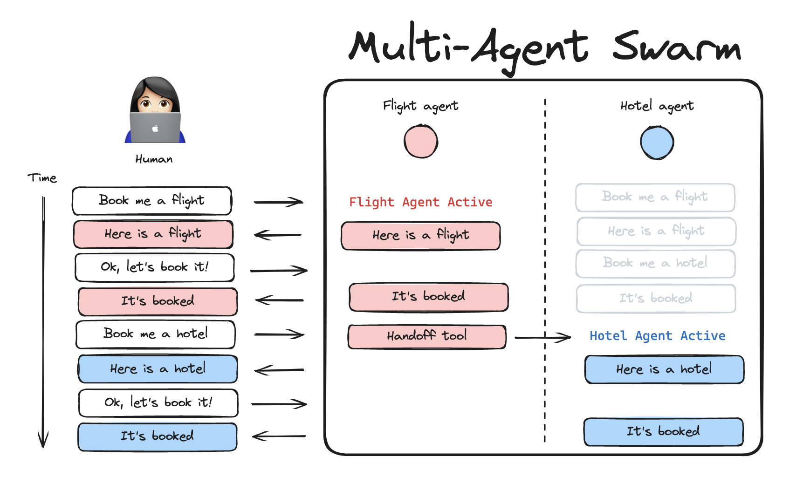

# 🤖 LangGraph Multi-Agent Swarm 

A JavaScript library for creating swarm-style multi-agent systems using [LangGraph](https://github.com/langchain-ai/langgraphjs). A swarm is a type of [multi-agent](https://langchain-ai.github.io/langgraphjs/concepts/multi_agent) architecture where agents dynamically hand off control to one another based on their specializations. The system remembers which agent was last active, ensuring that on subsequent interactions, the conversation resumes with that agent.



## Features

- 🤖 **Multi-agent collaboration** - Enable specialized agents to work together and hand off context to each other
- 🛠️ **Customizable handoff tools** - Built-in tools for communication between agents

This library is built on top of [LangGraph](https://github.com/langchain-ai/langgraphjs), a powerful framework for building agent applications, and comes with out-of-box support for [streaming](https://langchain-ai.github.io/langgraphjs/how-tos/#streaming), [short-term and long-term memory](https://langchain-ai.github.io/langgraphjs/concepts/memory/) and [human-in-the-loop](https://langchain-ai.github.io/langgraphjs/concepts/human_in_the_loop/)

## Installation

```bash
npm install @langchain/langgraph-swarm @langchain/langgraph @langchain/core
```

## Quickstart

```bash
npm install @langchain/langgraph-swarm @langchain/langgraph @langchain/core @langchain/openai

export OPENAI_API_KEY=<your_api_key>
```

```ts
import { z } from "zod";
import { ChatOpenAI } from "@langchain/openai";
import { tool } from "@langchain/core/tools";
import { MemorySaver } from "@langchain/langgraph";
import { createReactAgent } from "@langchain/langgraph/prebuilt";
import { createSwarm, createHandoffTool } from "@langchain/langgraph-swarm";

const model = new ChatOpenAI({ modelName: "gpt-4o" });

// Create specialized tools
const add = tool(
  async (args) => args.a + args.b,
  {
    name: "add",
    description: "Add two numbers.",
    schema: z.object({
      a: z.number(),
      b: z.number()
    })
  }
);

// Create agents with handoff tools
const alice = createReactAgent({
  llm: model,
  tools: [add, createHandoffTool({ agentName: "Bob" })],
  name: "Alice",
  prompt: "You are Alice, an addition expert."
});

const bob = createReactAgent({
  llm: model,
  tools: [createHandoffTool({ 
    agentName: "Alice", 
    description: "Transfer to Alice, she can help with math" 
  })],
  name: "Bob",
  prompt: "You are Bob, you speak like a pirate."
});

// Create swarm workflow
const checkpointer = new MemorySaver();
const workflow = createSwarm({
  agents: [alice, bob],
  defaultActiveAgent: "Alice"
});

export const app = workflow.compile({ 
  checkpointer 
});

const config = { configurable: { thread_id: "1" } };
const turn1 = await app.invoke(
  { messages: [{ role: "user", content: "i'd like to speak to Bob" }] },
  config
);
console.log(turn1);

const turn2 = await app.invoke(
  { messages: [{ role: "user", content: "what's 5 + 7?" }] },
  config
);
console.log(turn2);
```

## Memory

You can add [short-term](https://langchain-ai.github.io/langgraphjs/how-tos/persistence/) and [long-term](https://langchain-ai.github.io/langgraphjs/how-tos/cross-thread-persistence/) [memory](https://langchain-ai.github.io/langgraphjs/concepts/memory/) to your swarm multi-agent system. Since `createSwarm()` returns an instance of `StateGraph` that needs to be compiled before use, you can directly pass a [checkpointer](https://langchain-ai.github.io/langgraphjs/reference/classes/checkpoint.BaseCheckpointSaver.html) or a [store](https://langchain-ai.github.io/langgraphjs/reference/classes/checkpoint.BaseStore.html) instance to the `.compile()` method:

```ts
import { MemorySaver, InMemoryStore } from "@langchain/langgraph";

// short-term memory
const checkpointer = new MemorySaver()
// long-term memory
const store = new InMemoryStore()

alice = ...
bob = ...

const workflow = createSwarm({
  agents: [alice, bob],
  defaultActiveAgent: "Alice",
})

// Compile with checkpointer/store
const app = workflow.compile({
  checkpointer,
  store
})
```

> [!IMPORTANT]
> Adding [short-term memory](https://langchain-ai.github.io/langgraphjs/concepts/persistence/) is crucial for maintaining conversation state across multiple interactions. Without it, the swarm would "forget" which agent was last active and lose the conversation history. Make sure to always compile the swarm with a checkpointer if you plan to use it in multi-turn conversations; e.g., `workflow.compile(checkpointer=checkpointer)`.

## How to customize

You can customize multi-agent swarm by changing either the [handoff tools](#customizing-handoff-tools) implementation or the [agent implementation](#customizing-agent-implementation).

### Customizing handoff tools

By default, the agents in the swarm are assumed to use handoff tools created with the prebuilt `createHandoffTool`. You can also create your own, custom handoff tools. Here are some ideas on how you can modify the default implementation:

* change tool name and/or description
* add tool call arguments for the LLM to populate, for example a task description for the next agent
* change what data is passed to the next agent as part of the handoff: by default `create_handoff_tool` passes **full** message history (all of the messages generated in the swarm up to this point), as well as the contents of `Command.update` to the next agent

> [!IMPORTANT]
> If you want to change what messages are passed to the next agent, you **must** use a different state schema key for `messages` in your agent implementation (e.g., `alice_messages`). By default, all agent (subgraph) state updates are applied to the swarm (parent) graph state during the handoff. Since all of the agents by default are assumed to communicate over a single `messages` key, this means that the agent's messages are **automatically combined** into the parent graph's `messages`, unless an agent uses a different key for `messages`. See more on this in the [customizing agent implementation](#customizing-agent-implementation) section.

Here is an example of what a custom handoff tool might look like:

```ts
import { z } from "zod";
import { ToolMessage } from "@langchain/core/messages";
import { tool } from "@langchain/core/tools";
import { Command } from "@langchain/langgraph";
import { getContextVariable } from "@langchain/core/context";

const createCustomHandoffTool = ({
  agentName,
  toolName,
  toolDescription,
}: {
  agentName: string;
  toolName: string;
  toolDescription: string;
}) => {

  const handoffTool = tool(
    async (args, config) => {
      const toolMessage = new ToolMessage({
        content: `Successfully transferred to ${agentName}`,
        name: toolName,
        tool_call_id: config.toolCall.id,
      });

      // you can use a different messages state key here, if your agent uses a different schema
      // e.g., "alice_messages" instead of "messages"
      // NOTE: make sure to call setContextVariable("state") in your graph
      // see this how-to guide for more details: 
      // https://langchain-ai.github.io/langgraphjs/how-tos/pass-run-time-values-to-tools/#context-variables
      const lastAgentMessage = getContextVariable("state").messages[-1]
      return new Command({
        goto: agentName,
        graph: Command.PARENT,
        // NOTE: this is a state update that will be applied to the swarm multi-agent graph (i.e., the PARENT graph)
        update: {
          messages: [lastAgentMessage, toolMessage],
          activeAgent: agentName,
          // optionally pass the task description to the next agent
          taskDescription: args.taskDescription,
        },
      });
    },
    {
      name: toolName,
      schema: z.object({
        // you can add additional tool call arguments for the LLM to populate
        // for example, you can ask the LLM to populate a task description for the next agent
        taskDescription: z.string().describe("Detailed description of what the next agent should do, including all of the relevant context")
      }),
      description: toolDescription,
    }
  );

  return handoffTool;
}
```

> [!IMPORTANT]
> If you are implementing custom handoff tools that return `Command`, you need to ensure that:  
  (1) your agent has a tool-calling node that can handle tools returning `Command` (like LangGraph's prebuilt [`ToolNode`](https://langchain-ai.github.io/langgraphjs/reference/classes/langgraph_prebuilt.ToolNode.html))
  (2) both the swarm graph and the next agent graph have the [state schema](https://langchain-ai.github.io/langgraphjs/concepts/low_level/#annotation) containing the keys you want to update in `Command.update`

### Customizing agent implementation

By default, individual agents are expected to communicate over a single `messages` key that is shared by all agents and the overall multi-agent swarm graph. This means that **all** of the messages from **all** of the agents will be combined into a single, shared list of messages. This might not be desirable if you don't want to expose an agent's internal history of messages. To change this, you can customize the agent by taking the following steps:

1.  use custom [state schema](https://langchain-ai.github.io/langgraphjs/concepts/low_level#annotation) with a different key for messages, for example `alice_messages`
1.  write a wrapper that converts the parent graph state to the child agent state and back (see this [how-to](https://langchain-ai.github.io/langgraphjs/how-tos/subgraph-transform-state/) guide)

```ts
import { BaseMessage } from "@langchain/core/messages";
import { Annotation, StateGraph, messagesStateReducer } from "@langchain/langgraph";

export const AliceStateAnnotation = Annotation.Root({
  alice_messages: Annotation<BaseMessage[]>({
    reducer: messagesStateReducer,
    default: () => [],
  }),
});
import { SwarmState } from "@langchain/langgraph-swarm";

// see this guide to learn how you can implement a custom tool-calling agent
// https://langchain-ai.github.io/langgraphjs/how-tos/react-agent-from-scratch/
const alice = (
    new StateGraph(AliceStateAnnotation)
    .addNode("model", ...)
    .addNode("tools", ...)
    .addEdge(...)
    ...
    .compile()
)

// wrapper calling the agent
const callAlice = async (state: typeof SwarmState.State) => {
    // you can put any input transformation from parent state -> agent state
    // for example, you can invoke "alice" with "task_description" populated by the LLM
    const response = await alice.invoke({"alice_messages": state["messages"]})
    // you can put any output transformation from agent state -> parent state
    return { "messages": response.alice_messages }
}

const callBob = async (state: typeof SwarmState.State) => {
    ...
}
```

Then, you can create the swarm manually in the following way:

```ts
import { addActiveAgentRouter } from "@langchain/langgraph-swarm";

let workflow = (
    new StateGraph(SwarmState)
    .addNode("Alice", callAlice, { ends: ["Bob"] })
    .addNode("Bob", callBob, { ends: ["Alice"] })
)
// this is the router that enables us to keep track of the last active agent
workflow = addActiveAgentRouter(workflow, {
    routeTo: ["Alice", "Bob"],
    defaultActiveAgent: "Alice",
})

// compile the workflow
const app = workflow.compile()
```

